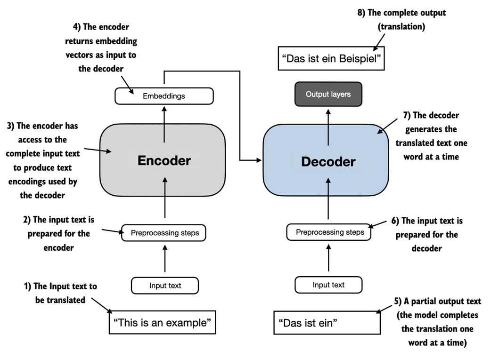
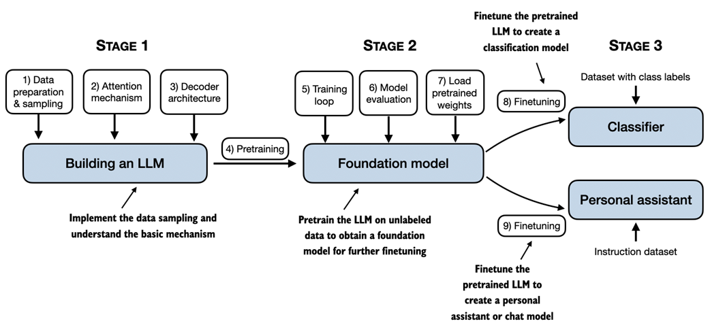

## 1. 理解大语言模型

> **本章涵盖**
>
> - 对大型语言模型 (LLM) 背后的基本概念的高级解释
> - 深入了解 Transformer 架构，从中衍生出类似 ChatGPT 的 LLM
> - 从头开始建立 LLM 的计划

像 ChatGPT 这样的大语言模型 (LLM) 是过去几年开发的深度神经网络模型。它们开创了自然语言处理（NLP）的新时代。在大语言模型出现之前，传统方法擅长分类任务，例如电子邮件垃圾邮件分类和直接模式识别，这些任务可以通过手工规则或更简单的模型捕获。然而，它们在需要复杂理解和生成能力的语言任务中通常表现不佳，例如解析详细指令、进行上下文分析或创建连贯且适合上下文的原始文本。例如，前几代语言模型无法根据关键字列表编写电子邮件，这对于当代 LLM 来说是微不足道的任务。

LLM 具有理解、生成和解释人类语言的卓越能力。然而，需要澄清的是，当我们说语言模型「理解」时，我们的意思是它们能够以连贯且与上下文相关的方式处理和生成文本，而不是说它们拥有类似人类的意识或理解力。

借助深度学习（专注于神经网络的机器学习和人工智能 (AI) 的子集）的进步，LLM 接受了大量文本数据的训练。与以前的方法相比，这使得 LLM 能够捕获更深入的上下文信息和人类语言的微妙之处。因此，LLM 在各种 NLP 任务中显着提高了性能，包括文本翻译、情感分析、问答等。

当代 LLM 和早期 NLP 模型之间的另一个重要区别是后者通常是为特定任务而设计的；虽然那些早期的 NLP 模型在其狭窄的应用中表现出色，但 LLM 在广泛的 NLP 任务中表现出了更广泛的熟练程度。

LLM 背后的成功可归因于支撑许多 LLM 的 Transformer 架构，并且 LLM 接受了大量数据的训练，使它们能够捕捉各种语言的细微差别、上下文和模式，而这些对于手动编码来说是具有挑战性的。

这种基于 Transformer 架构实现模型并使用大型训练数据集来训练 LLM 的转变从根本上改变了 NLP，为理解人类语言并与之交互提供了更强大的工具。

从本章开始，我们为实现本书的主要目标奠定了基础：通过在代码中逐步实现基于 Transformer 架构的类似 ChatGPT 的 LLM 来理解 LLM。

### 1.1 什么是 LLM？

LLM 是大语言模型，是一种旨在理解、生成和响应类人文本的神经网络。这些模型是在大量文本数据上训练的深度神经网络，有时涵盖互联网上整个公开文本的大部分。

大语言模型中的「大」指的是模型的参数大小和训练它的巨大数据集。像这样的模型通常有数百亿甚至数千亿个参数，这些参数是网络中的可调整权重，在训练期间进行优化以预测序列中的下一个单词。下一个单词预测是明智的，因为它利用语言固有的顺序性质来训练模型来理解文本中的上下文、结构和关系。然而，这是一项非常简单的任务，因此许多研究人员对它能够产生如此强大的模型感到惊讶。我们将在后面的章节中逐步讨论和实现下一个单词的训练过程。

LLM 使用一种称为 Transformer 的架构（第 1.4 节更详细地介绍），这使得它们在进行预测时能够选择性地关注输入的不同部分，使它们特别擅长处理人类语言的细微差别和复杂性。

由于 LLM 能够生成文本，因此 LLM 通常也被称为生成人工智能 (AI) 的一种形式，通常缩写为**生成式 AI**或 **GenAI**。如图 1.1 所示，人工智能涵盖了更广泛的领域，即创建能够执行需要类人智能的任务的机器，包括理解语言、识别模式和做出决策，还包括机器学习和深度学习等子领域。

> **图 1.1** 正如对不同领域之间关系的分层描述所表明的那样，LLM 代表了深度学习技术的具体应用，利用了它们处理和生成类人文本的能力。深度学习是机器学习的一个专门分支，专注于使用多层神经网络。机器学习和深度学习是旨在实现算法的领域，使计算机能够从数据中学习并执行通常需要人类智能的任务。如今，人工智能领域以机器学习和深度学习为主，但也包括其他方法，例如使用基于规则的系统、遗传算法、专家系统、模糊逻辑或符号推理。

用于实现人工智能的算法是机器学习领域的焦点。具体来说，机器学习涉及算法的开发，这些算法可以根据数据进行学习并做出预测或决策，而无需显式编程。为了说明这一点，请将垃圾邮件过滤器想象为机器学习的实际应用。机器学习算法不需要手动编写规则来识别垃圾邮件，而是输入标记为垃圾邮件和合法邮件的电子邮件示例。通过最大限度地减少对训练数据集的预测误差，该模型可以学习识别表明垃圾邮件的模式和特征，从而能够将新电子邮件分类为垃圾邮件或合法邮件。

深度学习是机器学习的一个子集，专注于利用三层或多层神经网络（也称为深度神经网络）对数据中的复杂模式和抽象进行建模。与深度学习相比，传统机器学习需要手动提取特征。这意味着人类专家需要识别并选择与模型最相关的特征。

回到垃圾邮件分类示例，在传统的机器学习中，人类专家可能会手动从电子邮件文本中提取特征，例如某些触发词（「奖品」、「获胜」、「免费」）的频率、感叹号的数量、所有大写单词的使用，或存在可疑链接。然后，根据这些专家定义的特征创建的数据集将用于训练模型。与传统机器学习相比，深度学习不需要手动提取特征。这意味着人类专家不需要识别和选择深度学习模型最相关的特征。

接下来的部分将涵盖 LLM 今天可以解决的一些问题、 LLM 要解决的挑战以及我们将在本书中实现的一般 LLM 架构。

### 1.2 LLM 的应用

由于其解析和理解非结构化文本数据的先进能力，LLM 在各个领域拥有广泛的应用。如今，LLM 被用于机器翻译、小说文本生成（见图 1.2）、情感分析、文本摘要和许多其他任务。LLM 最近被用于内容创作，例如撰写小说、文章，甚至计算机代码。

> **图 1.2** LLM 接口支持用户和人工智能系统之间的自然语言通信。此屏幕截图显示 ChatGPT 根据用户的指定写一首诗。

LLM 还可以为复杂的聊天机器人和虚拟助理提供支持，例如 OpenAI 的 ChatGPT 或 Google 的 Bard，它们可以回答用户查询并增强传统搜索引擎（例如 Google Search 或 Microsoft Bing）。

此外，LLM 可用于从医学或法律等专业领域的大量文本中进行有效的知识检索。这包括筛选文档、总结冗长的段落以及回答技术问题。

简而言之，LLM 对于自动化几乎所有涉及解析和生成文本的任务来说都是无价的。它们的应用几乎是无穷无尽的，随着我们不断创新和探索使用这些模型的新方法，很明显 LLM 有可能重新定义我们与技术的关系，使其更加对话式、直观和易于理解。

在本书中，我们将重点从头开始了解 LLM 如何工作，编写可以生成文本的 LLM。我们还将学习允许 LLM 进行查询的技术，从回答问题到总结文本、将文本翻译成不同的语言等等。换句话说，在本书中，我们将通过一步步构建来了解 ChatGPT 等复杂的 LLM 助手是如何工作的。

### 1.3 建立和使用 LLM 的阶段

我们为什么要建立自己的 LLM？ 从头开始编写 LLM 课程是了解其机制和局限性的绝佳练习。此外，它还为我们提供了根据我们自己的特定领域数据集或任务预训练或微调现有开源 LLM 架构所需的知识。

研究表明，在建模性能方面，定制的 LLM（针对特定任务或领域量身定制的 LLM）可以胜过 ChatGPT 等通用 LLM，后者是为广泛的应用程序而设计的。这方面的例子包括专门针对金融的 BloombergGPT，以及专为医学问答而定制的 LLM（请参阅附录 B 中的**进一步阅读和参考资料**部分以了解更多详细信息）。

创建 LLM 的一般过程包括预训练和微调。「预训练」中的术语「预」指的是初始阶段，在该阶段，LLM 等模型在大型、多样化的数据集上进行训练，以形成对语言的广泛理解。然后，该预训练模型将作为基础资源，可以通过微调进一步细化，在微调过程中，模型在更针对特定任务或领域的更窄数据集上进行专门训练。这种由预训练和微调组成的两阶段训练方法如图 1.3 所示。

> **图 1.3** LLM 的预训练涉及对大型未标记文本语料库（原始文本）进行下一个单词预测。然后可以使用较小的标记数据集对预训练的 LLM 进行微调。

如图 1.3 所示，创建 LLM 的第一步是在大型文本数据语料库（有时称为原始文本）上对其进行训练。这里的「原始」是指这些数据只是普通文本，没有任何标签信息[1]。（过滤可能被应用，例如删除未知语言的格式字符或文档。）

LLM 的第一个训练阶段也称为预训练，创建初始预训练的 LLM，通常称为基础模型。这种模型的典型例子是 GPT-3 模型（ChatGPT 的前身）。该模型能够完成文本补全，即完成用户提供的写了一半的句子。它还具有有限的小样本（few-shot）能力，这意味着它可以仅根据几个示例来学习执行新任务，而不需要大量的训练数据。下一节将进一步说明这一点，将 Transformer 用于不同的任务。

通过未标记文本的训练获得预训练的 LLM 后，我们可以进一步在标记数据上训练 LLM，也称为微调。

LLM 微调的两个最流行的类别包括指令微调和分类任务微调。在指令微调中，标记的数据集由指令和答案对组成，例如翻译文本的查询以及正确翻译的文本。在分类微调中，标记数据集由文本和关联的类标签组成，例如与垃圾邮件和非垃圾邮件标签关联的电子邮件。

在本书中，我们将介绍预训练和微调 LLM 的代码实现，并且在预训练基础 LLM 后，我们将在本书后面深入研究指令微调和分类微调的细节。

### 1.4 使用 LLM 来完成不同的任务

大多数现代 LLM 都依赖于 Transformer 架构，这是 2017 年论文《Attention Is All You Need》中介绍的一种深度神经网络架构。为了理解 LLM ，我们必须简要回顾一下最初的 Transformer，它最初是为机器翻译而开发的，将英语文本翻译成德语和法语。图 1.4 描述了 Transformer 架构的简化版本。

> **图 1.4** 原始 Transformer 架构的简化描述，它是一种用于语言翻译的深度学习模型。Transformer 由两部分组成：编码器用于处理输入文本并生成文本的嵌入表示（一种捕获不同维度中许多不同因素的数字表示），解码器使用该嵌入表示一次生成一个单词的翻译文本 。请注意，该图显示了翻译过程的最后阶段，其中解码器必须仅生成最终单词「Beispiel」，给定原始输入文本「This is an example」和部分翻译的句子「Das ist  ein」，完成翻译。图中编号指示数据处理的顺序，并提供有关读取该图的最佳顺序指导。

图 1.4 所示的 Transformer 架构由两个子模块组成：编码器和解码器。编码器模块处理输入文本并将其编码为一系列数字表示或向量，以捕获输入的上下文信息。然后，解码器模块获取这些编码向量并从中生成输出文本。例如，在翻译任务中，编码器将源语言的文本编码为向量，解码器将这些向量解码以生成目标语言的文本。编码器和解码器都由通过所谓的自注意力机制连接的许多层组成。您可能对如何预处理和编码输入有很多疑问。这些将在后续章节中逐步实现。

Transformer 和 LLM 的一个关键组成部分是自注意力机制（未展示），它允许模型权衡序列中不同单词或标记相对于彼此的重要性。这种机制使模型能够捕获输入数据中的远程依赖性和上下文关系，从而增强其生成连贯且上下文相关的输出的能力。但由于其复杂性，我们将推迟到第 3 章进行解释，我们将在其中逐步讨论和实现。此外，我们还将在第 2 章“处理文本数据”中讨论和实现创建模型输入的数据预处理步骤。

Transformer 架构的后续变体，例如所谓的 BERT（Transformer 双向编码器表示的缩写）和各种 GPT 模型（生成式预训练 Transformer 的缩写），基于此概念构建，以使该架构适应不同的任务。（参考文献可在附录 B 中找到。）

BERT 建立在原始 Transformer 的编码器子模块之上，其训练方法与 GPT 不同。虽然 GPT 是为生成任务而设计的，但 BERT 及其变体专注于屏蔽词预测，其中模型预测给定句子中的屏蔽词或隐藏词，如图 1.5 所示。这种独特的训练策略使 BERT 具备了文本分类任务的优势，包括情感预测和文档分类。作为其功能的应用，截至撰写本文时，Twitter 使用 BERT 来检测有毒内容。

> **图 1.5** Transformer 编码器和解码器子模块的可视化表示。左侧，编码器部分举例说明了类似 BERT 的 LLM，它专注于掩码词预测，主要用于文本分类等任务。右侧的解码器部分展示了类似 GPT 的 LLM，专为生成任务和生成连贯的文本序列而设计。

另一方面，GPT 专注于原始 Transformer 架构的解码器部分，专为需要生成文本的任务而设计。这包括机器翻译、文本摘要、小说写作、编写计算机代码等等。我们将在本章的剩余部分中更详细地讨论 GPT 架构，并在本书中从头开始实现它。

GPT 模型主要是为执行文本补全任务而设计和训练的，也表现出了非凡的多功能性。这些模型擅长执行零样本和少样本学习任务。零样本学习是指在没有任何先前具体示例的情况下泛化到完全未见过的任务的能力。另一方面，小样本学习涉及从用户提供的最少数量的示例作为输入进行学习，如图 1.6 所示。

> **图 1.6** 除了文本补全之外，类似 GPT 的 LLM 可以根据输入解决各种任务，而无需重新训练、微调或特定于任务的模型架构更改。有时，在输入中提供目标示例会很有帮助，这称为「少样本设置」。然而，类似 GPT 的 LLM 也能够在没有具体示例的情况下执行任务，这称为「零样本设置」。

> **Transformer 和 LLM 对比**
>
> 今天的 LLM 基于上一节中介绍的 Transformer 架构。因此，Transformer 和 LLM 是文献中经常作为同义词使用的术语。但请注意，并非所有 Transformer 都是 LLM，因为 Transformer 也可用于计算机视觉。此外，并非所有 LLM 都是 Transformer，因为存在基于循环和卷积架构的大型语言模型。这些替代方法背后的主要动机是提高 LLM 的计算效率。然而，这些替代的 LLM 架构是否可以与基于 Transformer 的 LLM 的能力竞争以及它们是否会在实践中被采用还有待观察。（感兴趣的读者可以在本章末尾的进一步阅读部分找到描述这些架构的文献参考。）

### 1.5 利用大型数据集

流行的 GPT 和 BERT 类模型的大型训练数据集代表了包含数十亿个单词的多样化且全面的文本语料库，其中包括大量主题以及自然语言和计算机语言。为了提供一个具体的例子，表 1.1 总结了用于预训练 GPT-3 的数据集，它作为 ChatGPT 第一个版本的基础模型。

> **表 1.1** 流行的 GPT-3 LLM 的预训练数据集

| 数据集名               | 数据集描述                 | token 数量  | 训练数据占比 |
| ---------------------- | :------------------------- | ----------- | ------------ |
| CommonCrawl (filtered) | Web crawl data             | 410 billion | 60%          |
| WebText2               | Web crawl data             | 19 billion  | 22%          |
| Books1                 | Internet-based book corpus | 12 billion  | 8%           |
| Books2                 | Internet-based book corpus | 55 billion  | 8%           |
| Wikipedia              | High-quality text          | 3 billion   | 3%           |

表 1.1 展示了 token 的数量，其中 token 是模型读取的文本单位，数据集中的 token 数量大致相当于文本中的单词和标点字符的数量。我们将在下一章更详细地介绍标记化，即将文本转换为标记的过程。

主要结论是，该训练数据集的规模和多样性使这些模型能够在各种任务上表现良好，包括语言语法、语义和上下文，甚至一些需要常识的任务。

> **GPT-3 数据集详细信息**
>
> 在表 1.1 中，值得注意的是，每个数据集中只有一小部分数据（总计 3000 亿个 token）用于训练过程。这种采样方法意味着训练并未涵盖每个数据集中可用的每一条数据。相反，使用了从所有数据集中提取的 3000 亿个 token 的选定子集。此外，虽然某些数据集并未完全包含在此子集中，但其他数据集可能已包含多次，以达到 3000 亿个 token 的总数。表中比例一栏，在不考虑四舍五入误差的情况下，合计占本次抽样数据的100%。
>
> 对于上下文，考虑 CommonCrawl 数据集的大小，仅该数据集就包含 4100 亿个 token，并且需要大约 570 GB 的存储空间。相比之下，GPT-3 等模型的后续迭代（例如 Meta 的 LLaMA）已经扩大了其训练范围，以包括其他数据源，例如 Arxiv 研究论文（92 GB）和 StackExchange 的代码相关问答（78 GB）。
>
> 维基百科语料库由英语维基百科组成。虽然 GPT-3 论文的作者没有进一步说明细节，但 Books1 很可能是来自 Project Gutenberg ([https://www.gutenberg.org/](https://www.gutenberg.org/)) 的样本，Books2 很可能来自 Libgen ([https://en.wikipedia.org/wiki/Library_Genesis](https://en.wikipedia.org/wiki/Library_Genesis)) 。CommonCrawl 是 CommonCrawl 数据库 ([https://commoncrawl.org/](https://commoncrawl.org/)) 的过滤子集，WebText2 是来自具有 3 个以上点赞的帖子的所有出站 Reddit 链接的网页文本。
>
> GPT-3 论文的作者没有共享训练数据集，但公开的可比较数据集是 The Pile ([https://pile.eleuther.ai/](https://pile.eleuther.ai/))。但是，该集合可能包含受版权保护的作品，并且确切的使用条款可能取决于预期的使用案例和国家/地区。有关更多信息，请参阅 HackerNews 讨论：[https://news.ycombinator.com/item?id=25607809](https://news.ycombinator.com/item?id=25607809)。

这些模型的预训练性质使其具有难以置信的通用性，可用于进一步微调下游任务，这就是为什么它们也被称为基础模型。LLM 预训练需要大量资源，而且非常昂贵。例如，以云计算计费计算，GPT-3 预训练成本估计为 460 万美元[2]。

好消息是，许多预训练的 LLM（作为开源模型）可以用作通用工具来编写、提取和编辑不属于训练数据的文本。此外，LLM 可以针对具有相对较小数据集的特定任务进行微调，从而减少所需的计算资源并提高特定任务的性能。

在本书中，我们将实现预训练代码，并使用它来预训练 LLM 以用于教育目的。所有计算都可以在消费类硬件上执行。实现预训练代码后，我们将学习如何重用公开可用的模型权重并将其加载到我们将实现的架构中，从而使我们能够在本书后面微调 LLM 时跳过昂贵的预训练阶段。

### 1.6 仔细看看 GPT 架构

在本章前面，我们提到了类似 GPT 模型、GPT-3 和 ChatGPT 等术语。现在让我们仔细看看一般的 GPT 架构。首先，GPT 代表 Generative Pretrained Transformer，最初是在以下论文中介绍的：

- ***Improving Language Understanding by Generative Pre-Training* (2018) by *Radford et al.*** from OpenAI, [http://cdn.openai.com/research-covers/language-unsupervised/language_understanding_paper.pdf](http://cdn.openai.com/research-covers/language-unsupervised/language_understanding_paper.pdf)

GPT-3 是该模型的放大版本，具有更多参数并在更大的数据集上进行训练。原始的 ChatGPT 模型是通过使用 OpenAI 的 InstructGPT 论文中的方法在大型指令数据集上对 GPT-3 进行微调而创建的，我们将在第 8 章「利用人类反馈进行微调以遵循指令」中详细介绍该模型。正如我们之前在图 1.6 中看到的，这些模型是能干的文本补全模型，并且可以执行其他任务，例如拼写纠正、分类或语言翻译。这实际上是非常值得注意的，因为 GPT 模型是在相对简单的下一个单词预测任务上进行预训练的，如图 1.7 所示。

> **图 1.7** 在 GPT 模型的下一个单词预训练任务中，系统通过查看句子之前的单词来学习预测句子中即将出现的单词。这种方法有助于模型理解单词和短语通常如何在语言中组合在一起，形成可应用于各种其他任务的基础。

下一个单词预测任务是自我监督学习的一种形式，也是自我标记的一种形式。这意味着我们不需要明确地收集训练数据的标签，而是可以利用数据本身的结构：我们可以使用句子或文档中的下一个单词作为模型应该预测的标签。由于这个下一个单词预测任务允许我们「即时」创建标签，因此可以利用大量未标记的文本数据集来训练 LLM，如前面第 1.5 节「利用大型数据集」中所述。

与我们在 1.4 节「使用 LLM 完成不同的任务」中介绍的原始 Transformer 架构相比，通用 GPT 架构相对简单。本质上，它只是解码器部分，没有编码器，如图 1.8 所示。由于像 GPT 这样的解码器式模型通过一次预测一个单词来生成文本，因此它们被认为是一种自回归 (autoregressive) 模型。

GPT-3 等架构也比原始 Transformer 模型大得多。例如，原始 Transformer 将编码器和解码器块重复六次。GPT-3 有 96 个 transformer 层，总共 1750 亿个参数。

> **图 1.8** GPT 架构仅采用原始 Transformer 的解码器部分。它专为单向、从左到右的处理而设计，非常适合文本生成和下一个单词预测任务，以迭代方式一次一个单词地生成文本。

GPT-3 于 2020 年推出，按照深度学习和 LLM 开发标准来说已经是很久以前的事了，最近的架构（例如 Meta 的 Llama 模型）仍然基于相同的底层概念，只引入了较小的修改。因此，理解 GPT 仍然与以往一样重要，本书重点关注实现 GPT 背后的突出架构，同时提供替代 LLM 所采用的特定调整的指导。

最后，值得注意的是，尽管原始 Transformer 模型是专门为语言翻译而设计的，但 GPT 模型（尽管其架构更大但更简单，旨在预测下一个单词）也能够执行翻译任务。这种能力最初出乎研究人员的意料，因为它来自主要针对下一个单词预测任务训练的模型，该任务并不专门针对翻译。

执行模型未经过明确训练的任务的能力称为「新兴属性」。这种能力在训练过程中并未明确教授，而是作为模型在不同环境下接触大量多语言数据的自然结果而出现的。事实上，GPT 模型可以「学习」语言之间的翻译模式并执行翻译任务，即使它们没有经过专门训练，这一事实证明了这些大规模生成语言模型的优势和功能。我们可以执行不同的任务，而无需为每个任务使用不同的模型。

### 1.7 构建大语言模型

在本章中，我们为理解 LLM 奠定了基础。在本书的其余部分，我们将从头开始编写代码。我们将以 GPT 背后的基本思想为蓝图，分三个阶段解决这个问题，如图 1.9 所示。

> **图 1.9** 本书涵盖的构建 LLM 的阶段包括实施 LLM 架构和数据准备过程、预训练 LLM 以创建基础模型，以及微调基础模型以成为个人助理或文本分类器。

首先，我们将了解基本的数据预处理步骤，并对作为每个 LLM 核心的注意力机制进行编码。

接下来，在第二阶段，我们将学习如何编码和预训练能够生成新文本的类似 GPT 的 LLM。我们还将回顾评估 LLM 的基础知识，这对于开发强大的 NLP 系统至关重要。

请注意，从头开始预训练大型 LLM 是一项艰巨的任务，需要数千到数百万美元的计算成本来构建类似 GPT 的模型。因此，第二阶段的重点是使用小数据集实施用于教育目的的训练。此外，本书还将提供加载公开可用的模型权重的代码示例。

最后，在第三阶段，我们将采用预训练的 LLM 并对其进行微调，以遵循回答查询或文本分类等指令——这是许多现实世界应用和研究中最常见的任务。

我希望您期待着踏上这段激动人心的旅程！

### 1.8 概括

-  LLM 改变了自然语言处理领域，该领域以前主要依赖于明确的基于规则的系统和更简单的统计方法。 LLM 的出现引入了新的深度学习驱动方法，促进了理解、生成和翻译人类语言的进步。
- 现代 LLM 的训练主要分为两个步骤。
  - 首先，通过使用句子中下一个单词的预测作为「标签」，对大量未标记文本进行预训练。
  - 然后，它们在较小的、标记的目标数据集上进行微调，以遵循指令或执行分类任务。
- LLM 基于 Transformer 架构。Transformer 架构的关键思想是一种注意力机制，在一次生成一个单词的输出时，LLM 可以选择性地访问整个输入序列。
- 原始的 Transformer 架构由用于解析文本的编码器和用于生成文本的解码器组成。
- 用于生成文本和遵循指令的 LLM，例如 GPT-3 和 ChatGPT，仅实现解码器模块，从而简化了架构。
- 包含数十亿个单词的大型数据集对于 LLM 的预训练至关重要。在本书中，我们将出于教育目的在小型数据集上实现和训练 LLM ，同时也会了解如何加载公开可用的模型权重。
- 虽然类似 GPT 模型的一般预训练任务是预测句子中的下一个单词，但这些 LLM 表现出「新兴」属性，例如分类、翻译或总结文本的能力。
- 一旦 LLM 经过预训练，所得到的基础模型就可以针对各种下游任务更有效地进行微调。
- 在自定义数据集上进行微调的 LLM 在特定任务上可以胜过一般的 LLM 。

[1] 具有机器学习背景的读者可能会注意到，传统机器学习模型和通过传统监督学习范式训练的深度神经网络通常需要标记信息。然而， LLM 预训练阶段的情况并非如此。在此阶段， LLM 利用自监督学习，模型从输入数据生成自己的标签。这个概念将在本章后面介绍。

[2] GPT-3，价值 4,600,000 美元的语言模型，[https://www.reddit.com/r/MachineLearning/comments/h0jwoz/d_gpt3_the_4600000_language_model/](https://www.reddit.com/r/MachineLearning/comments/h0jwoz/d_gpt3_the_4600000_language_model/)

