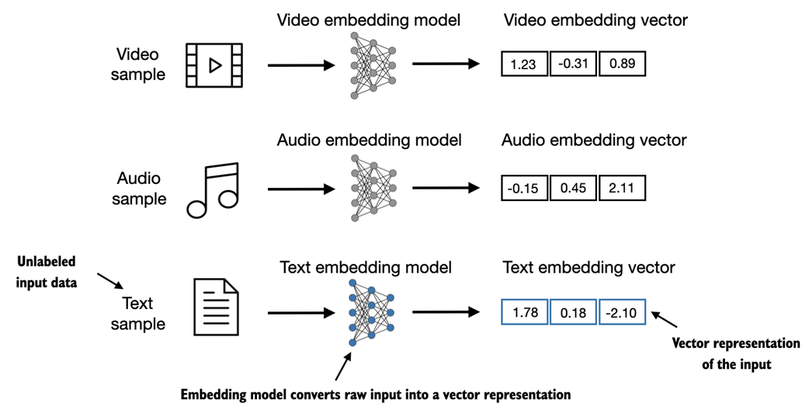
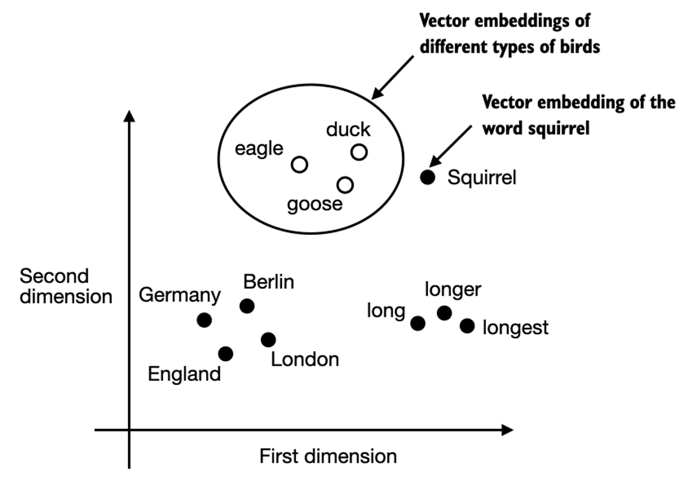
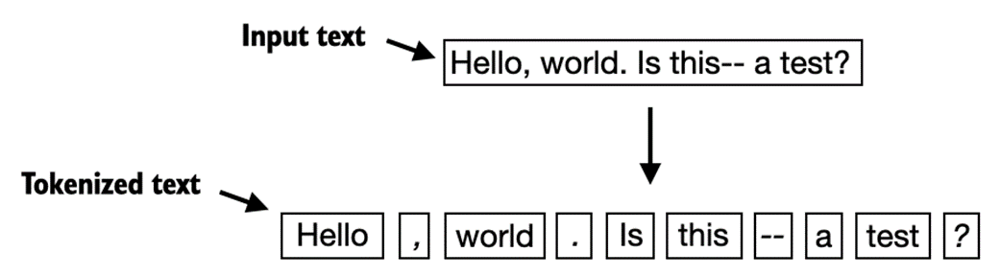
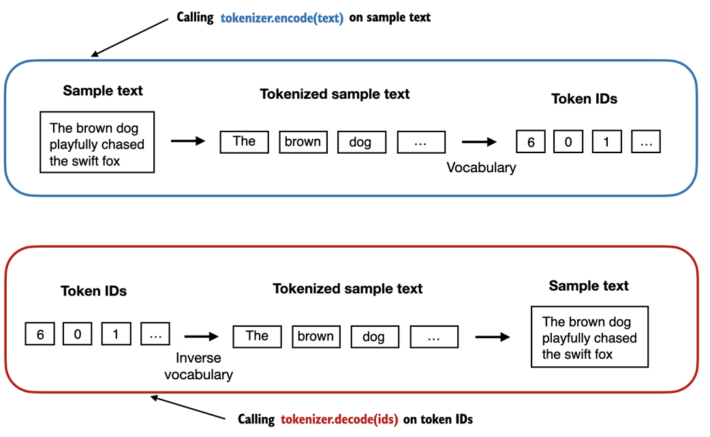
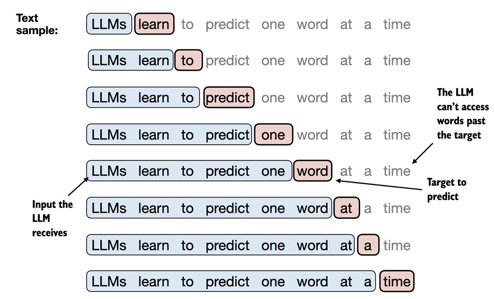
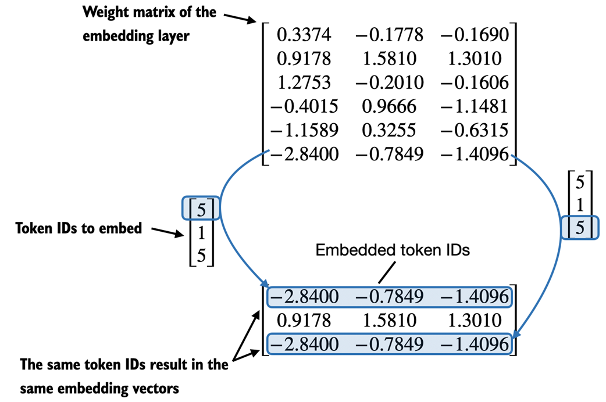

## 2. 处理文本数据

> 本章涵盖
>
> - 为大语言模型训练准备文本
> - 将文本拆分为单词和子单词标记
> - 字节对编码作为一种更高级的文本标记方式
> - 使用滑动窗口方法对训练示例进行采样
> - 将标记转换为输入大语言模型的向量

在上一章中，我们深入研究了大语言模型 (LLM) 的一般结构，并了解到它们是在大量文本上进行预训练的。具体来说，我们的重点是基于 Transformer 架构的纯编码器 LLM，该架构是 CharGPT 和其他流行的类似 GPT 的 LLM 的基础。

在预训练阶段，LLM 一次处理一个单词的文本。使用下一个单词预测任务训练具有数百万至数十亿个参数的 LLM，可以产生具有令人印象深刻的能力的模型。然后可以进一步微调这些模型以遵循一般指令或执行特定的目标任务。但在接下来的章节中实现和训练 LLM 之前，我们需要准备训练数据集，这是本章的重点，如图 2.1 所示。

> 图 2.1 编写 LLM、在一般文本数据集上预训练 LLM 以及在标记数据集上对其进行微调的三个主要阶段的模型。本章将解释和编码数据准备和采样管道，为 LLM 提供用于预训练的文本数据。


在本章中，您将学习如何为训练 LLM 准备输入文本。这涉及将文本拆分为单独的单词和子单词标记，然后将其编码为 LLM 的向量表示。您还将了解高级标记化方案，例如字节对编码，该方案在 GPT 等流行的 LLM 中使用。最后，我们将实现采样和数据加载策略，以生成后续章节中训练 LLM 所需的输入输出对。

### 2.1 理解词嵌入

深度神经网络模型，包括 LLM，无法直接处理原始文本。由于文本是分类的，因此它与用于实现和训练神经网络的数学运算不兼容。因此，我们需要一种将单词表示为连续值向量的方法。（不熟悉计算环境中的向量和张量的读者可以在附录 A 的 「A2.2 理解张量」中了解更多信息。）

将数据转换为向量格式的概念通常称为嵌入 (embedding)。使用特定的神经网络层或另一个预训练的神经网络模型，我们可以嵌入不同的数据类型，例如视频、音频和文本，如图 2.2 所示。

> 图2.2 深度学习模型无法处理原始形式的视频、音频和文本等数据格式。因此，我们使用嵌入模型将这些原始数据转换为深度学习架构可以轻松理解和处理的密集向量表示。具体来说，该图说明了将原始数据转换为三维数值向量的过程。值得注意的是，不同的数据格式需要不同的嵌入模型。例如，为文本设计的嵌入模型不适合嵌入音频或视频数据。



嵌入的核心是从离散对象（例如单词、图像甚至整个文档）到连续向量空间中的点的映射 -- 嵌入的主要目的是将非数字转换为神经网络可处理的格式。

虽然词嵌入是最常见的文本嵌入形式，但也有句子、段落或整个文档的嵌入。句子或段落嵌入是检索增强生成 (retrieval-augmented generation) 的流行选择。检索增强生成将生成（如生成文本）与检索（如搜索外部知识库）结合起来，在生成文本时提取相关信息，这是一种超出了本书范围的技术。由于我们的目标时训练类似 GPT 的 LLM，它学习一次生成一个单词的文本，因此本章重点讨论词嵌入。

业内已经开发了多种算法和框架来生成词嵌入。早期最流行的示例之一是 Word2Vec 方法。Word2Vec 训练神经网络架构，通过预测给定目标单词的上下文来生成词嵌入，反之亦然。Word2Vec 背后的主要思想是，出现在相似上下文中的单词往往具有相似的含义。因此，当出于可视化目的投影到二维词嵌入时，可以看到相似的术语聚集在一起，如图 2.3 所示。

> 图2.3 如果词嵌入是二维的，我们可以将它们绘制在二维散点图中以实现可视化目的，如下所示。当使用词嵌入技术（例如 Word2Vec）时，与相似概念相对应的单词通常在嵌入空间中彼此靠近出现。例如，与国家和城市相比，不同类型的鸟类在嵌入空间中显得彼此更接近。



词嵌入可以有不同的维度，从一到一千。如图 2.3 所示，我们可以选择二维词嵌入来实现可视化目的。更高的维度可能会捕获更细微的关系，但代价是计算效率。

虽然我们可以使用 Word2Vec 等预训练模型来生成机器学习模型的嵌入，但 LLM 通常会生成自己的嵌入，这些嵌入是输入层的一部分，并在训练期间更新。在 LLM 训练中优化嵌入而不是使用 Word2Vec 的优点是嵌入针对特定任务和手头的数据进行了优化。我们将在本章后面实现这样的嵌入层，此外，正如我们在第 3 章讨论的，LLM 还可以创建上下文化的输出嵌入。

不幸的是，高维嵌入对可视化提出了挑战，因为我们的感官知觉和常见的图形表示本质上仅限于三个维度或更少，这就是为什么图 2.3 在二维散点图中显示了二维嵌入。然而，在处理 LLM 时，我们通常使用比图 2.3 所示更高维度的嵌入。对于 GPT-2 和 GPT-3，嵌入大小（通常称为模型隐藏状态的维度）根据特定模型变体和大小而变化。这是性能和效率之间的权衡。最小的 GPT-2（117M 参数）和 GPT-2（125M 参数）模型使用 768 维的嵌入大小来提供具体示例。最大的 GPT-3模型（175B 参数）使用 12,288 维的嵌入大小。

本章接下来的部分将介绍准备 LLM 使用的嵌入所需的步骤，其中包括将文本拆分为单词、将单词转换为标记以及将标记转换为嵌入向量。

### 2.2 标记文本

本节介绍我们如何将输入文本拆分为单独的标记 (tokens)，这是为 LLM 创建嵌入所需的预处理步骤。这些标记要么是单个单词，要么是特殊字符，包括标点符号，如图 2.4 所示。

> 图 2.4 在 LLM 背景下的文本处理步骤图示。在这里，我们将输入文本分割成单独的标记，这些标记可以是单词或特殊字符，例如标点符号。在接下来的部分中，我们将把文本转换为 token ID 并创建 token 嵌入。


我们将为 LLM 训练标记的文本是 Edith Wharton 的短篇小说 **The Verdict**，该小说已发布到公共领域，因此被允许用于 LLM 训练任务。该文本可在维基文库 [https://en.wikisource.org/wiki/The_Verdict](https://en.wikisource.org/wiki/The_Verdict) 上找到，您可以将其复制并粘贴到文本文件中，我将其复制到文本文件 "the-verdict.txt" 中，以使用以下 Python 的标准文件读取实用程序来加载：

```python
## 清单 2.1 将一个短篇故事作为文本示例读入 Python
with open("the-verdict.txt", "r", encoding="utf-8") as f:
    raw_text = f.read()
print("Total number of character:", len(raw_text))
print(raw_text[:99])
```

或者，您可以在本书的 GitHub 存储库 [https://github.com/rasbt/LLMs-from-scratch/tree/main/ch02/01_main-chapter-code](https://github.com/rasbt/LLMs-from-scratch/tree/main/ch02/01_main-chapter-code) 中找到此 "the-verdict.txt"。

出于说明目的，打印命令打印该文件的总字符数，后跟该文件的前 100 个字符：

```
Total number of character: 20479
I HAD always thought Jack Gisburn rather a cheap genius--though a good fellow enough--so it was no 
```

我们的目标是将这个 20,479 个字符的短篇故事标记为单个单词和特殊字符，然后我们可以将其转化为后续章节中 LLM 训练的嵌入。

> **文本样本大小**
>
> 请注意，在 LLM 中，处理数百万篇文章和数十万本书（数千兆字节的文本）是很常见的。然而，出于教育目的，使用较小的文本样本（例如一本书）就足以说明文本处理步骤背后的主要思想，并使其能够在合理的时间内在消费类硬件上运行。

我们怎样才能最好地分割这个文本以获得标记列表？为此，我们进行了一次小游览，并使用 Python 的正则表达式库 re 进行说明。（请注意，您不必学习或记住任何正则表达式语法，因为我们将在本章后面过渡到预构建的分词器。）

使用一些简单的示例文本，我们可以使用 `re.split` 命令和以下语法来分割空白字符上的文本：

```python
import re
text = "Hello, world. This, is a test."
result = re.split(r'(\s)', text)
print(result)
```

结果是单个单词、空格和标点符号的列表：

```
['Hello,', ' ', 'world.', ' ', 'This,', ' ', 'is', ' ', 'a', ' ', 'test.']
```

请注意，上面的简单标记化方案主要用于将示例文本分成单独的单词，但是，某些单词仍然连接到我们希望作为单独列表条目的标点符号。

让我们修改空格 (\s) 和逗号以及句点 ([,.]) 上的正则表达式分割：

```python
result = re.split(r'([,.]|\s)', text)
print(result)
```

我们可以看到单词和标点符号现在是单独的列表条目，正如我们想要的那样：

```
['Hello', ',', '', ' ', 'world.', ' ', 'This', ',', '', ' ', 'is', ' ', 'a', ' ', 'test.']
```

剩下的一个小问题是列表仍然包含空白字符。或者，我们可以安全地删除这些冗余字符，如下所示：

```python
result = [item.strip() for item in result if item.strip()]
print(result)
```

生成的无空格输出如下所示：

```
['Hello', ',', 'world.', 'This', ',', 'is', 'a', 'test.']
```

> **是否删除空格**
>
> 在开发简单的分词器时，我们是否应该将空格编码为单独的字符，或者只是删除它们取决于我们的应用程序及其要求。删除空格可以减少内存和计算需求。然而，如果我们训练对文本的确切结构敏感的模型（例如，对缩进和间距敏感的 Python 代码），保留空格可能会很有用。在这里，为了标记化输出的简单性和简洁性，我们删除了空格。稍后，我们将切换到包含空格的标记化方案。

我们上面设计的标记化方案在简单的示例文本上效果很好。让我们进一步修改它，以便它也可以处理其他类型的标点符号，例如我们之前在 Edith Wharton 短篇小说的前 100 个字符中看到的问号、引号和双破折号，以及其他特殊字符：

```python
text = "Hello, world. Is this-- a test?"
result = re.split(r'([,.?_!"()\']|--|\s)', text)
result = [item.strip() for item in result if item.strip()]
print(result)
```

结果输出如下：

```
['Hello', ',', 'world', '.', 'Is', 'this', '--', 'a', 'test', '?']
```

从图 2.5 中总结的结果可以看出，我们的标记化方案现在可以成功处理文本中的各种特殊字符。

> 图2.5 到目前为止，我们实现的标记化方案将文本拆分为单独的单词和标点符号。在此图所示的具体示例中，示例文本被分为 10 个单独的标记。



现在我们已经有了一个基本的分词器，让我们将它应用到 Edith Wharton 的整个短篇小说中：

```python
preprocessed = re.split(r'([,.?_!"()\']|--|\s)', raw_text)
preprocessed = [item.strip() for item in preprocessed if item.strip()]
print(len(preprocessed))
```

上面的 print 语句输出 `4649`，这是该文本中的标记数（不包括空格）。

让我们打印前 30 个标记以进行快速目视检查：

```python
print(preprocessed[:30])
```

结果输出显示我们的分词器似乎能够很好地处理文本，因为所有单词和特殊字符都被整齐地分开：

```
['I', 'HAD', 'always', 'thought', 'Jack', 'Gisburn', 'rather', 'a', 'cheap', 'genius', '--', 'though', 'a', 'good', 'fellow', 'enough', '--', 'so', 'it', 'was', 'no', 'great', 'surprise', 'to', 'me', 'to', 'hear', 'that', ',', 'in']
```

### 2.3 将标记转换为 token ID

在上一节中，我们将 Edith Wharton 的短篇小说标记为单独的标记。在本节中，我们会将这些标记从 Python 字符串转换为整数表示形式，以生成所谓的 token ID。此转换是将 token ID 转换为嵌入向量之前的中间步骤。

为了将之前生成的标记映射到 token ID，我们必须首先构建一个所谓的词汇表。该词汇表定义了我们如何将每个唯一单词和特殊字符映射到唯一整数，如图 2.6 所示。

> 图2.6 我们通过将训练数据集中的整个文本标记为单独的 token 来构建词汇表。然后将这些单独的 token 按字母顺序排序，并删除重复的 token。然后，将唯一 token 聚合到词汇表中，该词汇表定义从每个唯一 token 到唯一整数值的映射。为了说明的目的，所描绘的词汇量故意较小，并且为了简单起见不包含标点符号或特殊字符。


在上一节中，我们对 Edit Wharton 的短篇小说进行了标记，并将其分配给一个名为 `preprocessed` 的 Python 变量。现在让我们创建所有唯一标记的列表，并按字母顺序对它们进行排序以确定词汇表大小：

```python
all_words = sorted(list(set(preprocessed)))
vocab_size = len(all_words)
print(vocab_size)
```

通过上述代码确定词汇表大小为 1,159 后，我们创建词汇表并打印其前 50 个条目以供说明：

```python
## 清单 2.2 创建词汇表
vocab = {token: integer for integer, token in enumerate(all_words)}
for i, item in enumerate(vocab.items()):
    print(item)
    if i >= 50:
        break
```

输出如下：

```
('!', 0)
('"', 1)
("'", 2)
...
('Has', 49)
('He', 50)
```

正如我们所看到的，根据上面的输出，字典包含与唯一整数标签关联的各个 token。我们的下一个目标是应用这个词汇表将新文本转换为 token ID，如图 2.7 所示：

> 图 2.7 从新的文本样本开始，我们对文本进行标记，并使用词汇表将文本标记转换为 token ID。词汇表是根据整个训练集构建的，可以应用于训练集本身和任何新的文本样本。为了简单起见，所描述的词汇不包含标点符号或特殊字符。


在本书后面，当我们想要将 LLM 的输出从数字转换回文本时，我们还需要一种将 token ID 转换为文本的方法。为此，我们可以创建词汇表的逆版本，将 token ID 映射回相应的文本标记。

让我们在 Python 中实现一个完整的 tokenizer 类，其中包含一个编码方法，该方法将文本拆分为 token，并执行字符串到整数的映射，以通过词汇表生成 token ID。此外，我们还实现了一个解码方法，该方法执行反响整数到字符串映射，将 token ID 转换回文本。

该 tokenizer 实现的代码如清单 2.3 所示：

```python
## 清单 2.3 实现一个简单的文本 tokenizer
class SimpleTokenizerV1:
    def __init__(self, vocab):
        self.str_to_int = vocab
        self.int_to_str = {i:s for s, i in vocab.items()}
    
    def encode(self, text):
        preprocessed = re.split(r'([,.?_!"()\']|--|\s)', text)
        preprocessed = [item.strip() for item in preprocessed if item.strip()]
        ids = [self.str_to_int[s] for s in preprocessed]
        return ids
    
    def decode(self, ids):
        text = " ".join([self.int_to_str[i] for i in ids])
        text = re.sub(r'\s+([,.?!"(\'])', r'\1', text)
        return text
```

使用上面的 `SimpleTokenizerV1` Python 类，我们现在可以通过现有词汇表实例化新的 tokenizer 对象，然后使用它来对文本进行编码和解码，如图 2.8 所示。

> 图 2.8 Tokenizer 实现共享两种常用方法：编码方法和解码方法。编码方法接收示例文本，将其分割成单独的 token，并通过词汇表将 token 转换为 token ID。解码方法接收 token ID，将它们转换回文本 token，并将文本 token 连接成自然文本。



让我们从 `SimpleTokenizerV1` 类实例化一个新的 tokenizer 对象，并对 Edith Wharton 的短篇小说中的一段进行标记化，以便在实践中进行尝试：

```python
tokenizer = SimpleTokenizerV1(vocab)

text = """"It's the last he painted, you know," Mrs. Gisburn said with pardonable pride."""
ids = tokenizer.encode(text)
print(ids)
```

上面的代码打印一下 token ID：

```
[1, 58, 2, 872, 1013, 615, 541, 763, 5, 1155, 608, 5, 1, 69, 7, 39, 873, 1136, 773, 812, 7]
```

接下来，让我们看看是否可以使用 decode 方法将这些 token ID 转换回文本：

```python
tokenizer.decode(ids)
```

这将输出以下文本：

```
'" It\' s the last he painted, you know," Mrs. Gisburn said with pardonable pride.'
```

根据上面的输出，我们可以看到 decode 方法成功地将 token ID 转换回原始文本。

到目前为止，一切都很好。我们实现了一个 tokenizer，能够根据训练集中的片段对文本进行标记化和去标记化。现在让我们将其应用于训练集未包含的新文本样本：

```python
text = "Hello, do you like tea?"
tokenizer.encode(text)
```

执行上面的代码会出现以下错误：

```python
...
KeyError: 'Hello'
```

问题是 **The Verdict** 短篇小说中没有使用 "Hello" 这个词。因此，它不包含在词汇表中。这凸显了在处理 LLM 时需要考虑大型而且多样化的训练集来扩展词汇量。

在下一节中，我们将在包含未知单词的文本上进一步测试标记器，我们还将讨论其他特殊标记，这些标记可用于在训练期间为 LLM 提供进一步的上下文。

### 2.4 添加特殊的上下文标记

在上一节中，我们实现了一个简单的标记器并将其应用于训练集中的段落。在本节中，我们将修改词标记器以处理未知单词。

我们还将讨论特殊上下文标记的使用和添加，这些标记可以增强模型对文本中上下文或其他相关信息的理解。例如，这些特殊标记可以包括未知单词和文档边界的标记。

特别是，我们将修改上一节中实现的词汇表和标记器 SimpleTokenizerV2，以支持两个新的 token，<|unk|> 和 <|endoftext|>，如图 2.9 所示。

> 图 2.9 我们向词汇表添加特殊标记来处理某些上下文。例如，我们添加一个 <|unk|> 标记来表示新的和未知的单词，这些单词不属于训练数据，因此也不属于现有词汇表。此外，我们添加一个 <|endoftext|> 标记，可用一分隔两个不相关的文本源。


如图 2.9 所示，如果遇到不属于词汇表的单词，我们可以修改分词器以使用 <|unk|> 标记。此外，我们在不相关的文本之间添加了一个标记。例如，当在多个独立文档或书籍上训练类似 GPT 的 LLM 时，通常会在前一个文本源后面的每个文档或书籍前插入一个标记，如图 2.10 所示。这有助于 LLM 了解，尽管这些文本源时为了训练而串联起来的，但实际上它们是不相关的。

> 图 2.10 当使用多个独立的文本源时，我们在这些文本之间添加 <|endoftext|> token。这些 <|endoftext|> token 充当标记，表示特定片段的开始或结束，从而允许 LLM 进行更有效的处理和理解。


现在让我们修改词汇表以包含这两个特殊标记，<|unk|> 和 <|endoftext|>，通过将它们添加到我们在上一节中创建的所有唯一单词的列表中：

```python
all_tokens = sorted(list(set(preprocessed)))
all_tokens.extend(["<|endoftext|>", "<|unk|>"])
vocab = {token:integer for integer, token in enumerate(all_tokens)}

print(len(vocab.items()))
```

根据上面 print 语句的输出，新的词汇量为 1,161（上一节的词汇量为 1,159）。

作为额外的快速检查，让我们打印更新词汇表的最后 5 个条目：

```python
for i, item in enumerate(list(vocab.items())[-5:]):
    print(item)
```

上面的代码打印以下内容：

```python
('younger', 1156)
('your', 1157)
('yourself', 1158)
('<|endoftext|>', 1159)
('<|unk|>', 1160)
```

根据上面的代码输出，我们可以确认这两个新的特殊标记确实已经成功合并到词汇表中，接下来，我们相应地调整代码清单 2.3 中的标记器，如清单 2.4 所示：

```python
## 清单 2.4 一个处理未知单词的简单文本标记器
class SimpleTokenizerV2:
    def __init__(self, vocab):
        self.str_to_int = vocab
        self.int_to_str = {i:s for s, i in vocab.items()}
        
    def encode(self, text):
        preprocessed = re.split(r'([,.?_!"()\']|--|\s)', text)
        preprocessed = [item.strip() for item in preprocessed if item.strip()]
        preprocessed = [item if item in self.str_to_int else "<|unk|>" for item in preprocessed]
        ids = [self.str_to_int[s] for s in preprocessed]
        return ids
    
    def decode(self, ids):
        text = " ".join([self.int_to_str[i] for i in ids])
        
        text = re.sub(r'\s+([,.?!"()\'])', r'\1', text)
        return text
```

与我们在上一节的代码清单 2.3 中实现的 `SimpleTokenizerV1` 相比，新的 `SimpleTokenizerV2` 用 <|unk|> 标记替换未知单词。

现在让我们在实践中尝试一下这个新的标记器。为此，我们将使用一个简单的文本示例，该示例由两个独立且不相关的句子连接而成：

```python
text1 = "Hello, do you like tea?"
text2 = "In the sunlit terraces of the palace."
text = " <|endoftext|> ".join((text1, text2))
print(text)
```

输出如下：

```
'Hello, do you like tea? <|endoftext|> In the sunlit terraces of the palace.'
```

接下来，让我们使用 `SimpleTokenizerV2` 对示例文本进行标记：

```python
tokenizer = SimpleTokenizerV2(vocab)
print(tokenizer.encode(text))
```

这将打印一下 token ID：

```python
[1160, 5, 362, 1155, 642, 1000, 10, 1159, 57, 1013, 981, 1009, 738, 1013, 1160, 7]
```

在上面，我们可以看到 token ID 列表包含 <|endoftext|> 分隔符 token 1159，以及两个用于未知单词的token 1160。

让我们对文本进行去标记化以进行快速健全性检查：

```python
print(tokenizer.decode(tokenizer.encode(text)))
```

输出如下：

```
'<|unk|>, do you like tea? <|endoftext|> In the sunlit terraces of the <|unk|>.'
```

通过将上面的去标记化文本与原始输入文本进行比较，我们知道训练数据集（Edith Wharton 的短篇小说 **The Verdict**）不包含 "Hello" 和 "palace" 一词。

到目前为止，我们已经讨论了标记化作为处理文本作为 LLM 输入的一个重要步骤。根据 LLM，一些研究人员还考虑其他特殊标记，例如：

- `[BOS]`（序列的开始）：该标记标志着文本的开始。对于 LLM 来说，它意味着一段内容的开始。
- `[EOS]`（序列的结束）：该标记位于文本末尾，在连接多个不相关文本时特别有用，类似于 <|endoftext|>。例如，当组合两篇不同的维基百科文章或书籍时，`[EOS]` 标记指示一篇文章的结束位置和下一篇文章的开始位置。
- `[PAD]`（填充）：当训练批量大小大于 1 的 LLM 时，批量可能包含不同长度的文本。为了确保所有文本具有相同的长度，较短的文本将使用 `[PAD]` 标记进行扩展或填充，直到批次中最长文本的长度。

请注意，用于 GPT 模型的标记生成器不需要上述任何标记，但为了简单起见仅使用 <|endoftext|> 标记。<|endoftext|> 标记类似于上面提到的 `[EOS]` 标记。此外，<|endoftext|> 也用于填充。然而，正如我们将在后续章节中探讨的那样，在对批量输入进行训练时，我们通常使用掩码，这意味着我们不会关注填充的标记。因此，选择用于填充的特殊标记变得无关紧要。

此外，用于 GPT 模型的标记生成器也不对词汇表的单词使用 <|unk|> 标记。相反，GPT 模型使用字节对编码分词器，它将单词分解为子词单元，我们将在下一节中讨论。

### 2.5 字节对编码

为了说明目的，我们在前面的部分实现了一个简单的标记化方案。本节介绍基于字节对编码（BPE）概念的更复杂的标记化方案。本节介绍的 BPE 标记器用于训练 LLM，例如 GPT-2、GPT-3 和 ChatGPT。

由于实现 BPE 可能相对复杂，我们将使用现有的 Python 开源库 **tiktoken** ([https://github.com/openai/tiktoken](https://github.com/openai/tiktoken))，它基于 Rust 源代码非常有效地实现了 BPE 算法。与其他 Python 库类似，我们可以从终端通过 Python 的 pip 安装程序安装 tiktoken 库：

```shell
pip install tiktoken
```

本章代码基于 tiktoken 0.5.1。您可以使用以下代码来检查您当前安装的版本：

```python
import importlib
import tiktoken
print("tiktoken version:", importlib.metadata.version("tiktoken"))
```

安装完成后，我们可以从 tiktoken 实例化 BPE 标记生成器，如下所示：

```python
tokenizer = tiktoken.get_encoding("gpt2")
```

这个标记器的用法类似于我们之前通过 encode 方法实现的 `SimpleTokenizerV2`：

```python
text = "Hello, do you like tea? <|endoftext|> In the sunlit terraces of someunknownPlace."
integers = tokenizer.encode(text, allowed_special={"<|endoftext|>"})
print(integers)
```

上面的代码打印一下 token ID：

```
[15496, 11, 466, 345, 588, 8887, 30, 220, 50256, 554, 262, 4252, 18250, 8812, 2114, 286, 617, 34680, 27271, 13]
```

然后，我们可以使用解码方法将 token ID 转换回文本，类似于之前的 `SimpleTokenizerV2`：

```python
strings = tokenizer.decode(integers)
print(strings)
```

上面的代码打印以下内容：

```
'Hello, do you like tea? <|endoftext|> In the sunlit terraces of someunknownPlace.'
```

根据上面的 token ID 和解码文本，我们可以做出两个值得注意的观察。首先，为 <|endoftext|> token 分配一个相对较大的 token ID，即 50256。事实上，用于训练 GPT-2、GPT-3 和 ChatGPT 等模型的 BPE 标记器的总词汇量为 50,257，其中 <|endoftext|> 被分配了最大的 token ID。

其次，上面的 BPE 标记器可以正确编码和解码未知单词，例如 "someunknownPlace"。BPE 标记器可以处理任何未知单词。它如何在不使用 <|unk|> 标记的情况下实现这一目标？

BPE 的底层算法将不在其预定义词汇表中的单词分解为更小的子词单元甚至单个字符，使其能够处理词汇表之外的单词。因此，借助 BPE 算法，如果标记器在标记过程中遇到不熟悉的单词，它可以将其表示为一系列子词标记或字符，如图 2.11 所示。

> 图 2.11 BPE 标记器将未知单词分解为子词和单个字符。这样，BPE 标记器就可以解析任何单词，并且不需要用特殊标记替换未知单词，例如 <|unk|>。


如图 2.11 所示，将未知单词分解为单个字符的能力确保了标记器以及用它训练的 LLM 可以处理任何文本，即使它包含训练数据中不存在的单词。

> **练习 2.1 未知单词的字节对编码**
>
> 尝试使用 tiktoken 库中的 BPE 标记生成器处理未知单词 "Akwirw ier" 并打印各个 token ID。然后，对该列表中的每个整数调用解码函数，以重现图 2.11 中所示的映射。最后，调用 token ID 的解码方法来检查它是否可以重建原始输入 "Akwirw ier"。

BPE 的详细讨论和实现超出了本书的范围，但简而言之，它通过迭代地将频繁出现的字符合并为子词以及将频繁出现的子词合并为单词来构建词汇表。例如，BPE 首先将所有单独的单个字符添加到其词汇表中 ("a", "b", ...)。在下一阶段，它将经常一起出现的字符组合合并为子词。例如，"d" 和 "e" 可以合并成子词 "de"，这在许多英语单词中很常见，例如 "define"、"depend"、"made" 和 "hidden"。合并由频率隔断决定。

### 2.6 使用滑动窗口进行数据采样

上一节详细介绍了标记化步骤以及从字符串标记到整数 token ID 的转换。在我们最终为 LLM 创建嵌入之前，下一步时生成训练 LLM 所需的输入目标对。

这些输入-目标对是什么样的？正如我们在第 1 章中了解到的，LLM 通过预测文本中的下一个单词来进行预训练，如图 2.12 所示。

> 图 2.12 给定一个文本样本，提取输入块作为子样本，作为 LLM 的输入，LLM 在训练期间的预测任务是预测输入块后面的下一个单词。在训练过程中，我们屏蔽掉所有超出目标的单词。请注意，该图中显示的文本将在 LLM 处理之前进行标记化；然而，为了清楚起见，该图省略了标记化步骤。



在本节中，我们实现一个数据加载器，它使用滑动窗口方法从训练数据集中获取图 2.12 中所示的输入目标对。

首先，我们将首先使用上一节中介绍的 BPE 分词器对我们之前处理过的整个 **The Verdict** 短篇故事进行标记化：

```python
with open("the-verdict.txt", "r", encoding="utf-8") as f:
    raw_text = f.read()

enc_text = tokenizer.encode(raw_text)
print(len(enc_text))
```

应用 BPE 标记器后，执行上述代码将返回 5145，即训练集中的分词总数。

接下来，出于演示目的，我们从数据集中删除前 50 个 token，因为这会在接下来的步骤中产生稍微跟有趣的文本段落：

```python
enc_sample = enc_text[50:]
```

为下一个单词预测任务创建输入-目标对的最简单、最直观的方法之一是创建两个变量 x 和 y，其中 x 包含输入标记，y 包含目标，这些目标是平移 1 位的输入：

```python
context_size = 4

x = enc_sample[:context_size]
y = enc_sample[1:context_size+1]
print(f"x: {x}")
print(f"y: {y}")
```

运行上面的代码会打印以下输出：

```python
x: [290, 4920, 2241, 287]
y: [4920, 2241, 287, 257]
```

处理输入和目标（即移动 1 个位置的输入），然后我们可以创建图 2.12 中所示的下一个单词预测任务，如下所示：

```python
for i in range(1, context_size+1):
    context = enc_sample[:i]
    desired = enc_sample[i]
    print(context, "---->", desired)
```

上面的代码打印以下内容：

```python
[290] ----> 4920
[290, 4920] ----> 2241
[290, 4920, 2241] ----> 287
[290, 4920, 2241, 287] ----> 257
```

箭头（---->）左侧的所有内容均指 LLM 将接收的输入，箭头右侧的 token ID 表示 LLM 应该预测的目标 token ID。

出于说明目的，让我们重复前面的代码，但转换 token ID 为文本：

```python
for i in range(1, context_size+1):
    context = enc_sample[:i]
    desired = enc_sample[i]
    print(tokenizer.decode(context), "---->", tokenizer.decode([desired]))
```

以下输出显示了文本格式的输入和输出的外观：

```
 and ---->  established
 and established ---->  himself
 and established himself ---->  in
 and established himself in ---->  a
```

我们现在已经创建了输入目标对，可以将其用于后续章节中的 LLM 训练。

正如我们在本章开头提到的，在我们将标记转换为嵌入之前，只剩下一个任务：实现一个高效的数据加载器，该加载器迭代输入数据集并将输入和目标作为 PyTorch 张量返回。

特别是，我们有兴趣返回两个张量：一个包含 LLM 看到的文本的输入张量和一个包含 LLM 预测目标的目标张量，如图 2.13 所示。

> 图 2.13 为了实现高效的数据加载器，我们收集张量 x 中的输入，其中每一行代表一个输入上下文。第二个张量 y 包含相应的预测目标（下一个单词），这些目标是通过将输入移动一个位置来创建的。


虽然图 2.13 以字符串格式显示了标记以供说明，但代码实现将直接对 token ID 进行操作，因为 BPE 标记生成器的编码方法将标记化和转换为 token ID 的操作作为一个步骤执行。

为了实现高效的数据加载器，我们将使用 PyTorch 的内置 Dataset 和 DataLoader 类。有关安装 PyTorch 的其他信息和指南，请参阅附录 A 中的 「A.1.3 节 安装 PyTorch」。

Dataset 类的代码如代码清单 2.5 所示：

```python
## 清单 2.5 批量输入和目标的数据集
import torch
from torch.utils.data import Dataset, DataLoader

class GPTDatasetV1(Dataset):
    def __init__(self, txt, tokenizer, max_length, stride):
        self.tokenizer = tokenizer
        self.input_ids = []
        self.target_ids = []
        
        token_ids = tokenizer.encode(txt)
        
        for i in range(0, len(token_ids) - max_length, stride):
            input_chunk = token_ids[i: i + max_length]
            target_chunk = token_ids[i + 1: i + max_length + 1]
            self.input_ids.append(torch.tensor(input_chunk))
            self.target_ids.append(torch.tensor(target_chunk))
        
    def __len__(self):
        return len(self.input_ids)
    
    def __getitem__(self, idx):
        return self.input_ids[idx], self.target_ids[idx]
```

清单 2.5 中的 `GPTDatasetV1` 类基于 PyTorch Dataset 类，并定义如何从数据集中获取各个行，其中每行由分配给 `input_chunk` 张量的多个 token ID（基于 `max_length`）组成。`target_chunk` 张量包含相应的目标。我建议继续阅读，看看当我们将数据集与 PyTorch DataLoader 结合使用时，从该数据集返回的数据时什么样子——这将带来额外的直观性和清晰度。

如果您不熟悉 PyTorch `Dataset` 类的结构（如清单 2.5 所示），请阅读附录 A 中的 「A.6 节 设置高效的数据加载器」，它解释了 PyTorch `Dataset`  类和 `DataLoader` 类的一般结构和用法。

以下代码将使用 `GPTDatasetV1` 通过 PyTorch `DataLoader` 批量加载输入：

```python
## 清单 2.6 用于生成带有输入对的批次的数据加载器
def create_dataloader(txt, batch_size=4, max_length=256, stride=128, shuffle=True):
    tokenizer = tiktoken.get_encoding("gpt2")
    dataset = GPTDatasetV1(txt, tokenizer, max_length, stride)
    dataloader = DataLoader(dataset, batch_size=batch_size, shuffle=shuffle)
    return dataloader
```

让我们针对上下文大小为 4 的 LLM 测试批量大小为 1 的数据加载器，以直观地了解清单 2.5 中的 `GPTDatasetV1` 类和清单 2.6 中的 `create_dataloader` 函数如何协同工作：

```python
with open("data/the-verdict.txt", "r", encoding="utf-8") as f:
    raw_text = f.read()
    
dataloader = create_dataloader(raw_text, batch_size=1, max_length=4, stride=1, shuffle=False)
data_iter = iter(dataloader)
first_batch = next(data_iter)
print(first_batch)
```

执行前面的代码会打印以下内容：

```python
[tensor([[  40,  367, 2885, 1464]]), tensor([[ 367, 2885, 1464, 1807]])]
```

`first_batch` 变量包含两个张量：第一个张量存储输入 token ID，第二个张量存储目标 token ID。由于 `max_length` 设置为 4，因此两个张量中的每一个都包含 4 个 token ID。请注意，输入大小 4 相对较小，仅为说明目的而选择。训练 LLM 的输入大小至少为 256 是很常见的。

为了说明 `stride=1` 的含义，让我们从此数据集中获取另一批：

```python
second_batch = next(data_iter)
print(second_batch)
```

第二批内容如下：

```
[tensor([[ 367, 2885, 1464, 1807]]), tensor([[2885, 1464, 1807, 3619]])]
```

如果我们将第一批与第二批进行比较，我们可以看到第二批的 token ID 与第一批相比移动了一个位置（例如第一批输入的第二个 ID 是 367，这是第二批输入的第一个 ID）。`stride` 设置决定输入在批次之间移动的位置数，模拟滑动窗口方法，如图 2.14 所示。

> 图 2.14 当从输入数据集创建多个批次时，我们在文本上滑动输入窗口。如果步幅设置为 1，我们在创建下一批时将输入窗口移动 1 个位置。如果我们将步幅设置为等于输入窗口大小，则可以防止批次之间的重叠。


> **练习 2.2 具有不同步长和上下文大小的数据加载器**
>
> 为了更直观地了解数据加载器的工作原理，请尝试使用不同的设置来运行它，例如，max_length=2 和 stride=2 以及 max_length=8 和 stride=2。

批量大小为 1（例如我们迄今为止从数据加载器中采样的）对于说明目的很有用。如果您以前有过深度学习的经验，您可能知道小批量在训练期间需要较少的内存，但会导致模型更新的噪声更大。就像常规深度学习一样，批量大小是训练 LLM 是需要进行权衡和实验的超参数。

在我们继续讨论本章的最后两部分（重点是从 token ID 创建嵌入向量）之前，让我们简要了解一下如何使用数据加载器以大于 1 的批量大小进行采样：

```python
dataloader = create_dataloader(raw_text, batch_size=8, max_length=4, stride=5)
data_iter = iter(dataloader)
inputs, targets = next(data_iter)
print("Inputs:\n", inputs)
print("\nTargets:\n", targets)
```

这将打印以下内容：

```python
Inputs:
 tensor([[   40,   367,  2885,  1464],
         [ 3619,   402,   271, 10899],
         [  257,  7026, 15632,   438],
         [  257,   922,  5891,  1576],
         [  568,   340,   373,   645],
         [ 5975,   284,   502,   284],
         [  326,    11,   287,   262],
         [  286,   465, 13476,    11]])
 
Targets:
 tensor([[  367,  2885,  1464,  1807],
         [  402,   271, 10899,  2138],
         [ 7026, 15632,   438,  2016],
         [  922,  5891,  1576,   438],
         [  340,   373,   645,  1049],
         [  284,   502,   284,  3285],
         [   11,   287,   262,  6001],
         [  465, 13476,    11,   339]])
 
```

请注意，我们将步幅增加到 5，即最大长度 + 1。这是为了充分利用数据集（我们不会跳过任何一个单词），但也要避免批次之间的任何重叠，因为更多的重叠可能会导致过度拟合增加。例如，如果我们将步幅设置为等于最大长度，则每行中最后一个输入 token ID 的目标 将成为下一行中的第一个输入 token ID。

在本章的最后两节中，我们将实现嵌入层，将 token ID 转换为连续向量表示，作为 LLM 的输入数据格式。

### 2.7 创建标记嵌入

为 LLM 训练准备输入文本的最后一步时将 token ID 转换为嵌入向量，如图 2.15 所示，这将是本章最后两个剩余部分的重点。

> 图 2.15 为 LLM 准备输入文本涉及对文本进行标记、将文本标记转换为 token ID，以及将 token ID 转换为嵌入向量。在本节中，我们考虑前面几节中创建的 token ID 来创建标记嵌入向量。


连续向量表示或嵌入是必要的，因为类似 GPT 的 LLM 是使用反向传播算法训练的深度神经网络。如果您不熟悉如何通过反向传播训练神经网络，请阅读附录 A 中的 「A.4 节 自动微分变得简单」。

让我们通过一个实际示例来说明 token ID 到嵌入向量的转换是如何工作的。加入我们有以下四个 ID 为 5, 1, 3 和 2 的输入 token：

```python
input_ids = torch.tensor([5, 1, 3, 2])
```

为了简单起见和说明目的，假设我们的词汇量很小，只有 6 个单词（而不是 BPE 标记器词汇表中的 50,257 个单词），我们想要创建大小为 3 的嵌入（在 GPT-3 中，嵌入大小为 12,288 维）：

```python
vocab_size = 6
output_dim = 3
```

使用 `vocab_size` 和 `output_dim`，我们可以在 PyTorch 中实例化嵌入层，将随机种子设置为 123 以实现可重复性：

```python
torch.manual_seed(123)
embedding_layer = torch.nn.Embedding(vocab_size, output_dim)
print(embedding_layer.weight)
```

前面的代码示例中的 print 语句打印嵌入层的底层权重矩阵：

```python
Parameter containing:
tensor([[ 0.3374, -0.1778, -0.1690],
        [ 0.9178,  1.5810,  1.3010],
        [ 1.2753, -0.2010, -0.1606],
        [-0.4015,  0.9666, -1.1481],
        [-1.1589,  0.3255, -0.6315],
        [-2.8400, -0.7849, -1.4096]], requires_grad=True)
```

我们可以看到嵌入层的权重矩阵包含小的随机值。这些值在 LLM 训练期间作为 LLM 优化本身的一部分进行优化，我们将在接下来的章节中看到。此外，我们可以看到权重矩阵有六行三列。词汇表中六个可能的标记各占一行。三个嵌入维度中的每个维度都有一列。

实例化嵌入层后，现在将其应用于 token ID 以获得嵌入向量：

```python
print(embedding_layer(torch.tensor([3])))
```

返回的嵌入向量如下：

```python
tensor([[-0.4015,  0.9666, -1.1481]], grad_fn=<EmbeddingBackward0>)
```

如果我们将 token ID 3 的嵌入向量与之前的嵌入矩阵进行比较，我们会发现它与第 4 行相同（Python 从灵索引开始，因此它是与索引 3 对应的行）。换句话说，嵌入层本质上是一个查找操作，通过 token ID 从嵌入层的权重矩阵中检索行。

> **嵌入层与矩阵乘法**
>
> 对于那些熟悉 one-hot 编码的人来说，上面的嵌入层方法本质上只是一种更有效的方式来实现 one-hot 编码，然后在全连接层中进行矩阵乘法，在 GitHub 上的补充代码 [https://github.com/rasbt/LLMs-from-scratch/tree/main/ch02/03_bonus_embedding-vs-matmul](https://github.com/rasbt/LLMs-from-scratch/tree/main/ch02/03_bonus_embedding-vs-matmul) 上对此进行了说明。由于嵌入层只是一种更有效的实现，相当于 one-hot 编码和矩阵乘法方法，因此它可以被视为通过反向传播进行优化的神经网络层。

之前，我们已经了解了如何将单个 token ID 转换为三维嵌入向量。现在让我们将其应用于之前定义的所有四个输入 ID（`torch.tensor([5, 1, 3, 2])`）：

```python
print(embedding_layer(input_ids))
```

打印输出显示这会产生一个 4x3 矩阵：

```python
tensor([[-2.8400, -0.7849, -1.4096],
        [ 0.9178,  1.5810,  1.3010],
        [-0.4015,  0.9666, -1.1481],
        [ 1.2753, -0.2010, -0.1606]], grad_fn=<EmbeddingBackward0>)
```

该输出矩阵的每一行都是通过嵌入权重矩阵的查找操作获得的，如图 2.16 所示。

> 图 2.16 嵌入层执行查找操作，从嵌入层的权重矩阵中检索与 token ID 相对应的嵌入向量。例如，token ID 5 的嵌入向量是嵌入层权重矩阵的第六行（它是第六行而不是第五行，因为 Python 从 0 开始计数）。


本节介绍了如何从 token ID 创建嵌入向量。本章的下一部分也是最后一部分将这些嵌入向量进行一些小的修改，以对文本中标记的位置信息进行编码。

### 2.8 编码单词位置

在上一节中，我们将 token ID 转换为连续向量表示，即所谓的标记嵌入。原则上，这是一个适合 LLM 的输入。然而，LLM 的一个小缺点是它们的自注意力机制（将在第 3 章中详细介绍）没有序列中标记的位置或顺序的概念。

先前引入的嵌入层的工作方式是，无论 token ID 在输入序列中的位置如何，相同的 token ID 始终映射到相同的向量表示，如图 2.17 所示。

> 图 2.17 嵌入层将 token ID 转换为相同的向量表示，无论它位于输入序列的位置。例如，token ID 5，无论它位于 token ID 输入向量中的第一个位置还是第三个位置，都将产生相同的嵌入向量。



原则上，token ID 的确定性、位置无关的嵌入有利于再现性目的。然而，由于 LLM 本身的自注意力机制也是位置不可知的，因此向 LLM 注入额外的位置信息是有帮助的。

为了实现这一目标，有两大类位置感知嵌入：相对位置嵌入和绝对位置嵌入。

绝对位置嵌入与序列中的特定位置直接相关。对于输入序列中的每个位置，将唯一的嵌入添加到标记的嵌入中以传达其确切位置。例如，第一个 token 将具有特定的位置嵌入，第二个 token 将具有另一个不同的嵌入，以此类推，如图 2.18 所示。

> 图 2.18 位置嵌入被添加到标记嵌入向量中，以创建 LLM 的输入嵌入。位置向量与原始标记嵌入具有相同的维度。为了简单起见，标记嵌入显示为值 1。


相对位置嵌入不是关注标记的绝对位置，而是强调标记之间的相对位置或距离。这意味着模型根据“相距多远”而不是“具体位置”来学习关系。这里的优点是模型可以更好地泛化到不同长度的序列，即使它在训练期间没有看到这样的长度。

这两种类型的位置嵌入都旨在增强 LLM 理解 token 之间的顺序和关系的能力，确保更准确和上下文感知的预测。它们之间的选择通常取决于具体应用和所处理数据的性质。

OpenAI 的 GPT 模型使用在训练过程中优化的绝对位置嵌入，而不是像原始 Transformer 模型中的位置编码那样固定或预定义。这个优化过程是模型训练本身的一部分，我们将在本书后面实现。现在，让我们创建初始位置嵌入，以便为接下来的章节创建 LLM 的输入。

之前，出于说明目的，我们在本章中重点关注非常小的嵌入大小。我们现在考虑更现实和有用的嵌入大小，并将输入标记编码为 256 维向量表示。这笔原始 GPT-3 模型使用的药效（在 GPT-3 模型中，嵌入大小为 12,288 维），但对于实验来说仍然合理。

```python
output_dim = 256
vocab_size = 50257
token_embedding_layer = torch.nn.Embedding(vocab_size, output_dim)
```

使用上面的 `token_embedding_layer`，如果我们从数据加载器中采样数据，我们会将每个批次中的每个 token 嵌入到 256 维向量中。如果我们的批量大小为 8，每个批量有 4 个 token，则结果将是 8x4x256 的张量。

首先，让我们实例化第 2.6 节 “使用滑动窗口进行数据采样” 中的数据加载器：

```python
max_length = 4
dataloader = create_dataloader(raw_text,batch_size=8, max_length=max_length, stride=5, shuffle=False)
data_iter = iter(dataloader)
inputs, targets = next(data_iter)
print("Token IDs:\n", inputs)
print("\nInput shape:\n", inputs.shape)
```

前面的代码打印以下输出：

```python
Token IDs:
 tensor([[   40,   367,  2885,  1464],
        [ 3619,   402,   271, 10899],
        [  257,  7026, 15632,   438],
        [  257,   922,  5891,  1576],
        [  568,   340,   373,   645],
        [ 5975,   284,   502,   284],
        [  326,    11,   287,   262],
        [  286,   465, 13476,    11]])
 
Inputs shape:
 torch.Size([8, 4])
```

正如我们所看到的，token ID 张量是 8x4 维的，这意味着数据批次由 8 个文本样本组成，每个样本有 4 个 token。

现在让我们使用嵌入层将这些 token ID 嵌入到 256 维向量中：

```python
token_embeddings = token_embedding_layer(inputs)
print(token_embeddings.shape)
```

前面的 print 函数调用返回以下内容：

```python
torch.Size([8, 4, 256])
```

根据 8x4x256 维张量输出，我们可以看出，每个 token ID 现在都嵌入为 256 维张量。

对于 GPT 模型的绝对嵌入方法，我们只需要创建另一个与 `token_embedding_layer` 具有相同维度的嵌入层：

```python
block_size = max_length
pos_embedding_layer = torch.nn.Embedding(block_size, output_dim)
pos_embeddings = pos_embedding_layer(torch.arange(block_size))
print(pos_embeddings.shape)
```

如前面的代码示例所示，`pos_embeddings` 的输入通常是占位符向量 `torch.arange(block_size)`，其中包含数字 1, 2, ... 的序列，直至最大输入长度。`block_size` 是一个变量，表示 LLM 支持的输入大小。这里，我们选择它类似于输入文本的最大长度。在实践中，输入文本可能比支持的块大小长，在这种情况下我们必须截断文本。文本也可以比块大小段，在这种情况下，我们用占位符标记填充剩余的输入以匹配块大小，正如我们将在第 3 章中看到的。

打印语句的输出如下：

```python
torch.Size([4, 256])
```

正如我们所看到的，位置嵌入张量由 4 个 256 维向量组成。我们现在可以将它们添加到标记嵌入中，其中 PyTorch 会将 4x256 维 `pos_embeddings` 张量添加到 8 个批次中每个批次中的每个 4x256 维标记嵌入张量：

```python
input_embeddings = token_embeddings + pos_embeddings
print(input_embeddings.shape)
```

打印输出如下：

```python
torch.Size([8, 4, 256])
```

如图 2.19 所示，我们创建的 `input_embeddings` 是嵌入式输入示例，现在可以由主 LLM 模块进行处理，我们将在第 3 章中开始实现这些模块。

> 图 2.19 作为输入处理管道的一部分，输入文本首先被分解为单独的标记。然后使用词汇表将这些标记转换为 token ID。token ID 被转换为嵌入向量，其中添加了相似大小的位置嵌入，从而产生用作主 LLM 层的输入的输入嵌入。


### 2.9 概括

- LLM 需要将文本数据转换为数值向量，称为嵌入，因为它们无法处理原始文本。嵌入将离散数据（如单词或图像）转换为连续向量空间，使它们与神经网络操作兼容。
- 第一步，将原始文本分解为标记，这些标记可以是单词或字符。然后，标记被转换为整数表示形式，称为 token ID。
- 可以添加特殊标记，例如 <|unk|> 和 <|endoftext|>，以增强模型的理解并处理各种上下文，例如未知单词或标记不相关文本之间的边界。
- 用于 GPT-2 和 GPT-3 等 LLM 的字节对编码（BPE）标记器可以通过将未知单词分解为子字单元或单个字符来有效地处理未知单词。
- 我们对标记化数据使用滑动窗口方法来生成用于 LLM 训练的输入目标对。
- 在 PyTorch 中嵌入层作为查找操作，检索与 token ID 相对应的向量。生成的嵌入向量提供了标记的连续表示，这对于训练 LLM 等深度学习模型至关重要。
- 虽然标记嵌入为每个 token 提供了一致的向量表示，但它们缺乏对 token 在序列中的位置的感知。为了纠正这个问题，存在两种主要类型的位置嵌入：绝对嵌入和相对嵌入。OpenAI 的 GPT 模型利用绝对位置嵌入，将其添加到标记嵌入向量中并在模型训练期间进行优化。