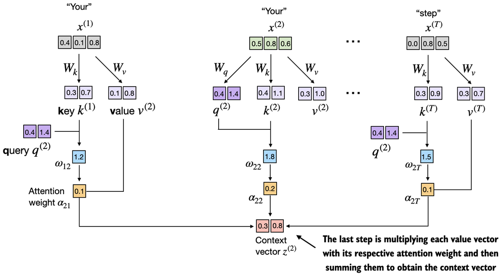
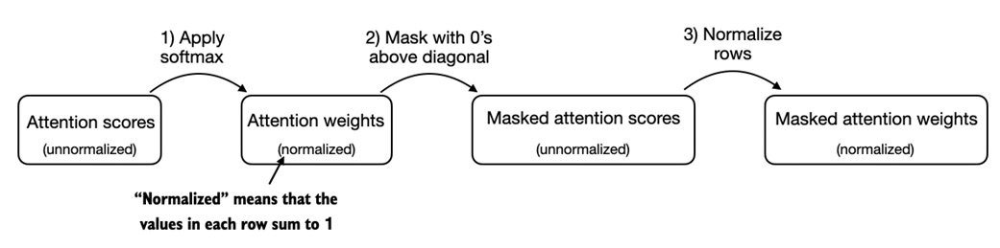

## 3. 编码注意力机制

> **本章涵盖**
>
> - 探索神经网络中使用注意力机制的原因
> - 引入基本的自注意力框架并逐步发展为增强的自注意力机制
> - 实现因果注意力模块，允许 LLM 一次生成一个 token
> - 用 dropout 掩盖随机选择的注意力权重以减少过拟合
> - 将多个因果注意力模块堆叠成多头注意力模块

在上一章中，您学习了如何准备用于训练 LLM 的输入文本。这涉及到将文本分割成单独的单词和子词 token，这些 token 可以被编码成向量表示，即所谓 LLM 的嵌入。

在本章中，我们将研究 LLM 架构本身的一个组成部分，即注意力机制，如图 3.1 所示。

> **图 3.1** 编码 LLM、在一般文本数据集上预训练 LLM 以及在标记数据集上对其进行微调的三个主要阶段的模型。本章重点介绍注意力机制，它是 LLM 架构的一个组成部分。


注意力机制是一个综合性的主题，这就是我们用整整一章来讨论它的原因。我们将主要独立地看待这些注意力机制，并在机制层面上关注它们。在下一章中，我们将围绕自注意力机制对 LLM 的其余部分进行编码，以查看它的实际效果并创建一个模型来生成文本。

本章中，我们将实现注意力机制的四种不同变体，如图 3.2 所示。

> **图 3.2** 该图描绘了我们将在本章中编码的不同注意机制，从自注意的简化版本开始，然后添加可训练权重。因果注意力机制为自注意力添加了一个掩码，允许 LLM 一次生成一个单词。最后，多头注意力将注意力机制组织成多个头，使模型能够并行捕获输入数据的各个方面。


图 3.2 中所示的这些不同的注意力变体相互构建，目标是在本章末尾实现紧凑且高效的多头注意力实现，然后我们可以将其插入到我们将在下一章编码的 LLM 架构中。

### 3.1 长序列建模的问题

在我们深入探讨本章后面的 LLM 核心的自注意力机制之前，先了解一下 LLM 之前没有注意力机制的架构有什么问题？ 假设我们想要开发一种语言翻译模型，将文本从一种语言翻译成另一种语言。如图 3.3 所示，由于源语言和目标语言的语法结构，我们不能简单地逐字翻译文本。

> **图 3.3 ** 将文本从一种语言翻译为另一种语言（例如将德语翻译为英语）时，不可能仅逐字翻译。相反，翻译过程需要上下文理解和语法对齐。


为了解决我们无法逐字翻译文本的问题，通常使用具有两个子模块的深度神经网络，即所谓的编码器 (encoder) 和解码器 (decoder)。编码器的工作是首先读入并处理整个文本，然后解码器生成翻译后的文本。

当我们在第 1 章（第 1.4 节，将 LLM 用于不同任务）中介绍 Transformer 架构时，我们已经简要讨论了编码器-解码器网络。在 Transformer 出现之前，循环神经网络 (RNN) 是最流行的语言翻译编码器-解码器架构。

RNN 是一种神经网络，其中先前步骤的输出被作为当前步骤的输入，这使得它们非常适合文本等序列数据。如果您不熟悉 RNN，请不要担心，您不需要了解 RNN 的详细工作原理即可跟随本讨论； 我们这里的重点更多是编码器-解码器设置的一般概念。

在编码器-解码器 RNN 中，输入文本被送入编码器，编码器按顺序对其进行处理。编码器在每一步都会更新其隐藏状态（隐藏层的内部值），试图在最终隐藏状态中捕获输入句子的完整含义，如图 3.4 所示。然后，解码器采用最终的隐藏状态开始生成翻译的句子，一次一个单词。它还在每一步更新其隐藏状态，该隐藏状态应该携带下一个单词预测所需的上下文。

> **图 3.4** 在 Transformer 模型出现之前，编码器-解码器 RNN 是机器翻译的流行选择。编码器将源语言中的标记序列作为输入，其中编码器的隐藏状态（中间神经网络层）对整个输入序列的压缩表示进行编码。然后，解码器使用其当前的隐藏状态开始逐个标记的翻译。


虽然我们不需要知道这些编码器-解码器 RNN 的内部工作原理，但这里的关键思想是编码器部分将整个输入文本处理为隐藏状态（存储单元）。然后解码器采用该隐藏状态来产生输出。您可以将此隐藏状态视为嵌入向量，这是我们在第 2 章中讨论的概念。

编码器-解码器 RNN 的最大问题和限制是，RNN 无法在解码阶段直接从编码器访问早期隐藏状态。因此，它仅依赖于当前隐藏状态，其中封装了所有相关信息。这可能会导致上下文丢失，尤其是在依赖关系可能跨越很长距离的复杂句子中。

对于不熟悉 RNN 的读者来说，没有必要理解或研究这种架构，因为我们不会在本书中使用它。本节的要点是编码器-解码器 RNN 有一个缺点，这激发了注意力机制的设计。

### 3.2 使用注意力机制捕获数据依赖性

在 Transformer LLM 之前，如前所述，通常使用 RNN 来执行语言建模任务，例如语言翻译。RNN 可以很好地翻译短句子，但不能很好地翻译较长的文本，因为它们无法直接访问输入中的先前单词。

这种方法的一个主要缺点是 RNN 必须记住单个隐藏状态下的整个编码输入，然后再将其传递给解码器，如上一节中的图 3.4 所示。

因此，研究人员在 2014 年为 RNN 开发了所谓的 Bahdanau 注意力机制（以相应论文的第一作者的名字命名），该机制修改了编码器-解码器 RNN，使得解码器可以在每次解码步骤时选择性地访问输入序列的不同部分，如图 3.5 所示。

> **图 3.5** 使用注意力机制，网络的文本生成解码器部分可以有选择地访问所有输入 token。这意味着对于生成给定的输出 token，某些输入 token 比其他输入 token 更重要。重要性由所谓的注意力权重决定，我们稍后将计算该权重。请注意，该图显示了注意力背后的总体思想，并未描述 Bahdanau 机制的确切实现，这是本书范围之外的 RNN 方法。


有趣的是，仅仅三年后，研究人员发现构建自然语言处理的深度神经网络不需要 RNN 架构，并提出了原始的 Transformer 架构（在第一章中讨论），其具有受 Bahdanau 注意力机制启发的自注意力机制。

自注意力是一种机制，允许输入序列中的每个位置在计算序列的表示时关注同一序列中的所有位置。自注意力是基于 Transformer 架构的当代 LLM 的关键组成部分，例如 GPT 系列。

本章重点是编码和理解类似 GPT 模型中使用的自注意力机制，如图 3.6 所示。在下一章中，我们将编写 LLM 的其余部分。

> **图 3.6** 自注意力是 Transformer 中的一种机制，用于通过允许序列中的每个位置与同一序列中的所有其他位置交互并权衡其重要性来计算更有效的输入表示。在本章中，我们将从头开始编写这种自注意力机制，然后再在下一章中编写类似 GPT 的 LLM 的其余部分。


### 3.3 通过自注意力来关注输入的不同部分

现在，我们将深入研究自注意力机制的内部工作原理，并学习如何从头开始对其进行编码。自注意力是每个基于 Transformer 架构的 LLM 的基石。值得注意的是，这个主题可能需要大量的关注和注意（没有双关语的意思），但是一旦你掌握了它的基础知识，你将克服这本书和实施 LLM 最困难的方面之一。

> **自注意中的「自」**
>
> 在自注意力中，「自」是指机制通过关联单个输入序列中的不同位置来计算注意力权重的能力。它评估和学习输入本身各个部分之间的关系和依赖关系，例如句子中的单词或图像中的像素。这与传统的注意力机制相反，传统的注意力机制关注的是两个不同序列的元素之间的关系，例如在序列到序列模型中，注意力可能位于输入序列和输出序列之间，例如示例 如图 3.5 所示。

由于自注意力可能看起来很复杂，特别是如果您是第一次遇到它，我们将在下一小节中首先介绍自注意力的简化版本。之后，在 3.4 节中，我们将实现具有可训练权重的自注意力机制，该机制在 LLM 中使用。

#### 3.3.1 一种无需可训练权重的简单自注意力机制

在本节中，我们实现了自注意力的简化变体，没有任何可训练的权重，如图 3.7 所示。本节的目标是在第 3.4 节添加可训练权重之前说明自注意力的一些关键概念。

> **图 3.7** 自注意力的目标是为每个输入元素计算一个上下文向量，该向量结合了来自所有其他输入元素的信息。在此图中描绘的示例中，我们计算上下文向量 z(2)。每个输入元素对于计算 z(2) 的重要性或贡献由注意力权重 a21 到 α2T 确定。计算 z(2) 时，会根据输入元素 x(2) 和所有其他输入计算注意力权重。这些注意力权重的精确计算将在本节后面讨论。


图 3.7 显示了一个输入序列，表示为 x，由表示为 x(1) 到 x(T) 的 T 个元素组成。这个序列通常表示文本，例如一个句子，它已经被转换为标记嵌入，如第 2 章所述。

例如，考虑类似「Your journey starts with one step」的输入文本。在这种情况下，序列的每个元素（例如 x(1)）对应于表示特定标记（例如「Your」）的 d 维嵌入向量。在图 3.7 中，这些输入向量显示为 3 维嵌入。

在自注意力中，我们的目标是计算输入序列中每个元素 x(i) 的上下文向量 z(i)。上下文向量可以解释为丰富的嵌入向量。

为了说明这个概念，让我们重点关注第二个输入元素的嵌入向量 x(2)（对应于 token 「journey」）以及相应的上下文向量 z(2)，如图 3.7 底部所示 。这个增强的上下文向量 z(2) 是一个嵌入，包含有关 x(2) 和所有其他输入元素 x(1) 到 x(T) 的信息。

在自注意力中，上下文向量起着至关重要的作用。它们的目的是通过合并序列中所有其他元素的信息来创建输入序列（如句子）中每个元素的丰富表示，如图 3.7 所示。这对于 LLM 来说至关重要，因为 LLM 需要理解句子中单词之间的关系和相关性。稍后，我们将添加可训练的权重，帮助 LLM 学习构建这些上下文向量，以便它们与 LLM 生成下一个标记相关。

在本节中，我们实现了一种简化的自注意力机制来一次一步地计算这些权重和生成的上下文向量。

考虑下面的输入句子，它已经嵌入到第 2 章中讨论的 3 维向量中。出于说明目的，我们选择一个小的嵌入维度，以确保它适合页面且没有换行符：

```python
import torch
inputs = torch.tensor(
  [[0.43, 0.15, 0.89], # Your     (x^1)
   [0.55, 0.87, 0.66], # journey  (x^2)
   [0.57, 0.85, 0.64], # starts   (x^3)
   [0.22, 0.58, 0.33], # with     (x^4)
   [0.77, 0.25, 0.10], # one      (x^5)
   [0.05, 0.80, 0.55]] # step     (x^6)
)
```

实现自注意力的第一步是计算中间值 ω，称为注意力分数，如图 3.8 所示。

> **图 3.8** 本节的总体目标是说明使用第二个输入序列 x(2) 作为查询来计算上下文向量 z(2)。该图显示了第一个中间步骤，计算查询 x(2) 和所有其他输入元素之间的注意力分数 ω 作为点积。


图 3.8 说明了我们如何计算查询 token 和每个输入 token 之间的中间注意力分数。我们通过计算查询 x(2) 与每个其他输入 token 的点积来确定这些分数：

```python
query = inputs[1]
attn_scores_2 = torch.empty(inputs.shape[0])
for i, x_i in enumerate(inputs):
 attn_scores_2[i] = torch.dot(x_i, query)
 print(attn_scores_2)
```

计算出的注意力分数如下：

```python
tensor([0.9544, 1.4950, 1.4754, 0.8434, 0.7070, 1.0865])
```

> **理解点积**
>
> 点积本质上只是将两个向量按元素相乘然后对乘积求和的简洁方法，我们可以如下演示：
>
> ```python
> res = 0.
> for idx, element in enumerate(inputs[0]):
>  res += inputs[0][idx] * query[idx]
> print(res)
> print(torch.dot(inputs[0], query))
> ```
>
> 输出证实逐元素乘法的总和给出与点积相同的结果：
>
> ```python
> tensor(0.9544)
> tensor(0.9544)
> ```

在下一步中，如图 3.9 所示，我们对之前计算的每个注意力分数进行标准化。

> **图 3.9** 在计算关于输入查询x(2)的注意力分数ω21至ω2T之后，下一步是通过标准化注意力分数来获得注意力权重α21至α2T。


图 3.9 所示标准化背后的主要目标是获得总和为 1 的注意力权重。这种标准化是一种约定，对于解释和维持 LLM 的训练稳定性很有用。这是实现此标准化步骤的简单方法：

```python
attn_weights_2_tmp = attn_scores_2 / attn_scores_2.sum()
print("Attention weights:", attn_weights_2_tmp)
print("Sum:", attn_weights_2_tmp.sum())
```

如输出所示，注意力权重现在总和为 1：

```python
Attention weights: tensor([0.1455, 0.2278, 0.2249, 0.1285, 0.1077, 0.1656])
Sum: tensor(1.0000)
```

在实践中，使用 softmax 函数进行归一化更为常见，也更可取。这种方法更擅长处理极值，并在训练期间提供更有利的梯度属性。下面是用于标准化注意力分数的 softmax 函数的基本实现：

```python
def softmax_naive(x):
 return torch.exp(x) / torch.exp(x).sum(dim=0)

attn_weights_2_naive = softmax_naive(attn_scores_2)
print("Attention weights:", attn_weights_2_naive)
print("Sum:", attn_weights_2_naive.sum())
```

如输出所示，softmax 函数也满足目标并将注意力权重归一化，使其总和为 1：

```python
Attention weights: tensor([0.1385, 0.2379, 0.2333, 0.1240, 0.1082, 0.1581])
Sum: tensor(1.)
```

请注意，在处理较大或较小的输入值时，这种朴素的 softmax 实现 (softmax_naive) 可能会遇到数值不稳定问题，例如上溢和下溢。因此，在实践中，建议使用 Softmax 的 PyTorch 实现，它已针对性能进行了广泛优化：

```python
attn_weights_2 = torch.softmax(attn_scores_2, dim=0)
print("Attention weights:", attn_weights_2)
print("Sum:",attn_weights_2.sum())
```

在这种情况下，我们可以看到它产生与之前的 softmax_naive 函数相同的结果：

```python
Attention weights: tensor([0.1385, 0.2379, 0.2333, 0.1240, 0.1082, 0.1581])
Sum: tensor(1.)
```

现在我们计算了归一化的注意力权重，我们准备好进行图 3.10 所示的最后一步：通过将嵌入的输入标记 x(i) 与相应的注意力权重相乘来计算上下文向量 z(2)，然后将结果向量加起来。

> **图 3.10** 在计算并标准化注意力分数以获得查询 x(2) 的注意力权重之后，最后一步是计算上下文向量 z(2)。该上下文向量是由注意力权重加权的所有输入向量 x(1) 到 x(T) 的组合。


图 3.10 中描述的上下文向量 z(2) 被计算为所有输入向量的加权和。这涉及将每个输入向量乘以其相应的注意力权重：

```python
query = inputs[1] # 2nd input token is the query
context_vec_2 = torch.zeros(query.shape)
for i, x_i in enumerate(inputs):
 context_vec_2 += attn_weights_2[i]*x_i
print(context_vec_2)
```

计算结果如下：

```python
tensor([0.4419, 0.6515, 0.5683])
```

在下一节中，我们将推广计算上下文向量的过程，以同时计算所有上下文向量。

#### 3.3.2 计算所有输入 token 的注意力权重

在上一节中，我们计算了输入 2 的注意力权重和上下文向量，如图 3.11 中突出显示的行所示。现在，我们要扩展此计算以计算所有输入的注意力权重和上下文向量。

> **图 3.11** 突出显示的行显示了作为查询的第二个输入元素的注意力权重，正如我们在上一节中计算的那样。本节概括了获得所有其他注意力权重的计算。


我们遵循与之前相同的三个步骤，如图 3.12 所示，不同之处在于我们对代码进行了一些修改以计算所有上下文向量，而不是仅计算第二个上下文向量 z(2)。

> **图 3.12** 在自注意力中，我们首先计算注意力分数，然后将其归一化以获得总和为 1 的注意力权重。这些注意力权重用于计算上下文向量作为输入的加权和。


首先，如图 3.12 所示，在步骤 1 中，我们添加一个额外的 for 循环来计算所有输入对的点积。

```python
attn_scores = torch.empty(6, 6)
for i, x_i in enumerate(inputs):
 for j, x_j in enumerate(inputs):
  attn_scores[i, j] = torch.dot(x_i, x_j)
print(attn_scores)
```

得到的注意力分数如下：

```python
tensor([[0.9995, 0.9544, 0.9422, 0.4753, 0.4576, 0.6310],
        [0.9544, 1.4950, 1.4754, 0.8434, 0.7070, 1.0865],
        [0.9422, 1.4754, 1.4570, 0.8296, 0.7154, 1.0605],
        [0.4753, 0.8434, 0.8296, 0.4937, 0.3474, 0.6565],
        [0.4576, 0.7070, 0.7154, 0.3474, 0.6654, 0.2935],
        [0.6310, 1.0865, 1.0605, 0.6565, 0.2935, 0.9450]])
```

前面张量中的每个元素代表每对输入之间的注意力分数，如图 3.11 所示。请注意，图 3.11 中的值是标准化的，这就是它们与前面张量中的非标准化注意力分数不同的原因。我们稍后将负责规范化。

在计算前面的注意力分数张量时，我们在Python中使用了for循环。然而，for 循环通常很慢，我们可以使用矩阵乘法获得相同的结果：

```python
attn_scores = input @ inputs.T
print(attn_scores)
```

我们可以直观地确认结果与之前相同：

```python
tensor([[0.9995, 0.9544, 0.9422, 0.4753, 0.4576, 0.6310],
        [0.9544, 1.4950, 1.4754, 0.8434, 0.7070, 1.0865],
        [0.9422, 1.4754, 1.4570, 0.8296, 0.7154, 1.0605],
        [0.4753, 0.8434, 0.8296, 0.4937, 0.3474, 0.6565],
        [0.4576, 0.7070, 0.7154, 0.3474, 0.6654, 0.2935],
        [0.6310, 1.0865, 1.0605, 0.6565, 0.2935, 0.9450]])
```

在步骤 2 中，如图 3.12 所示，我们现在对每一行进行标准化，以便每一行中的值总和为 1：

```python
attn_weights = torch.softmax(attn_scores, dim=1)
print(attn_weights)
```

这将返回以下与图 3.10 中所示值匹配的注意力权重张量：

```python
tensor([[0.2098, 0.2006, 0.1981, 0.1242, 0.1220, 0.1452],
        [0.1385, 0.2379, 0.2333, 0.1240, 0.1082, 0.1581],
        [0.1390, 0.2369, 0.2326, 0.1242, 0.1108, 0.1565],
        [0.1435, 0.2074, 0.2046, 0.1462, 0.1263, 0.1720],
        [0.1526, 0.1958, 0.1975, 0.1367, 0.1879, 0.1295],
        [0.1385, 0.2184, 0.2128, 0.1420, 0.0988, 0.1896]])
```

在继续进行步骤 3（图 3.12 中所示的最后一步）之前，我们先简单验证一下各行的总和是否确实都为 1：

```python
row_2_sum = sum([0.1385, 0.2379, 0.2333, 0.1240, 0.1082, 0.1581])
print("Row 2 sum:", row_2_sum)
print("All row sums:", attn_weights.sum(dim=1))
```

结果如下：

```python
Row 2 sum: 1.0
All row sums: tensor([1.0000, 1.0000, 1.0000, 1.0000, 1.0000, 1.0000])
```

在第三步也是最后一步中，我们现在使用这些注意力权重通过矩阵乘法计算所有上下文向量：

```python
all_context_vecs = attn_weights @ inputs
print(all_context_vecs)
```

在生成的输出张量中，每行包含一个 3 维上下文向量：

```python
tensor([[0.4421, 0.5931, 0.5790],
        [0.4419, 0.6515, 0.5683],
        [0.4431, 0.6496, 0.5671],
        [0.4304, 0.6298, 0.5510],
        [0.4671, 0.5910, 0.5266],
        [0.4177, 0.6503, 0.5645]])
```

我们可以通过将第二行与我们之前在 3.3.1 节中计算的上下文向量 z(2) 进行比较来仔细检查代码是否正确：

```python
print("Previous 2nd context vector:", context_vec_2)
```

根据结果，我们可以看到之前计算的`context_vec_2` 与之前张量中的第二行完全匹配：

```python
Previous 2nd context vector: tensor([0.4419, 0.6515, 0.5683])
```

一个简单的自注意力机制的代码演练到此结束。在下一节中，我们将添加可训练的权重，使 LLM 能够从数据中学习并提高其在特定任务上的表现。

### 3.4 使用可训练权重实现自注意力

在本节中，我们将实现原始 Transformer 架构、GPT 模型和大多数其他流行的 LLM 中使用的自注意力机制。这种自注意力机制也称为缩放点积注意力。图 3.13 提供了一个心理模型，说明了这种自我关注机制如何适应实现 LLM 的更广泛背景。

> **图 3.13** 一个心理模型说明我们在本节中编写的自注意力机制如何适应本书和章节的更广泛背景。在上一节中，我们编写了一个简化的注意力机制，以了解注意力机制背后的基本机制。在本节中，我们向此注意力机制添加可训练的权重。在接下来的部分中，我们将通过添加因果掩码和多个头来扩展这种自注意力机制。


如图 3.13 所示，具有可训练权重的自注意力机制建立在前面的概念之上：我们希望将上下文向量计算为特定于某个输入元素的输入向量的加权和。正如你将看到的，与我们之前在 3.3 节中编写的基本自注意力机制相比，只有细微的差别。

最显着的区别是引入了在模型训练期间更新的权重矩阵。这些可训练的权重矩阵至关重要，以便模型（特别是模型内的注意力模块）可以学习生成「好的」上下文向量。（请注意，我们将在第 5 章中训练 LLM。）

我们将在两小节中讨论这种自注意力机制。首先，我们将像以前一样逐步编码。其次，我们将把代码组织成一个紧凑的 Python 类，该类可以导入到 LLM 架构中，我们将在第 4 章中对其进行编码。

#### 3.4.1 逐步计算注意力权重

我们将通过引入三个可训练的权重矩阵Wq、Wk和Wv来逐步实现自注意力机制。这三个矩阵用于将嵌入的输入标记 x(i) 投影到查询、键和值向量中，如图 3.14 所示。

> **图 3.14** 在具有可训练权重矩阵的自注意力机制的第一步中，我们计算输入元素 x 的查询 (q)、键 (k) 和值 (v) 向量。与前面的部分类似，我们指定第二个输入 x(2) 作为查询输入。查询向量q(2)是通过输入x(2)和权重矩阵Wq之间的矩阵乘法获得的。类似地，我们通过涉及权重矩阵 Wk 和 Wv 的矩阵乘法获得键和值向量。


在 3.3.1 节的前面，我们在计算简化注意力权重以计算上下文向量 z(2) 时将第二个输入元素 x(2) 定义为查询。后来，在第 3.3.2 节中，我们将其推广到计算六字输入句子「Your journey starts with one step.」的所有上下文向量 z(1) ... z(T)。

同样，出于说明目的，我们将首先计算一个上下文向量 z(2)。在下一节中，我们将修改此代码以计算所有上下文向量。

让我们首先定义几个变量：

```python
x_2 = inputs[1]
d_in = inputs.shape[1]
d_out = 2
```

请注意，在类似 GPT 的模型中，输入和输出维度通常是相同的，但出于说明目的，为了更好地遵循计算，我们在这里选择不同的输入（`d_in=3`）和输出（`d=2`）维度。

接下来，我们初始化三个权重矩阵Wq、Wk和Wv，如图 3.14 所示：

请注意，出于说明目的，我们设置 `require_grad=False` 来减少输出中的混乱，但如果我们要使用权重矩阵进行模型训练，我们将设置 `require_grad=True` 来在模型训练期间更新这些矩阵。

接下来，我们计算查询、键和值向量，如图 3.14 所示：

```python
query_2 = x_2 @ W_query
key_2 = x_2 @ W_key
value_2 = x_2 @ W_value
print(query_2)
```

正如我们根据查询的输出所看到的，这会产生一个二维向量，因为我们通过 `d_out` 将相应权重矩阵的列数设置为 2：

```python
tensor([0.4306, 1.4551])
```

> **权重参数 VS 注意力权重**
>
> 请注意，在权重矩阵 W 中，术语「权重」是「权重参数」的缩写，即在训练期间优化的神经网络的值。不要将其与注意力权重混淆。正如我们在上一节中已经看到的，注意力权重决定了上下文向量依赖于输入的不同部分的程度，即网络在多大程度上关注输入的不同部分。
>
> 总之，权重参数是定义网络连接的基本学习系数，而注意力权重是动态的、特定于上下文的值。

尽管我们的临时目标是仅计算一个上下文向量 z(2)，但我们仍然需要所有输入元素的键和值向量，因为它们涉及计算相对于查询 q(2) 的注意力权重， 如图 3.14 所示。

我们可以通过矩阵乘法获得所有的键和值：

```python
keys = inputs @ W_key
values = inputs @ W_value
print("keys.shape:", keys.shape)
print("values.shape:", values.shape)
```

从输出中我们可以看出，我们成功地将 6 个输入标记从 3D 投影到 2D 嵌入空间：

```python
keys.shape: torch.Size([6, 2])
values.shape: torch.Size([6, 2])
```

现在第二步是计算注意力分数，如图 3.15 所示。

> **图 3.15** 注意力分数计算是一种点积计算，类似于我们在 3.3 节中简化的自注意力机制中使用的计算。这里的新方面是，我们不是直接计算输入元素之间的点积，而是使用通过各自的权重矩阵转换输入而获得的查询和键。


首先，我们计算注意力分数 ω22：

```python
keys_2 = keys[1]
attn_score_22 = query_2.dot(keys_2)
print(attn_score_22)
```

结果是以下非标准化注意力分数：

```python
tensor(1.8524)
```

同样，我们可以通过矩阵乘法将此计算推广到所有注意力分数：

```python
attn_scores_2 = query_2 @ keys.T # All attention scores for given query
print(attn_scores_2)
```

正如我们所看到的，作为快速检查，输出中的第二个元素与我们之前计算的 `attn_score_22` 匹配：

```python
tensor([1.2705, 1.8524, 1.8111, 1.0795, 0.5577, 1.5440])
```

第三步现在从注意力分数转向注意力权重，如图 3.16 所示。

> **图 3.16** 计算出注意力分数 ω 后，下一步是使用 softmax 函数对这些分数进行归一化以获得注意力权重 α。


接下来，如图 3.16 所示，我们使用之前使用的 softmax 函数计算注意力权重。与之前的不同之处在于，我们现在通过将注意力分数除以键的嵌入维度的平方根来缩放注意力分数（请注意，取平方根在数学上与乘以 0.5 求幂相同）：

```python
d_k = keys.shape[-1]
attn_weights_2 = torch.softmax(attn_scores_2 / d_k ** 0.5, dim=-1)
print(attn_weights_2)
```

得到的注意力权重如下：

```python
tensor([0.1500, 0.2264, 0.2199, 0.1311, 0.0906, 0.1820])
```

> **尺度点积关注背后的基本原理**
>
> 通过嵌入维度大小进行归一化的原因是为了通过避免小梯度来提高训练性能。例如，当扩大嵌入维度时（对于类似 GPT 的 LLM，嵌入维度通常大于千），由于应用了 softmax 函数，大点积可能会在反向传播期间导致非常小的梯度。随着点积的增加，softmax 函数的行为更像阶跃函数，导致梯度接近于零。这些小梯度会大大减慢学习速度或导致训练停滞。
>
> 通过嵌入维度的平方根进行缩放是这种自注意力机制也称为缩放点积注意力的原因。

现在，最后一步是计算上下文向量，如图 3.17 所示。

> **图 3.17** 在自注意力计算的最后一步，我们通过注意力权重组合所有值向量来计算上下文向量。



与第 3.3 节类似，我们将上下文向量计算为输入向量的加权和，现在我们将上下文向量计算为值向量的加权和。这里，注意力权重用作权重因子，对每个值向量各自的重要性进行加权。与3.3节类似，我们可以使用矩阵乘法一步获得输出：

```python
context_vec_2 = attn_weights_2 @ values
print(context_vec_2)
```

所得向量的内容如下：

```python
tensor([0.3061, 0.8210])
```

到目前为止，我们只计算了一个上下文向量 z(2)。在下一节中，我们将推广代码来计算输入序列 z(1) 到 z(T) 中的所有上下文向量。

> **为什么是 query, key 和 value**
>
> 注意力机制上下文中的术语「key」、「query」和「value」借用自信息检索和数据库领域，其中类似的概念用于存储、搜索和检索信息。
>
> 「query」类似于数据库中的搜索查询。它代表模型关注或试图理解的当前项目（例如，句子中的单词或 token）。该查询用于探测输入序列的其他部分，以确定对它们的关注程度。
>
> 「key」就像用于索引和搜索的数据库键。在注意力机制中，输入序列中的每个项目（例如，句子中的每个单词）都有一个关联的键。这些键用于与查询匹配。
>
> 此上下文中的「value」类似于数据库中键值对中的值。它表示输入项的实际内容或表示。一旦模型确定哪些键（以及输入的哪些部分）与查询（当前焦点项）最相关，它就会检索相应的值。

#### 3.4.2 实现一个紧凑的自注意力 Python 类

在前面的部分中，我们已经完成了许多步骤来计算自注意力输出。这主要是为了说明目的，以便我们可以一次完成一个步骤。在实践中，考虑到下一章中的 LLM 实现，将此代码组织到 Python 类中会很有帮助，如下所示：

```python
# 清单 3.1 紧凑的自注意力类
import torch.nn as nn
class SelfAttention_v1(nn.Module):
 def __init__(self, d_in, d_out):
  super().__init__()
  self.d_out = d_out
  self.W_query = nn.Parameter(torch.rand(d_in, d_out))
  self.W_key = nn.Parameter(torch.rand(d_in, d_out))
  self.W_value = nn.Parameter(torch.rand(d_in, d_out))
  
 def forward(self, x):
  keys = x @ self.W_key
  queries = x @ self.W_query
  values = x @ self.W_value
  attn_scores = queries @ keys.T # omega
  attn_weights = torch.softmax(attn_scores / keys.shape[-1] ** 0.5, dim=-1)
  context_vec = attn_weights @ values
  return context_vec
```

在此 PyTorch 代码中，`SelfAttention_v1` 是从 nn.Module 派生的类，它是 PyTorch 模型的基本构建块，为模型层创建和管理提供必要的功能。

`__init__` 方法初始化 query、key 和 value 的可训练权重矩阵（`W_query`、`W_key` 和 `W_value`），每个矩阵将输入维度 `d_in` 转换为输出维度 `d_out`。

在前向传递过程中，使用前向方法，我们通过将 query 和 key 相乘来计算注意力分数 (attn_scores)，并使用 softmax 标准化这些分数。最后，我们通过使用这些标准化注意力分数对 value 进行加权来创建上下文向量。

我们可以如下使用这个类：

```python
torch.manual_seed(123)
sa_v1 = SelfAttention_v1(d_in, d_out)
print(sa_v1(inputs))
```

由于 `input` 包含六个嵌入向量，因此会产生一个存储六个上下文向量的矩阵：

```python
tensor([[0.2996, 0.8053],
        [0.3061, 0.8210],
        [0.3058, 0.8203],
        [0.2948, 0.7939],
        [0.2927, 0.7891],
        [0.2990, 0.8040]], grad_fn=<MmBackward0>)
```

作为快速检查，请注意第二行 (`[0.3061, 0.8210]`) 如何与上一节中 `context_vec_2` 的内容匹配。

图 3.18 总结了我们刚刚实现的自注意力机制。

> **图 3.18** 在自注意力中，我们使用三个权重矩阵 Wq、Wk 和 Wv 来变换输入矩阵 X 中的输入向量。然后，我们根据结果 query（Q）和 key（K）计算注意力权重矩阵。然后，我们使用注意力权重和 value (V) 计算上下文向量 (Z)。（为了视觉清晰度，我们在此图中关注具有 n 个标记的单个输入文本，而不是一批多个输入。因此，在这种情况下，3D 输入张量被简化为 2D 矩阵。这种方法允许更直接的可视化 以及对所涉及过程的理解。）


如图 3.18 所示，自注意力涉及可训练的权重矩阵 Wq、Wk 和 Wv。这些矩阵将输入数据转换为 query、key 和 value，它们是注意力机制的重要组成部分。随着模型在训练过程中接触到更多数据，它会调整这些可训练权重，正如我们将在接下来的章节中看到的那样。

我们可以利用 PyTorch 的 `nn.Linear` 层进一步改进`SelfAttention_v1` 实现，该层在禁用偏置单元时有效地执行矩阵乘法。此外，使用 `nn.Linear` 而不是手动实现 `nn.Parameter(torch.rand(...))` 的一个显着优势是 `nn.Linear` 具有优化的权重初始化方案，有助于更稳定、更有效的模型训练。

```python
# 清单 3.2 使用 PyTorch Linear 层的自注意力类
class SelfAttention_v2(nn.Module):
 def __init__(self, d_in, d_out, qkv_bias=False):
  super().__init__()
  self.d_out = d_out
  self.W_query = nn.Linear(d_in, d_out, bias=qkv_bias)
  self.W_key = nn.Linear(d_in, d_out, bias=qkv_bias)
  self.W_value = nn.Linear(d_in, d_out, bias=qkv_bias)
  
 def forward(self, x):
  keys = self.W_key(x)
  queries = self.W_query(x)
  values = self.W_value(x)
  attn_weights = torch.softmax(attn_scores / keys.shape[-1] ** 0.5, dim=-1)
  context_vec = attn_weights @ values
  return context_vec
```

您可以使用类似于 `SelfAttention_v1` 的 `SelfAttention_v2`。但是，请注意，`SelfAttention_v1` 和 `SelfAttention_v2` 给出不同的输出，因为它们对权重矩阵使用不同的初始权重，因为 `nn.Linear` 使用更复杂的权重初始化方案。

> **练习 3.1 比较 SELFATTENTION_V1 和 SELFATTENTION_V2**
>
> 请注意，`SelfAttention_v2` 中的 `nn.Linear` 使用与 `SelfAttention_v1` 中使用的 `nn.Parameter(torch.rand(d_in, d_out))` 不同的权重初始化方案，这导致两种机制产生不同的结果。为了检查 `SelfAttention_v1` 和 `SelfAttention_v2` 这两个实现在其他方面是否相似，我们可以将权重矩阵从 `SelfAttention_v2` 对象转移到 `SelfAttention_v1`，以便两个对象产生相同的结果。
>
> 您的任务是将 `SelfAttention_v2` 实例的权重正确分配给 `SelfAttention_v1` 实例。为此，您需要了解两个版本中权重之间的关系。（提示：`nn.Linear` 以转置形式存储权重矩阵。）分配后，您应该观察到两个实例产生相同的输出。

在下一节中，我们将增强自注意力机制，特别关注合并因果和多头元素。因果方面涉及修改注意力机制，以防止模型访问序列中的未来信息，这对于语言建模等任务至关重要，其中每个单词预测应该仅依赖于之前的单词。

多头组件涉及将注意力机制分成多个「头」。每个头学习数据的不同方面，使模型能够同时处理来自不同位置的不同表示子空间的信息。这提高了模型在复杂任务中的性能。

### 3.5 通过因果关注隐藏未来的单词

在本节中，我们修改标准的自注意力机制以创建因果注意力机制，这对于后续章节中开发 LLM 至关重要。

因果注意力，也称为屏蔽注意力，是自我注意力的一种特殊形式。它限制模型在处理任何给定 token 时仅考虑序列中先前和当前的输入。这与标准的自注意力机制形成对比，标准的自注意力机制允许一次访问整个输入序列。

因此，在计算注意力分数时，因果注意力机制确保模型仅考虑序列中当前 token 处或之前出现的 token。

为了在类似 GPT 的 LLM 中实现这一点，对于处理的每个标记，我们屏蔽掉输入文本中当前 token 之后的未来 token，如图 3.19 所示。

> **图 3.19** 在因果注意力中，我们屏蔽了对角线上方的注意力权重，这样对于给定的输入，LLM 在使用注意力权重计算上下文向量时无法访问未来的标记。例如，对于第二行中的单词「journey」，我们只保留之前的单词（「Your」）和当前位置的单词（「journey」）的注意力权重。


如图 3.19 所示，我们屏蔽掉对角线上方的注意力权重，并对未屏蔽的注意力权重进行归一化，使得每行的注意力权重总和为 1。在下一节中，我们将在代码中实现此屏蔽和标准化过程。

#### 3.5.1 应用因果注意力屏蔽

在本节中，我们在代码中实现因果注意屏蔽。我们从图 3.20 中总结的过程开始。

> **图 3.20** 在因果注意力中获得屏蔽注意力权重矩阵的一种方法是将 softmax 函数应用于注意力分数，将对角线上方的元素归零并对结果矩阵进行归一化。



为了实现应用因果注意力屏蔽以获得如图 3.20 所示的屏蔽注意力权重的步骤，让我们使用上一节中的注意力分数和权重来编码因果注意力机制。

```python
attn_weights = torch.softmax(attn_scores / keys.shape[-1] ** 0.5, dim=1)
print(attn_weights)
```

这会产生以下注意力权重：

```python
tensor([[0.1972, 0.1910, 0.1894, 0.1361, 0.1344, 0.1520],
        [0.1476, 0.2164, 0.2134, 0.1365, 0.1240, 0.1621],
        [0.1479, 0.2157, 0.2129, 0.1366, 0.1260, 0.1608],
        [0.1505, 0.1952, 0.1933, 0.1525, 0.1375, 0.1711],
        [0.1571, 0.1874, 0.1885, 0.1453, 0.1819, 0.1399],
        [0.1473, 0.2033, 0.1996, 0.1500, 0.1160, 0.1839]])
```

我们可以使用 PyTorch 的 `tril` 函数来实现图 3.20 中的步骤 2，以创建一个屏蔽，其中对角线上方的值为零：

```python
block_size = attn_scores.shape[0]
mask_simple = torch.tril(torch.ones(block_size, block_size))
print(mask_simple)
```

得到的掩码如下：

```python
tensor([[1., 0., 0., 0., 0., 0.],
        [1., 1., 0., 0., 0., 0.],
        [1., 1., 1., 0., 0., 0.],
        [1., 1., 1., 1., 0., 0.],
        [1., 1., 1., 1., 1., 0.],
        [1., 1., 1., 1., 1., 1.]])
```

现在，我们可以将此掩码与注意力权重相乘，以将对角线上方的值归零：

```python
masked_simple = attn_weights * mask_simple
print(masked_simple)
```

正如我们所看到的，对角线上方的元素已成功归零：

```python
tensor([[0.1972, 0.0000, 0.0000, 0.0000, 0.0000, 0.0000],
        [0.1476, 0.2164, 0.0000, 0.0000, 0.0000, 0.0000],
        [0.1479, 0.2157, 0.2129, 0.0000, 0.0000, 0.0000],
        [0.1505, 0.1952, 0.1933, 0.1525, 0.0000, 0.0000],
        [0.1571, 0.1874, 0.1885, 0.1453, 0.1819, 0.0000],
        [0.1473, 0.2033, 0.1996, 0.1500, 0.1160, 0.1839]])
```

图 3.20 中的第三步是重新规范化注意力权重，使其每行的总和再次为 1。我们可以通过将每行中的每个元素除以每行中的总和来实现此目的：

```python
row_sums = masked_simple.sum(dim=1, keepdim=True)
masked_simple_norm = masked_simple / row_sums
print(masked_simple_norm)
```

结果是一个注意力权重矩阵，其中对角线上方的注意力权重被清零，并且行总和为 1：

```python
tensor([[1.0000, 0.0000, 0.0000, 0.0000, 0.0000, 0.0000],
        [0.4056, 0.5944, 0.0000, 0.0000, 0.0000, 0.0000],
        [0.2566, 0.3741, 0.3693, 0.0000, 0.0000, 0.0000],
        [0.2176, 0.2823, 0.2796, 0.2205, 0.0000, 0.0000],
        [0.1826, 0.2178, 0.2191, 0.1689, 0.2115, 0.0000],
        [0.1473, 0.2033, 0.1996, 0.1500, 0.1160, 0.1839]])
```

虽然我们现在可以在技术上完成因果注意力的实现，但我们可以利用 softmax 函数的数学特性，以更少的步骤更有效地实现屏蔽注意力权重的计算，如图 3.21 所示。

> **图 3.21** 在因果注意力中获得屏蔽注意力权重矩阵的更有效方法是在应用 softmax 函数之前用负无穷大值屏蔽注意力分数。


softmax 函数将其输入转换为概率分布。当负无穷大值 (-∞) 连续存在时，softmax 函数将它们视为零概率。（从数学上讲，这是因为 e-∞ 接近 0。）

我们可以通过创建对角线上方带有 1 的掩码，然后用负无穷 (`-inf`) 值替换这些 1，来实现这种更有效的掩码「技巧」：

```python
mask = torch.triu(torch.ones(block_size, block_size), diagonal=1)
masked = attn_scores.masked_fill(mask.bool(), -torch.inf)
print(masked)
```

这会产生以下掩码：

```python
tensor([[0.9995,   -inf,   -inf,   -inf,   -inf,   -inf],
        [0.9544, 1.4950,   -inf,   -inf,   -inf,   -inf],
        [0.9422, 1.4754, 1.4570,   -inf,   -inf,   -inf],
        [0.4753, 0.8434, 0.8296, 0.4937,   -inf,   -inf],
        [0.4576, 0.7070, 0.7154, 0.3474, 0.6654,   -inf],
        [0.6310, 1.0865, 1.0605, 0.6565, 0.2935, 0.9450]])
```

现在，我们需要做的就是将 softmax 函数应用于这些屏蔽结果，我们就完成了：

```python
attn_weights = torch.softmax(masked / keys.shape[-1] ** 0.5, dim=1)
print(attn_weights)
```

从输出中我们可以看到，每行中的值之和为 1，无需进一步标准化：

```python
tensor([[1.0000, 0.0000, 0.0000, 0.0000, 0.0000, 0.0000],
        [0.4056, 0.5944, 0.0000, 0.0000, 0.0000, 0.0000],
        [0.2566, 0.3741, 0.3693, 0.0000, 0.0000, 0.0000],
        [0.2176, 0.2823, 0.2796, 0.2205, 0.0000, 0.0000],
        [0.1826, 0.2178, 0.2191, 0.1689, 0.2115, 0.0000],
        [0.1473, 0.2033, 0.1996, 0.1500, 0.1160, 0.1839]])
```

我们现在可以使用修改后的注意力权重通过 `context_vec = attn_weights @ values` 来计算上下文向量，如第 3.4 节所示。然而，在下一节中，我们首先介绍对因果注意机制的另一个小调整，这对于减少训练 LLM 时的过度拟合很有用。

#### 3.5.2 用 dropout 掩盖额外的注意力权重

深度学习中的 Dropout 是一种在训练过程中忽略随机选择的隐藏层单元的技术，从而有效地将它们「丢弃」。此方法通过确保模型不会过度依赖任何特定的隐藏层单元集来帮助防止过度拟合。需要强调的是，dropout 仅在训练期间使用，之后就被禁用。

在 Transformer 架构中，包括 GPT 等模型，注意力机制中的 dropout 通常应用于两个特定领域：计算注意力分数之后或将注意力权重应用于值向量之后。

在这里，我们将在计算注意力权重后应用 dropout mask，如图 3.22 所示，因为它是实践中更常见的变体。

> **图 3.22** 使用因果注意力掩模（左上），我们应用额外的 dropout 掩码（右上）将额外的注意力权重归零，以减少训练期间的过度拟合。


在下面的代码示例中，我们使用 50% 的丢弃率，这意味着屏蔽掉一半的注意力权重。（当我们在后面的章节中训练 GPT 模型时，我们将使用较低的 dropout 率，例如 0.1 或0.2。）

在下面的代码中，为了说明目的，我们首先将 PyTorch 的 dropout 实现应用于由 1 组成的 6×6 张量：

```python
torch.manual_seed(123)
dropout = torch.nn.Dropout(0.5)
example = torch.ones(6, 6)
print(dropout(example))
```

正如我们所看到的，大约一半的值被清零：

```python
tensor([[2., 2., 0., 2., 2., 0.],
        [0., 0., 0., 2., 0., 2.],
        [2., 2., 2., 2., 0., 2.],
        [0., 2., 2., 0., 0., 2.],
        [0., 2., 0., 2., 0., 2.],
        [0., 2., 2., 2., 2., 0.]])
```

当将 dropout 应用于注意力权重矩阵时，比率为 50%，矩阵中的一半元素被随机设置为零。为了补偿活动元素的减少，矩阵中剩余元素的值按比例放大 1/0.5 =2。这种缩放对于保持注意力权重的整体平衡至关重要，确保注意力机制的平均影响力在训练和推理阶段保持一致。

现在，让我们将 dropout 应用于注意力权重矩阵本身：

```python
torch.manual_seed(123)
print(dropout(attn_weights))
```

由此产生的注意力权重矩阵现在将其他元素清零，并重新调整其余元素：

```python
tensor([[2.0000, 0.0000, 0.0000, 0.0000, 0.0000, 0.0000],
        [0.0000, 0.0000, 0.0000, 0.0000, 0.0000, 0.0000],
        [0.5132, 0.7482, 0.7386, 0.0000, 0.0000, 0.0000],
        [0.0000, 0.5646, 0.5592, 0.0000, 0.0000, 0.0000],
        [0.0000, 0.4357, 0.0000, 0.3378, 0.0000, 0.0000],
        [0.0000, 0.4065, 0.3991, 0.2999, 0.2320, 0.0000]])
```

了解因果注意力和 dropout masking 后，我们将在下一节中开发一个简洁的 Python 类。此类旨在促进这两种技术的有效应用。

#### 3.5.3 实现紧凑的因果注意力类

在本节中，我们现在将把因果注意力和 dropout 修改合并到我们在 3.4 节中开发的 `SelfAttention` Python 类中。这个类将作为下一节中开发多头注意力的模板，这是我们在本章中实现的最终注意力类。

但在开始之前，还有一件事是确保代码可以处理由多个输入组成的批次，以便 `CausalAttention` 类支持我们在第 2 章中实现的数据加载器生成的批次输出。

为简单起见，为了模拟此类批量输入，我们复制输入文本示例：

```python
batch = torch.stack((inputs, inputs), dim=0)
print(batch.shape)
```

这会产生一个由 2 个输入文本组成的 3D 张量，每个输入文本有 6 个标记，其中每个标记都是一个 3 维嵌入向量：

```python
torch.Size([2, 6, 3])
```

下面的 `CausalAttention` 类与我们之前实现的 `SelfAttention` 类类似，只是我们现在添加了 dropout 和 causal mask 组件，如以下代码中突出显示的：

```python
# 清单 3.3 紧凑的因果注意力类
class CasualAttention(nn.Module):
 def __init__(self, d_in, d_out, block_size, dropout, qkv_bias=False):
  super().__init__()
  self.d_out = d_out
  self.W_query = nn.Linear(d_in, d_out, bias=qkv_bias)
  self.W_key = nn.Linear(d_in, d_out, bias=qkv_bias)
  self.W_value = nn.Linear(d_in, d_out, bias=qkv_bias)
  self.dropout = nn.Dropout(dropout)
  self.register_buffer('mask', torch.triu(torch.ones(block_size, block_size), diagonal=1))
 
 def forward(self, x):
  b, num_tokens, d_in = x.shape # C New batch dimension b
  keys = self.W_key(x)
  queries = self.W_query(x)
  values = self.W_value(x)
  
  attn_scores = queries @ keys.transpose(1, 2)
  attn_scores.masked_fill_(self.mask.bool()[:num_tokens, :num_tokens], -torch.inf)
  attn_weights = torch.softmax(attn_scores / keys.shape[-1]**0.5, dim=1)
  
  context_vec = attn_weights @ values
  return context_vec
```

虽然所有添加的代码行在前面的部分中应该很熟悉，但我们现在在`__init__` 方法中添加了 `self.register_buffer()` 调用。在 PyTorch 中使用 `register_buffer` 并不是所有用例都严格必需的，但在这里提供了几个优点。例如，当我们在 LLM 中使用 `CausalAttention` 类时，缓冲区会与我们的模型一起自动移动到适当的设备（CPU 或 GPU），这在以后的章节中训练 LLM 时将是相关的。这意味着我们不需要手动确保这些张量与模型参数位于同一设备上，从而避免设备不匹配错误。

我们可以像下面这样使用 `CausalAttention` 类，类似于之前的 `SelfAttention`：

```python
torch.manual_seed(123)
block_size = batch.shape[1]
ca = CasualAttention(d_in, d_out, block_size, 0.0)
context_vecs = ca(batch)
print("context_vecs.shape:", context_vecs.shape)
```

生成的上下文向量是一个 3D 张量，其中每个标记现在由 2D 嵌入表示：

```python
context_vecs.shape: torch.Size([2, 6, 2])
```

图 3.23 提供了一个心理模型，总结了我们迄今为止所取得的成就。

> **图 3.23** 一个心理模型总结了我们在本章中编码的四种不同的注意力模块。我们从简化的注意力机制开始，添加可训练的权重，然后添加随意的注意力蒙版。在本章的剩余部分中，我们将扩展因果注意力机制并编码多头注意力，这是我们将在下一章的 LLM 实现中使用的最终模块。


如图 3.23 所示，在本节中，我们重点关注神经网络中因果注意力的概念和实现。在下一节中，我们将扩展这个概念并实现一个多头注意力模块，该模块并行实现多个此类因果注意力机制。

### 3.6 将单头注意力扩展到多头注意力

在本章的最后一节中，我们将之前实现的因果注意力类扩展到多头。这也称为多头注意力。

术语「多头」是指将注意力机制划分为多「头」，每个头独立运行。在这种情况下，单个因果注意力模块可以被视为单头注意力，其中只有一组注意力权重顺序处理输入。

在下面的小节中，我们将解决从因果注意力到多头注意力的扩展。第一小节将通过堆叠多个 `CausalAttention` 模块来直观地构建多头注意力模块以进行说明。然后，第二小节将以更复杂但计算更有效的方式实现相同的多头注意力模块。

#### 3.6.1 堆叠多个单头注意力层

实际上，实现多头注意力涉及创建自注意力机制的多个实例（如前面第 3.4.1 节的图 3.18 所示），每个实例都有自己的权重，然后组合它们的输出。使用自注意力机制的多个实例可能需要大量计算，但这对于基于 Transformer 的 LLM 等模型所熟知的复杂模式识别至关重要。

图 3.24 说明了多头注意力模块的结构，它由多个单头注意力模块组成，如图 3.xx 所示，相互堆叠。

> **图 3.24** 该图中的多头注意力模块描绘了两个相互堆叠的单头注意力模块。因此，在具有两个头的多头注意力模块中，我们现在有两个值权重矩阵：Wv1 和 Wv2，而不是使用单个矩阵 Wv 来计算值矩阵。这同样适用于其他权重矩阵Wq和Wk。我们获得两组上下文向量 Z1 和 Z2，可以将它们组合成单个上下文向量矩阵 Z。


如前所述，多头注意力背后的主要思想是使用不同的学习线性投影多次（并行）运行注意力机制——输入数据（如查询、键和值向量）相乘的结果。注意机制）通过权重矩阵。

在代码中，我们可以通过实现一个简单的 `MultiHeadAttentionWrapper` 类来实现这一点，该类堆叠了我们之前实现的 `CausalAttention` 模块的多个实例：

```python
# 清单 3.4 实现多头注意力的包装类
class MultiHeadAttentionWrapper(nn.Module):
 def __init__(self, d_in, d_out, block_size, dropout, num_heads, qkv_bias=False):
  super().__init__()
  self.heads = nn.ModuleList([CasualAttention(d_in, d_out, block_size, dropout, qkv_bias) for _ in range(num_heads)])
 def forward(self, x):
  return torch.cat([head(x) for head in self.heads], dim=-1)
```

例如，如果我们使用具有两个注意力头（通过 `num_heads=2`）和 CausalAttention 输出维度 `d_out=4` 的 MultiHeadAttentionWrapper 类，则会产生 4 维上下文向量（`d_out*num_heads=4`），如图 3.22 所示。

> **图3.25** 使用 `MultiHeadAttentionWrapper`，我们指定了注意力头的数量 (`num_heads`)。如果我们设置 `num_heads=2`，如图所示，我们得到一个具有两组上下文向量矩阵的张量。在每个上下文向量矩阵中，行表示与标记对应的上下文向量，列对应于通过 `d_out=2` 指定的嵌入维度。我们沿着列维度连接这些上下文向量矩阵。由于我们有 2 个注意力头且嵌入维度为 4，因此最终的嵌入维度为 2 × 2 = 4。


为了用一个具体的例子进一步说明图3.25，我们可以使用类似于之前 `CausalAttention` 类的 `MultiHeadAttentionWrapper` 类：

```python
torch.manual_seed(123)
block_size = batch.shape[1] # This is the number of tokens
d_in, d_out = 3, 2
mha = MultiHeadAttentionWrapper(d_in, d_out, block_size, 0.0, num_heads=2)
context_vecs = mha(batch)

print(context_vecs)
print("context_vecs.shape:", context_vecs.shape)
```

这会产生以下表示上下文向量的张量：

```python
tensor([[[-0.0844,  0.0414,  0.0766,  0.0171],
         [-0.2264, -0.0039,  0.2143,  0.1185],
         [-0.4163, -0.0564,  0.3878,  0.2453],
         [-0.5014, -0.1011,  0.4992,  0.3401],
         [-0.7754, -0.1867,  0.7387,  0.4868],
         [-1.1632, -0.3303,  1.1224,  0.8460]],
 
        [[-0.0844,  0.0414,  0.0766,  0.0171],
         [-0.2264, -0.0039,  0.2143,  0.1185],
         [-0.4163, -0.0564,  0.3878,  0.2453],
         [-0.5014, -0.1011,  0.4992,  0.3401],
         [-0.7754, -0.1867,  0.7387,  0.4868],
         [-1.1632, -0.3303,  1.1224,  0.8460]]], grad_fn=<CatBackward0>)
context_vecs.shape: torch.Size([2, 6, 4])
```

生成的 `context_vecs` 张量的第一个维度是 2，因为我们有两个输入文本（输入文本是重复的，这就是为什么上下文向量完全相同）。第二个维度是指每个输入中的 6 个标记。第三维是指每个 token 的 4 维嵌入。

> **练习 3.2 返回二维嵌入向量**
>
> 更改 `MultiHeadAttentionWrapper(..., num_heads=2)` 调用的输入参数，以便输出上下文向量为 2 维而不是 4 维，同时保持设置 `num_heads=2`。提示：您不必修改类的实现； 您只需更改其他输入参数之一。

在本节中，我们实现了一个结合多个单头注意力模块的 MultiHeadAttentionWrapper。但是，请注意，这些是通过前向方法中的 `[head(x) for head in self.heads]` 顺序处理的。我们可以通过并行处理头部来改进这种实现。实现这一目标的一种方法是通过矩阵乘法同时计算所有注意力头的输出，我们将在下一节中探讨。

#### 3.6.2 通过权重分割实现多头注意力

在上一节中，我们创建了一个 `MultiHeadAttentionWrapper`，通过堆叠多个单头注意力模块来实现多头注意力。这是通过实例化和组合几个 `CausalAttention` 对象来完成的。

我们可以将这两个概念合并到一个 `MultiHeadAttention` 类中，而不是维护两个单独的类 `MultiHeadAttentionWrapper` 和 `CausalAttention`。此外，除了将 `MultiHeadAttentionWrapper` 与 `CausalAttention` 代码合并之外，我们还将进行一些其他修改以更有效地实现多头注意力。

在 `MultiHeadAttentionWrapper` 中，多个头是通过创建 `CausalAttention` 对象（`self.heads`）列表来实现的，每个对象代表一个单独的注意力头。 `CausalAttention` 类独立执行注意力机制，并且将每个头的结果连接起来。 相比之下，以下 `MultiHeadAttention` 类将多头功能集成到单个类中。 它通过重塑投影查询、键和值张量将输入拆分为多个头，然后在计算注意力后组合这些头的结果。

在进一步讨论之前，让我们先看一下 `MultiHeadAttention` 类：

```python
# 清单 3.5 高效的多头注意力类
class MultiHeadAttention(nn.Module):
 def __init__(self, d_in, d_out, block_size, dropout, num_heads, qkv_bias=False):
  super().__init__()
  assert d_out % num_heads == 0, "d_out must be divisible by num_heads"
  
  self.d_out = d_out
  self.num_heads = num_heads
  self.head_dim = d_out // num_heads
  self.W_query = nn.Linear(d_in, d_out, bias=qkv_bias)
  self.W_key = nn.Linear(d_in, d_out, bias=qkv_bias)
  self.W_value = nn.Linear(d_in, d_out, bias=qkv_bias)
  self.out_proj = nn.Linear(d_out, d_out)
  self.dropout = nn.Dropout(dropout)
  self.register_buffer('mask', torch.triu(torch.ones(block_size, block_size), diagonal=1))
  
 def forward(self, x):
  b, num_tokens, d_in = x.shape
  keys = self.W_key(x)
  queries = self.W_query(x)
  values = self.W_value(x)
  
  keys = keys.view(b, num_tokens, self.num_heads, self.head_dim)
  values = values.view(b, num_tokens, self.num_heads, self.head_dim)
  queries = queries.view(b, num_tokens, self.num_heads, self.head_dim)
  
  keys = keys.transpose(1, 2)
  queries = queries.transpose(1, 2)
  values = values.transpose(1, 2)
  
  attn_scores = queries @ keys.transpose(2, 3)
  mask_bool = self.mask.bool()[:num_tokens, :num_tokens]
  mask_unsqueeze = mask_bool.unsqueeze(0).unsqueeze(0)
  attn_scores.masked_fill_(mask_unsqueeze, -torch.inf)
  
  attn_weights = torch.softmax(attn_scores / keys.shape[-1]**0.5, dim=-1)
  attn_weights = self.dropout(attn_weights)
  
  context_vec = (attn_weights @ values).transpose(1, 2)
  
  context_vec = context_vec.contiguous().view(b, num_tokens, self.d_out)
  context_vec = self.out_proj(context_vec)
  return context_vec
```

尽管 `MultiHeadAttention` 类中张量的重塑 (`.view`) 和转置 (`.transpose`) 看起来非常复杂，但从数学上讲，`MultiHeadAttention` 类实现了与之前的 `MultiHeadAttentionWrapper` 相同的概念。

从大局来看，在之前的 `MultiHeadAttentionWrapper` 中，我们堆叠了多个单头注意力层，并将它们组合成多头注意力层。 `MultiHeadAttention` 类采用集成方法。 它从多头层开始，然后在内部将该层分割成单独的注意力头，如图 3.26 所示。

> **图 3.26** 在具有两个注意力头的 `MultiheadAttentionWrapper` 类中，我们初始化了两个权重矩阵 Wq1 和 Wq2，并计算了两个查询矩阵 Q1 和 Q2，如图顶部所示。 在 `MultiheadAttention` 类中，我们初始化一个较大的权重矩阵 Wq ，仅与输入执行一次矩阵乘法以获得查询矩阵 Q，然后将查询矩阵拆分为 Q1 和 Q2，如图底部所示。 我们对键和值执行相同的操作，但未显示这些键和值是为了减少视觉混乱。


如图 3.26 所示，查询、键和值张量的分割是通过使用 PyTorch 的 `.view` 和 `.transpose` 方法进行张量重塑和转置操作来实现的。 首先对输入进行转换（通过查询、键和值的线性层），然后重新整形以表示多个头。

关键操作是将 `d_out` 维度拆分为 `num_heads` 和 `head_dim`，其中 `head_dim = d_out / num_heads`。 然后使用 `.view` 方法实现这种分割：维度 `(b, num_tokens, d_out)` 的张量被重塑为维度 `(b, num_tokens, num_heads, head_dim)`。

然后对张量进行转置，将 `num_heads` 维度置于 `num_tokens` 维度之前，从而形成 `(b, num_heads, num_tokens, head_dim)` 的形状。 这种转置对于正确对齐不同头中的查询、键和值以及高效执行批量矩阵乘法至关重要。

为了说明这种批量矩阵乘法，假设我们有以下示例张量：

```python
a = torch.tensor([[[[0.2745, 0.6584, 0.2775, 0.8573],
                    [0.8993, 0.0390, 0.9268, 0.7388],
                    [0.7179, 0.7058, 0.9156, 0.4340]],
 
                   [[0.0772, 0.3565, 0.1479, 0.5331],
                    [0.4066, 0.2318, 0.4545, 0.9737],
                    [0.4606, 0.5159, 0.4220, 0.5786]]]])
```

现在，我们在张量本身和转置最后两个维度 `num_tokens` 和 `head_dim` 的张量视图之间执行批量矩阵乘法：

```python
print(a @ a.transpose(2, 3))
```

结果如下：

```python
tensor([[[[1.3208, 1.1631, 1.2879],
          [1.1631, 2.2150, 1.8424],
          [1.2879, 1.8424, 2.0402]],
 
         [[0.4391, 0.7003, 0.5903],
          [0.7003, 1.3737, 1.0620],
          [0.5903, 1.0620, 0.9912]]]])
```

在这种情况下，PyTorch 中的矩阵乘法实现处理 4 维输入张量，以便在最后 2 个维度`(num_tokens、head_dim)` 之间执行矩阵乘法，然后对各个头重复。

例如，上面的方法成为一种更紧凑的方法来分别计算每个头的矩阵乘法：

```python
first_head = a[0, 0, :, :]
first_res = first_head @ first_head.T
print("First head:\n", first_res)

second_head = a[0, 1, :, :]
second_res = second_head @ second_head.T
print("Second head:\n", second_res)
```

结果与我们之前使用批量矩阵乘法 `print(a @ a.transpose(2, 3))` 获得的结果完全相同：

```python
First head:
 tensor([[1.3208, 1.1631, 1.2879],
        [1.1631, 2.2150, 1.8424],
        [1.2879, 1.8424, 2.0402]])
 
Second head:
 tensor([[0.4391, 0.7003, 0.5903],
        [0.7003, 1.3737, 1.0620],
        [0.5903, 1.0620, 0.9912]])
```

继续 `MultiHeadAttention`，在计算注意力权重和上下文向量后，所有头的上下文向量被转置回形状 `(b, num_tokens, num_heads, head_dim)`。 然后，这些向量被重塑（展平）为形状 `(b, num_tokens, d_out)`，有效地组合所有头的输出。

此外，我们在组合头部后向 `MultiHeadAttention` 添加了一个所谓的输出投影层 (`self.out_proj`)，这在 `CausalAttention` 类中是不存在的。 这个输出投影层并不是绝对必要的（有关更多详细信息，请参阅附录 B 中的参考资料部分），但它在许多 LLM 架构中常用，这就是我们为了完整性而在此处添加它的原因。

尽管由于额外的张量重塑和转置，`MultiHeadAttention` 类看起来比 `MultiHeadAttentionWrapper` 更复杂，但它的效率更高。 原因是我们只需要一次矩阵乘法来计算键，例如，`keys = self.W_key(x)`（查询和值也是如此）。 在 `MultiHeadAttentionWrapper` 中，我们需要对每个注意力头重复这个矩阵乘法，这在计算上是最昂贵的步骤之一。

`MultiHeadAttention` 类的使用方式与我们之前实现的 `SelfAttention` 和 `CausalAttention` 类类似：

```python
torch.manual_seed(123)
batch_size, block_size, d_in = batch.shape
d_out = 2
mha = MultiHeadAttention(d_in, d_out, block_size, 0.0, num_heads=2)
context_vecs = mha(batch)
print(context_vecs)
print("context_vecs.shape:", context_vecs)
```

从结果中我们可以看到，输出维度直接由 `d_out` 参数控制：

```python
tensor([[[0.3190, 0.4858],
         [0.2943, 0.3897],
         [0.2856, 0.3593],
         [0.2693, 0.3873],
         [0.2639, 0.3928],
         [0.2575, 0.4028]],
 
        [[0.3190, 0.4858],
         [0.2943, 0.3897],
         [0.2856, 0.3593],
         [0.2693, 0.3873],
         [0.2639, 0.3928],
         [0.2575, 0.4028]]], grad_fn=<ViewBackward0>)
context_vecs.shape: torch.Size([2, 6, 2])
```

在本节中，我们实现了 `MultiHeadAttention` 类，我们将在接下来的章节中实现和训练 LLM 本身时使用该类。 请注意，虽然代码功能齐全，但我们使用相对较小的嵌入大小和注意力头数量来保持输出的可读性。

作为比较，最小的 GPT-2 模型（1.17 亿个参数）有 12 个注意力头，上下文向量嵌入大小为 768。最大的 GPT-2 模型（15 亿个参数）有 25 个注意力头，上下文向量嵌入大小为 1600 . 请注意，GPT 模型中 token 输入和上下文嵌入的嵌入大小相同 (`d_in = d_out`)。

> **练习3.3 初始化 GPT-2 尺寸注意模块**
>
> 使用 `MultiHeadAttention` 类，初始化一个多头注意力模块，该模块具有与最小 GPT-2 模型相同数量的注意力头（12 个注意力头）。 还要确保您使用类似于 GPT-2（768 尺寸）的相应输入和输出嵌入大小。 请注意，最小的 GPT-2 模型的块大小为 1024 个 token。

### 3.7 概括

- 注意力机制将输入元素转换为增强的上下文向量表示，其中包含有关所有输入的信息。
- 自注意力机制将上下文向量表示计算为输入的加权和。
- 在简化的注意力机制中，注意力权重是通过点积计算的。
- 点积只是将两个向量按元素相乘然后对乘积求和的简洁方法。
- 矩阵乘法虽然不是严格要求的，但可以通过替换嵌套的 for 循环来帮助我们更高效、更紧凑地实现计算。
- 在 LLM 中使用的自注意力机制（也称为缩放点积注意力）中，我们包含可训练的权重矩阵来计算输入的中间转换：查询、值和键。
- 当使用从左到右读取和生成文本的 LLM 时，我们添加因果注意掩码以防止 LLM 访问未来的标记。
- 除了将注意力权重归零的因果注意力掩码之外，我们还可以添加一个 dropout 掩码来减少 LLM 中的过度拟合。
- 基于 Transformer 的 LLM 中的注意力模块涉及因果注意力的多个实例，这称为多头注意力。
- 我们可以通过堆叠因果注意力模块的多个实例来创建多头注意力模块。
- 创建多头注意力模块的一种更有效的方法涉及批量矩阵乘法。