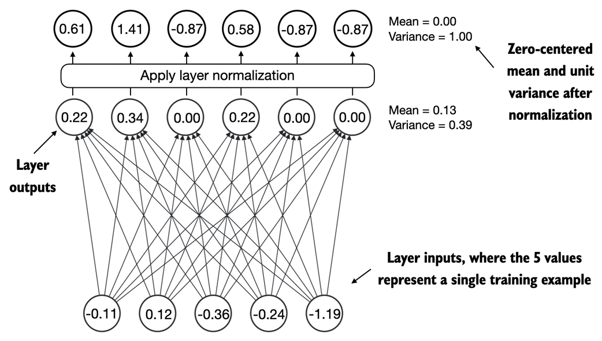
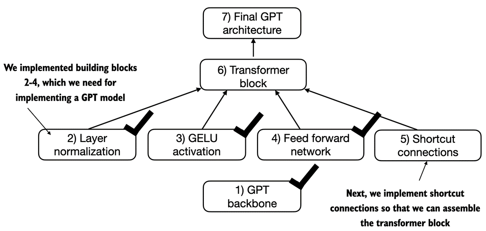

## 4. 从头开始实现 GPT 模型来生成文本

> **本章涵盖**
> 
> - 编码类似 GPT 的大语言模型（LLM），可以训练该模型生成类似人类的文本
> - 标准化层激活以稳定神经网络训练
> - 在深度神经网络中添加快捷连接以更有效地训练模型
> - 实现 Transformer 块来创建各种大小的 GPT 模型
> - 计算 GPT 模型的参数数量和存储需求

在上一章中，您学习并编码了多头注意力机制，这是 LLM 的核心组件之一。在本章中，我们现在将对 LLM 的其他构建块进行编码，并将它们组装成类似 GPT 的模型，我们将在下一章中训练该模型以生成类似人类的文本，如图 4.1 所示。

> **图 4.1** 编码 LLM，在一般文本数据集上预训练 LLM 以及在标记数据集上对其进行微调的三个主要阶段的心智模型。本章重点介绍 LLM 架构的实现，我们将在下一章中对其进行训练。


图 4.1 中引用的 LLM 架构由几个构建块组成，我们将在本章中实现这些构建块。我们将在下一节中从自上而下的模型架构视图开始，然后再更详细地介绍各个组件。

### 4.1 编码 LLM 架构

LLM，例如 GPT（代表 Generative Pretrained Transformer），是一种大型深度神经网络架构，旨在一次生成一个单词（或标记）的新文本。然而，尽管模型规模很大，但模型架构并不像您想象的那么复杂，因为它的许多组件都是重复的，正如我们稍后将看到的。图 4.2 提供了类似 GPT 的 LLM 的自顶向下视图，其中突出显示了其主要组件。

> **图4.2** GPT 模型的心智模型。在嵌入层旁边，它由一个或多个转换器块组成，其中包含我们在上一章中实现的屏蔽多头注意力模块。


如图 4.2 所示，我们已经涵盖了几个方面，例如输入标记化和嵌入，以及屏蔽多头注意力模块。本章的重点将是实现 GPT 模型的核心结构，包括其转换器块，然后我们将在下一章中对其进行训练以生成类似人类的文本。

在前面的章节中，为了简单起见，我们使用了较小的嵌入尺寸，确保概念和示例可以轻松地放在单个页面上。现在，在本章中，我们将扩大到小型 GPT-2 模型的大小，特别是具有 1.24 亿个参数的最小版本，如 Radford 等人的论文“语言模型是无监督多任务学习器”中所述。请注意，虽然原始报告提到了 1.17 亿个参数，但后来得到了更正。

第 6 章将重点介绍将预训练权重加载到我们的实现中，并使其适应具有 345、762 和 15.42 亿个参数的更大的 GPT-2 模型。在深度学习和 GPT 等 LLM 的背景下，术语「参数」是指模型的可训练权重。这些权重本质上是模型的内部变量，在训练过程中进行调整和优化，以最小化特定的损失函数。这种优化允许模型从训练数据中学习。

例如，在由 2,048x2,048 维权重矩阵（或张量）表示的神经网络层中，该矩阵的每个元素都是一个参数。由于有 2,048 行和 2,048 列，因此该层中的参数总数为 2,048 乘以 2,048，等于 4,194,304 个参数。

> GPT-2 对比 GPT-3
> 请注意，我们关注的是 GPT-2，因为 OpenAI 已经公开了预训练模型的权重，我们将在第 6 章中将其加载到我们的实现中。GPT-3 在模型架构方面基本相同，只是它从 GPT-2 的 15 亿个参数扩展到 GPT-3 的 1750 亿个参数，并且在更多数据上进行训练。截至撰写本文时，GPT-3 的权重尚未公开。GPT-2 也是学习如何实现 LLM 的更好选择，因为它可以在一台笔记本电脑上运行，而 GPT-3 需要 GPU 集群来进行训练和推理。根据 Lambda Labs 的说法，在单个 V100 数据中心 GPU 上训练 GPT-3 需要 355 年，在消费类 RTX 8000 GPU 上训练 GPT-3 需要 665 年。

我们通过以下 Python 字典指定小型 GPT-2 模型的配置，我们将在后面的代码示例中使用它：

```python
GPT_CONFIG_124M = {
    "vocab_size": 50257, # Vocabulary size
    "ctx_len": 1024, # Context length
    "embed_dim": 768, # Embedding dimension
    "n_heads": 12, # Number of attention heads
    "n_layers": 12, # Number of layers
    "drop_rate": 0.1, # Dropout rate
    "qkv_bias": False # Query-Key-Value bias
}
```

在 `GPT_CONFIG_124M` 字典中，为了清晰起见，我们使用简洁的变量名称并防止出现长行代码：
- `"vocab_size"` 指的是 50,257 个单词的词汇表，由第 2 章中的 BPE 分词器使用。
- `"ctx_len"` 表示模型可以通过第 2 章中讨论的位置嵌入处理的输入标记的最大数量。
- `"emb_dim"` 表示嵌入大小，将每个 token 转换为 768 维向量。
- `"n_heads"` 表示多头注意力机制中注意力头的数量，如第 3 章中所实现。
- `"n_layers"` 指定模型中变压器块的数量，这将在接下来的章节中详细说明。
- `"drop_rate"` 表示 dropout 机制的强度（0.1 表示隐藏单元下降 10%），以防止过度拟合，如第 3 章所述。
- `"qkv_bias"` 确定是否在多头注意力的线性层中包含偏差向量以进行查询、键和值计算。我们最初将按照现代 LLM 的规范禁用此功能，但当我们将 OpenAI 中的预训练 GPT-2 权重加载到我们的模型中时，我们将在第 6 章中重新审视它。

使用上面的配置，我们将通过在本节中实现 GPT 占位符架构（DummyGPTModel）来开始本章，如图 4.3 所示。这将为我们提供一个全局视图，了解所有内容如何组合在一起，以及我们需要在接下来的部分中编写哪些其他组件来组装完整的 GPT 模型架构。

> **图 4.3** 概述我们编码 GPT 架构的顺序的心智模型。 在本章中，我们将从 GPT 主干（一种占位符架构）开始，然后再讨论各个核心部分，并最终将它们组装在最终 GPT 架构的 Transformer 块中。


图 4.3 中所示的编号框说明了我们处理编写最终 GPT 架构所需的各个概念的顺序。我们将从第 1 步开始，这是一个占位符 GPT 主干，我们称之为 `DummyGPTModel`：

```python
# 清单 4.1 占位符 GPT 模型架构类
import torch.nn as nn
import torch

class DummyGPTModel(nn.Module):
    def __iadd__(self, cfg):
        super().__init__()
        self.tok_emb = nn.Embedding(cfg["vocab_size"], cfg["emb_dim"])
        self.pos_emb = nn.Embedding(cfg["ctx_len"], cfg["emb_dim"])
        self.drop_emb = nn.Dropout(cfg["drop_rate"])
        self.trf_blocks = nn.Sequential(
            *[DummyTransformerBlock(cfg) for _ in range(cfg["n_layers"])])
        self.final_norm = DummyLayerNorm(cfg["emb_dim"])
        self.out_head = nn.Linear(
            cfg["emb_dim"], cfg["vocab_size"], bias=False
        )
        
    def forward(self, in_idx):
        batch_size, seq_len = in_idx.shape
        tok_embeds = self.tok_emb(in_idx)
        pos_embeds = self.pos_emb(torch.arange(seq_len, device=in_idx.device))
        x = tok_embeds + pos_embeds
        x = self.drop_emb(x)
        x = self.trf_blocks(x)
        x = self.final_norm(x)
        logits = self.out_head(x)
        return logits
    
class DummyTransformerBlock(nn.Module):
    def __init__(self, cfg):
        super().__init__()
        
    def forward(self, x):
        return x
    
class DummyLayerNorm(nn.Module):
    def __init__(self, normalized_shape, eps=1e-5):
        super().__init__()
    
    def forward(self, x):
        return x
        
```

此代码中的 `DummyGPTModel` 类使用 PyTorch 的神经网络模块 (`nn.Module`) 定义了类似 GPT 模型的简化版本。`DummyGPTModel` 类中的模型架构由 token 和位置嵌入、dropout、一系列转换器块 (`DummyTransformerBlock`)、最终层归一化 (`DummyLayerNorm`) 和线性输出层 (`out_head`) 组成。配置是通过 `Python` 字典传入的，例如我们之前创建的 `GPT_CONFIG_124M` 字典。

`forward` 方法描述了通过模型的数据流：它计算输入索引的标记和位置嵌入，应用 dropout，通过转换器块处理数据，应用归一化，最后使用线性输出层生成 logits。

上面的代码已经可以运行，我们将在本节后面准备好输入数据后看到。但是，现在请注意，在上面的代码中，我们使用了占位符（`DummyLayerNorm` 和 `DummyTransformerBlock`）来进行变换器块和层标准化，我们将在后面的部分中对其进行开发。

接下来，我们将准备输入数据并初始化一个新的 GPT 模型来说明其用法。基于我们在第 2 章中对分词器进行编码的图，图 4.4 提供了数据如何流入和流出 GPT 模型的高级概述。

> **图 4.4** 总体概述显示输入数据如何标记化、嵌入并馈送到 GPT 模型。请注意，在我们之前编码的 `DummyGPTClass` 中，标记嵌入是在 GPT 模型内部处理的。在 LLM 中，嵌入的输入标记维度通常与输出维度匹配。这里的输出嵌入代表我们在第 3 章中讨论的上下文向量。


为了实现图 4.4 中所示的步骤，我们使用第 2 章中介绍的 tiktoken 分词器对由 GPT 模型的两个文本输入组成的批次进行分词：

```python
import tiktoken
import torch

tokenizer = tiktoken.get_encoding("gpt2")
batch = []
txt1 = "Every effort moves you"
txt2 = "Every day holds a"

batch.append(torch.tensor(tokenizer.encode(txt1)))
batch.append(torch.tensor(tokenizer.encode(txt2)))
batch = torch.stack(batch, dim=0)
print(batch)
```

两个文本的生成 token ID 如下：

```python
tensor([[6109, 3626, 6100,  345],
        [6109, 1110, 6622,  257]])
```

接下来，我们初始化一个新的 1.24 亿参数 `DummyGPTModel` 实例，并向其提供标记化批次：

```python
torch.manual_seed(123)
model = DummyGPTModel(GPT_CONFIG_124M)
logits = model(batch)
print("Output shape:", logits.shape)
print(logits)
```

模型输出通常称为 logits，如下所示：

```python
Output shape: torch.Size([2, 4, 50257])
tensor([[[-1.2034,  0.3201, -0.7130,  ..., -1.5548, -0.2390, -0.4667],
         [-0.1192,  0.4539, -0.4432,  ...,  0.2392,  1.3469,  1.2430],
         [ 0.5307,  1.6720, -0.4695,  ...,  1.1966,  0.0111,  0.5835],
         [ 0.0139,  1.6755, -0.3388,  ...,  1.1586, -0.0435, -1.0400]],

        [[-1.0908,  0.1798, -0.9484,  ..., -1.6047,  0.2439, -0.4530],
         [-0.7860,  0.5581, -0.0610,  ...,  0.4835, -0.0077,  1.6621],
         [ 0.3567,  1.2698, -0.6398,  ..., -0.0162, -0.1296,  0.3717],
         [-0.2407, -0.7349, -0.5102,  ...,  2.0057, -0.3694,  0.1814]]],
       grad_fn=<UnsafeViewBackward0>)
```

输出张量有两行对应于两个文本样本。每个文本样本由 6 个 token 组成；每个标记都是一个 50,257 维向量，与标记器词汇表的大小相匹配。

嵌入有 50,257 个维度，因为每个维度都引用词汇表中的唯一标记。在本章最后，当我们实现后处理代码时，我们将把这些 50,257 维向量转换回标记 ID，然后我们可以将其解码为单词。

现在我们已经自上而下地了解了 GPT 架构及其输入和输出，我们将在接下来的部分中对各个占位符进行编码，从将替换前面代码中的 `DummyLayerNorm` 的真实层规范化类开始。

### 4.2 使用层归一化对激活进行归一化

由于梯度消失或爆炸等问题，训练多层深度神经网络有时会具有挑战性。这些问题导致训练动态不稳定，使网络难以有效调整权重，这意味着学习过程很难找到一组神经网络参数（权重）来最小化损失函数。换句话说，网络很难学习数据中的潜在模式，使其能够做出准确的预测或决策。（如果您对神经网络训练和梯度概念不熟悉，可以在附录 A：PyTorch 简介中的 A.4 节「自动微分变得简单」中找到这些概念的简要介绍。然而，阅读本书的内容并不需要对梯度有深刻的数学理解。）

在本节中，我们将实现层归一化以提高神经网络训练的稳定性和效率。

层归一化背后的主要思想是将神经网络层的激活（输出）调整为均值 0 和方差 1（也称为单位方差）。这种调整加快了有效权重的收敛速度，并确保了一致、可靠的训练。正如我们在上一节中看到的，基于 `DummyLayerNorm` 占位符，在 GPT-2 和现代 Transformer 架构中，层归一化通常应用于多头注意力模块之前和之后以及最终输出层之前。

在我们在代码中实现层标准化之前，图 4.5 提供了层标准化功能的直观概述。

> **图 4.5** 层归一化的图示，其中 5 层输出（也称为激活）经过归一化，使其均值为零，方差为 1。



我们可以通过以下代码重新创建图 4.5 中所示的示例，其中我们实现了一个具有 5 个输入和 6 个输出的神经网络层，并将其应用于两个输入示例：

```python
torch.manual_seed(123)
batch_example = torch.randn(2, 5)
layer = nn.Sequential(nn.Linear(5, 6), nn.ReLU())
out = layer(batch_example)
print(out)
```

这将打印以下张量，其中第一行列出第一个输入的层输出，第二行列出第二行的层输出：

```python
tensor([[0.2260, 0.3470, 0.0000, 0.2216, 0.0000, 0.0000],
        [0.2133, 0.2394, 0.0000, 0.5198, 0.3297, 0.0000]],
       grad_fn=<ReluBackward0>)
```

我们编码的神经网络层由 `Linear` 层和非线性激活函数 `ReLU`（整流线性单元的缩写）组成，它是神经网络中的标准激活函数。如果您不熟悉 `ReLU`，它只是将负输入阈值设置为 0，确保层仅输出正值，这解释了为什么生成的层输出不包含任何负值。（请注意，我们将在 GPT 中使用另一个更复杂的激活函数，我们将在下一节中介绍）。

在对这些输出应用层归一化之前，让我们检查均值和方差：

```python
mean = out.mean(dim=-1, keepdim=True)
var = out.var(dim=-1, keepdim=True)
print("Mean:\n", mean)
print("Variance:\n", var)
```

输出如下：

```python
Mean:
 tensor([[0.1324],
        [0.2170]], grad_fn=<MeanBackward1>)
Variance:
 tensor([[0.0231],
        [0.0398]], grad_fn=<VarBackward0>)
```

上面平均张量中的第一行包含第一个输入行的平均值，第二个输出行包含第二个输入行的平均值。

在均值或方差计算等操作中使用 `keepdim=True` 可确保输出张量保持与输入张量相同的形状，即使该操作沿通过 `dim` 指定的维度减小张量也是如此。例如，如果没有 `keepdim=True`，返回的平均张量将是二维向量 `[0.1324, 0.2170]` 而不是 2×1 维矩阵 `[[0.1324], [0.2170]]`。

`dim` 参数指定应在张量中执行统计量计算（此处为均值或方差）的维度，如图 4.6 所示。

> **图 4.6** 计算张量平均值时的 dim 参数的图示。例如，如果我们有一个维度为 `[rows, columns]` 的二维张量（矩阵），使用 `dim=0 `将执行跨行操作（垂直，如底部所示）,产生聚合每列数据的输出。使用 `dim=1` 或 `dim=-1` 将跨列执行操作（水平方向，如顶部所示），从而产生聚合每行数据的输出。


如图 4.6 所示，对于 2D 张量（如矩阵），使用 `dim=-1` 进行均值或方差计算等操作与使用 `dim=1` 相同。这是因为 -1 指的是张量的最后一个维度，它对应于 2D 张量中的列。随后，当向 GPT 模型添加层归一化（生成形状为 `[batch_size, num_tokens, embedding_size]` 的 3D 张量）时，我们仍然可以使用 `dim=-1` 对最后一个维度进行归一化，避免从 `dim=1` 更改为 `dim= 2`.

接下来，让我们对之前获得的层输出应用层归一化。该运算包括减去平均值并除以方差的平方根（也称为标准差）：

```python
out_norm = (out - mean) / torch.sqrt(var)
mean = out_norm.mean(dim=-1, keepdim=True)
var = out_norm.var(dim=-1, keepdim=True)
print("Normalized layer outputs:\n", out_norm)
print("Mean:\n", mean)
print("Variance:\n", var)
```

从结果中我们可以看出，归一化层输出（现在也包含负值）的均值为零，方差为 1：

归一化层输出：

```python
Normalized layer outputs:
 tensor([[ 0.6159,  1.4126, -0.8719,  0.5872, -0.8719, -0.8719],
        [-0.0189,  0.1121, -1.0876,  1.5173,  0.5647, -1.0876]],
       grad_fn=<DivBackward0>)
Mean:
 tensor([[2.9802e-08],
        [3.9736e-08]], grad_fn=<MeanBackward1>)
Variance:
 tensor([[1.],
        [1.]], grad_fn=<VarBackward0>)
```

请注意，输出张量中的值 2.9802e-08 是 2.9802 × 10-8 的科学计数法，十进制形式为 0.0000000298。该值非常接近 0，但由于计算机表示数字的精度有限，可能会累积一些小的数值误差，因此它并不完全为 0。

为了提高可读性，我们还可以通过将 sci_mode 设置为 False 来在打印张量值时关闭科学计数法：

```python
torch.set_printoptions(sci_mode=False)
print("Mean:\n", mean)
print("Variance:\n", var)
```

输出如下：

```python
Mean:
 tensor([[    0.0000],
        [    0.0000]], grad_fn=<MeanBackward1>)
Variance:
 tensor([[1.],
        [1.]], grad_fn=<VarBackward0>)
```

到目前为止，在本节中，我们已经逐步编码并应用了层归一化。现在让我们将这个过程封装在 PyTorch 模块中，稍后我们可以在 GPT 模型中使用它：

```python
# 清单 4.2 层归一化类
class LayerNorm(nn.Module):
    def __init__(self, emb_dim):
        super().__init__()
        self.eps = 1e-5
        self.scale = nn.Parameter(torch.ones(emb_dim))
        self.shift = nn.Parameter(torch.zeros(emb_dim))
        
    def forward(self, x):
        mean = x.mean(dim=-1, keepdim=True)
        var = x.var(dim=-1, keepdim=True)
        norm_x = (x - mean) / torch.sqrt(var + self.eps)
        return self.scale * norm_x + self.shift
```

层归一化的具体实现对输入张量 x 的最后一个维度进行操作，该维度表示嵌入维度 (`emb_dim`)。变量 `eps` 是一个添加到方差中的小常数 (epsilon)，以防止在归一化过程中被零除。`scale` 和 `shift` 是两个可训练参数（与输入具有相同维度），LLM 在训练期间会自动调整，如果确定这样做会提高模型在训练任务中的性能。这使得模型能够学习最适合其正在处理的数据的适当缩放和移动。

> **偏差方差**
> 在我们的方差计算方法中，我们通过设置 `unbiased=False` 来选择实现细节。对于那些好奇这意味着什么的人，在方差计算中，我们除以方差公式中的输入数量 n。此方法不应用贝塞尔校正，贝塞尔校正通常使用 n-1 而不是分母中的 n 来调整样本方差估计中的偏差。这一决定会导致所谓的方差估计有偏差。对于大规模语言模型 (LLM)，嵌入维度 n 非常大，使用 n 和 n-1 之间的差异实际上可以忽略不计。我们选择这种方法是为了确保与 GPT-2 模型的标准化层的兼容性，并且因为它反映了 TensorFlow 的默认行为，该行为用于实现原始 GPT-2 模型。使用类似的设置可确保我们的方法与我们将在第 6 章中加载的预训练权重兼容。

现在让我们在实践中尝试 `LayerNorm` 模块并将其应用于批量输入：

```python
ln = LayerNorm(emb_dim=5)
out_ln = ln(batch_example)
mean = out_ln.mean(dim=-1, keepdim=True)
var = out_ln.var(dim=-1, keepdim=True)
print("Mean:\n", mean)
print("Variance:\n", var)
```

从结果中我们可以看到，层归一化代码按预期工作，并对两个输入中的每一个输入的值进行归一化，使它们的平均值为 0，方差为 1：

```python
Mean:
 tensor([[    -0.0000],
        [     0.0000]], grad_fn=<MeanBackward1>)
Variance:
 tensor([[1.0000],
        [1.0000]], grad_fn=<VarBackward0>)
```

在本节中，我们介绍了实现 GPT 架构所需的构建块之一，如图 4.7 中的心理模型所示。

> **图 4.7** 心理模型列出了我们在本章中实现的用于组装 GPT 架构的不同构建块。


在下一节中，我们将研究 GELU 激活函数，它是 LLM 中使用的激活函数之一，而不是我们在本节中使用的传统 ReLU 函数。

> **层标准化与批量标准化**
> 如果您熟悉批量归一化（神经网络的一种常见且传统的归一化方法），您可能想知道它与层归一化相比如何。与在批量维度上进行标准化的批量标准化不同，层标准化在特征维度上进行标准化。LLM 通常需要大量的计算资源，并且可用的硬件或特定用例可以决定训练或推理期间的批量大小。由于层归一化独立于批量大小对每个输入进行归一化，因此它在这些场景中提供了更大的灵活性和稳定性。这对于分布式训练或在资源受限的环境中部署模型时特别有益。

### 使用 GELU 激活实现前馈网络

在本节中，我们实现一个小型神经网络子模块，用作 LLM 中 Transformer 块的一部分。我们首先实现 GELU 激活函数，它在这个神经网络子模块中起着至关重要的作用。（有关在 PyTorch 中实现神经网络的更多信息，请参阅附录 A 中的 A.5 实现多层神经网络部分。）

从历史上看，ReLU 激活函数由于其简单性和跨各种神经网络架构的有效性而被广泛用于深度学习。然而，在 LLM 中，除了传统的 ReLU 之外，还采用了其他几种激活函数。两个著名的例子是 GELU（高斯误差线性单元）和 SwiGLU（S 型加权线性单元）。

GELU 和 SwiGLU 是更复杂、更平滑的激活函数，分别包含高斯和 sigmoid 门控线性单元。与更简单的 ReLU 不同，它们为深度学习模型提供了改进的性能。

GELU激活函数可以通过多种方式实现；确切的版本定义为 GELU(x)=x⋅Φ(x)，其中 Φ(x) 是标准高斯分布的累积分布函数。

然而，在实践中，通常会实现计算成本较低的近似值（原始 GPT-2 模型也是使用此近似值进行训练的）：


在代码中，我们可以将这个函数实现为 PyTorch 模块，如下所示

```python
# 清单 4.3 GELU激活函数的实现
class GELU(nn.Module):
    def __init__(self):
        super().__init__()
    
    def forward(self, x):
        return 0.5 * x * (1 + torch.tanh(
            torch.sqrt(torch.tensor(2.0 / torch.pi)) *
            (x + 0.044715 * torch.pow(x, 3))
        ))
```

接下来，为了了解这个 GELU 函数是什么样子以及它与 ReLU 函数的比较如何，让我们并排绘制这些函数：

```python
import matplotlib.pyplot as plt
gelu, relu = GELU(), nn.ReLU()

x = torch.linspace(-3, 3, 100)
y_gelu, y_relu = gelu(x), relu(x)
plt.figure(figsize=(8, 3))
for i, (y, label) in enumerate(zip([y_gelu, y_relu], ["GELU", "ReLU"]), 1):
    plt.subplot(1, 2, i)
    plt.plot(x, y)
    plt.title(f"{label} activation function")
    plt.xlabel("x")
    plt.ylabel(f"{label}(x)")
    plt.grid(True)
plt.tight_layout()
plt.show()
```

正如我们在图 4.8 的结果图中看到的，ReLU 是一个分段线性函数，如果输入为正，则直接输出；否则，输出零。GELU 是一种平滑的非线性函数，近似于 ReLU，但对于负值具有非零梯度。

> **图 4.8** 使用 matplotlib 绘制 GELU 和 ReLU 图的输出，其中 x 轴显示函数输入，y 轴显示函数输出。


如图 4.8 所示，GELU 的平滑度可以在训练期间带来更好的优化特性，因为它允许对模型参数进行更细致的调整。相比之下，ReLU 在零处有一个尖角，这有时会使优化变得更加困难，特别是在非常深或具有复杂架构的网络中。此外，与 RELU 对任何负输入输出零不同，GELU 允许对负值输出较小的非零输出。这一特性意味着在训练过程中，接收负输入的神经元仍然可以对学习过程做出贡献，尽管程度小于正输入。

接下来，让我们使用 GELU 函数来实现小型神经网络模块 `FeedForward`，稍后我们将在 LLM 的转换器块中使用它：

```python
# 清单 4.4 前馈神经网络模块
class FeedForward(nn.Module):
    def __init__(self, cfg):
        super().__init__()
        self.layers = nn.Sequential(
            nn.Linear(cfg["emb_dim"], 4 * cfg["emb_dim"]),
            GELU(),
            nn.Linear(4 * cfg["emb_dim"], cfg["emb_dim"]),
            nn.Dropout(cfg["drop_rate"])
        )
    
    def forward(self, x):
        return self.layers(x)
```

正如我们在前面的代码中看到的，`FeedForward` 模块是一个小型神经网络，由两个 `Linear` 层、一个 `GELU` 激活函数和一个 `Dropout` 层组成。在 1.24 亿参数的 GPT 模型中，它通过 `GPT_CONFIG_124M` 字典接收带有嵌入大小为 768 的令牌的输入批次，其中 `GPT_CONFIG_124M["emb_dim"] = 768`。

图 4.9 显示了当我们向其传递一些输入时，如何在这个小型前馈神经网络中操纵嵌入大小。

> **图 4.9** 提供了前馈神经网络各层之间连接的直观概述。值得注意的是，该神经网络可以适应输入中可变的批量大小和标记数量。然而，每个标记的嵌入大小是在初始化权重时确定和固定的。


按照图 4.9 中的示例，让我们初始化一个新的 `FeedForward` 模块，其令牌嵌入大小为 768，并为其提供批量输入，每个输入包含 2 个样本和 3 个 token：

```python
ffn = FeedForward(GPT_CONFIG_124M)
x = torch.rand(2, 3, 768)
out = ffn(x)
print(out.shape)
```

我们可以看到，输出张量的形状与输入张量的形状相同：

```python
torch.Size([2, 3, 768])
```

我们在本节中实现的 `FeedForward` 模块在增强模型学习和泛化数据的能力方面发挥着至关重要的作用。尽管该模块的输入和输出维度相同，但它通过第一个线性层在内部将嵌入维度扩展到更高维度的空间，如图4.10所示。该扩展之后是非线性 GELU 激活，然后通过第二次线性变换收缩回原始维度。这样的设计允许探索更丰富的表示空间。

> **图 4.10** 前馈神经网络中层输出的扩展和收缩的图示。首先，输入值从 768 个值扩大到 4 倍，达到 3072 个值。然后，第二层将 3072 个值压缩回 768 维表示。


此外，输入和输出维度的一致性通过启用多层堆叠来简化架构（正如我们稍后将要做的那样），而无需调整它们之间的维度，从而使模型更具可扩展性。

如图 4.11 所示，我们现在已经实现了 LLM 的大部分构建模块。

> **图 4.11** 显示我们在本章中讨论的主题的心理模型，黑色复选标记表示我们已经讨论过的主题。



在下一节中，我们将讨论在神经网络不同层之间插入的快捷连接的概念，这对于提高深度神经网络架构的训练性能非常重要。

### 4.4 添加快捷连接

接下来，让我们讨论快捷连接背后的概念，也称为跳过或剩余连接。最初，为计算机视觉中的深度网络（特别是残差网络）提出了快捷连接，以减轻梯度消失的挑战。梯度消失问题是指梯度（在训练过程中引导权重更新）随着层向后传播而逐渐变小的问题，使得有效训练早期层变得困难，如图 4.12 所示。

> **图 4.12** 由 5 层组成的不带快捷连接（左侧）和带快捷连接（右侧）的深度神经网络之间的比较。快捷连接涉及将层的输入添加到其输出，从而有效地创建绕过某些层的备用路径。这就是为什么这些连接也称为跳跃连接。它们在训练反向传播过程中保持梯度流动方面发挥着至关重要的作用。该图中所示的梯度表示每层的平均绝对梯度，我们将在下面的代码示例中计算它。


如图 4.12 所示，快捷连接通过跳过一层或多层，为梯度流经网络创建一条替代的、更短的路径。这是通过将一层的输出添加到后面一层的输出来实现的。

在下面的代码示例中，我们实现了图 4.12 所示的神经网络，看看如何在前向方法中添加快捷连接：

```python
# 清单 4.5 用于说明快捷连接的神经网络
class ExampleDeepNeuralNetwork(nn.Module):
    def __init__(self, layer_sizes, use_shortcut):
        super().__init__()
        self.use_shortcut = use_shortcut
        self.layers = nn.ModuleList([
            # 实现 5 层
            nn.Sequential(nn.Linear(layer_sizes[0], layer_sizes[1]), GELU()),
            nn.Sequential(nn.Linear(layer_sizes[1], layer_sizes[2]), GELU()),
            nn.Sequential(nn.Linear(layer_sizes[2], layer_sizes[3]), GELU()),
            nn.Sequential(nn.Linear(layer_sizes[3], layer_sizes[4]), GELU()),
            nn.Sequential(nn.Linear(layer_sizes[4], layer_sizes[5]), GELU())
        ])
    
    def forward(self, x):
        for layer in self.layers:
            # 计算当千层输出
            layer_output = layer(x)
            # 检查是否应用快捷
            if self.use_shortcut and x.size() == layer_output.size():
                x = x + layer_output
            else:
                x = layer_output
        return x
```

该代码实现了一个 5 层的深度神经网络，每层由一个线性层和一个 GELU 激活函数组成。在前向传递中，我们迭代地通过各层传递输入，如果 `self.use_shortcut` 属性设置为 True，则可以选择添加图 4.12 中所示的快捷方式连接。

让我们使用此代码首先初始化一个没有快捷连接的神经网络。在这里，每个层都将被初始化，以便它接受具有 3 个输入值的示例并返回 3 个输出值。最后一层返回单个输出值：

```python
layer_sizes = [3, 3, 3, 3, 3, 1]
sample_input = torch.tensor([[1., 0., -1.]])
torch.manual_seed(123) # 为可重复性的初始权重指定随机种子
model_without_shortcut = ExampleDeepNeuralNetwork(
    layer_sizes, use_shortcut=False
)
```

接下来，我们实现一个计算模型向后传递中的梯度的函数：

```python
def print_gradients(model, x):
    # 前向
    outputs = model(x)
    target = torch.tensor([[0.]])
    
    # 根据目标和输出的接近程度计算损失
    loss = nn.MSELoss()
    loss = loss(outputs, target)
    
    # 向后传递计算梯度
    loss.backward()
    
    for name, param in model.named_parameters():
        if 'weight' in name:
            # 打印权重的平均绝对梯度
            print(f"{name} has gradient mean of {param.grad.abs().mean().item()}")
```

在前面的代码中，我们指定了一个损失函数，用于计算模型输出与用户指定的目标（此处为简单起见，值为 0）的接近程度。然后，当调用 `loss.backward()` 时，PyTorch 计算模型中每一层的损失梯度。我们可以通过 `model.named_parameters()` 迭代权重参数。假设给定层有一个 3×3 的权重参数矩阵。在这种情况下，该层将具有 3×3 梯度值，我们打印这些 3×3 梯度值的平均绝对梯度，以获得每层的单个梯度值，以便更容易地比较各层之间的梯度。

简而言之，`.backward()` 方法是 PyTorch 中计算模型训练期间所需的损失梯度的便捷方法，无需我们自己实现梯度计算的数学运算，从而使深度神经网络的使用变得更加容易。如果您不熟悉梯度和神经网络训练的概念，我建议阅读附录 A 中的 A.4、自动微分变得简单和 A.7 典型训练循环部分。

现在让我们使用 print_gradients 函数并将其应用于模型而不跳过连接：

```python
print_gradients(model_without_shortcut, sample_input)
```

输出如下：

```python
layers.0.0.weight has gradient mean of 0.00020173587836325169
layers.1.0.weight has gradient mean of 0.0001201116101583466
layers.2.0.weight has gradient mean of 0.0007152041653171182
layers.3.0.weight has gradient mean of 0.001398873864673078
layers.4.0.weight has gradient mean of 0.005049646366387606
```

从 print_gradients 函数的输出可以看出，随着从最后一层（layers.4）到第一层（layers.0），梯度变得更小，这种现象称为梯度消失问题。

现在让我们实例化一个具有跳过连接的模型并看看它如何比较：

```python
torch.manual_seed(123)
model_with_shortcut = ExampleDeepNeuralNetwork(
    layer_sizes, use_shortcut=True
)
print_gradients(model_with_shortcut, sample_input)
```

输出如下：

```python
layers.0.0.weight has gradient mean of 0.22169792652130127
layers.1.0.weight has gradient mean of 0.20694105327129364
layers.2.0.weight has gradient mean of 0.32896995544433594
layers.3.0.weight has gradient mean of 0.2665732502937317
layers.4.0.weight has gradient mean of 1.3258541822433472
```

正如我们所看到的，根据输出，最后一层（layers.4）仍然比其他层具有更大的梯度。然而，当我们向第一层（layers.0）前进时，梯度值会稳定下来，并且不会缩小到一个非常小的值。

总之，快捷连接对于克服深度神经网络中梯度消失问题所带来的限制非常重要。快捷连接是 LLM 等超大型模型的核心构建块，当我们在下一章中训练 GPT 模型时，它们将通过确保跨层梯度流的一致性来帮助促进更有效的训练。

介绍完快捷方式连接后，我们现在将在下一节的转换器块中连接所有先前介绍的概念（层归一化、GELU 激活、前馈模块和快捷方式连接），这是我们编码所需的最终构建块 GPT 架构。

### 4.5 连接 Transformer 块中的注意力层和线性层

在本节中，我们将实现 Transformer 块，它是 GPT 和其他 LLM 架构的基本构建块。这个块在 1.24 亿参数的 GPT-2 架构中重复了十几次，结合了我们之前介绍过的几个概念：多头注意力、层归一化、dropout、前馈层和 GELU 激活，如图 4.13 所示。在下一节中，我们将把这个转换器块连接到 GPT 架构的其余部分。

> **图 4.13** Transformer 块的图示。该图的底部显示了已嵌入到 768 维向量中的输入标记。每一行对应一个标记的向量表示。 Transformer 模块的输出是与输入具有相同维度的向量，然后可以将其输入到 LLM 的后续层中。


如图 4.13 所示，Transformer 块结合了多个组件，包括第 3 章中的屏蔽多头注意力模块和我们在第 4.3 节中实现的前馈模块。

当 Transformer 块处理输入序列时，序列中的每个元素（例如，单词或子词标记）都由固定大小的向量表示（在图 4.13 的情况下，为 768 个维度）。Transformer 块内的操作（​​包括多头注意力和前馈层）旨在以保留其维度的方式转换这些向量。

这个想法是多头注意力模块中的自注意力机制识别并分析输入序列中元素之间的关系。相反，前馈网络在每个位置单独修改数据。这种组合不仅可以更细致地理解和处理输入，还可以增强模型处理复杂数据模式的整体能力。

在代码中，我们可以如下创建 `TransformerBlock`：

```python
# 清单 4.6 GPT 的 Transformer 块组件
from previous_chapter import MultiHeadAttention
class TransformerBlock(nn.Module):
    def __init__(self, cfg):
        super().__init__()
        self.att = MultiHeadAttention(
            d_in=cfg["emb_dim"],
            d_out=cfg["emb_dim"],
            block_size=cfg["ctx_len"],
            num_heads=cfg["n_heads"], 
            dropout=cfg["drop_rate"],
            qkv_bias=cfg["qkv_bias"])
        self.ff = FeedForward(cfg)
        self.norm1 = LayerNorm(cfg['emb_dim'])
        self.norm2 = LayerNorm(cfg['emb_dim'])
        self.drop_resid = nn.Dropout(cfg['drop_rate'])
        
    def forward(self, x):
        shortcut = x
        x = self.norm1(x)
        x = self.att(x)
        x = self.drop_resid(x)
        x = x + shortcut # 添加回原来的输入
        
        shortcut = x
        x = self.norm2(x)
        x = self.ff(x)
        x = self.drop_resid(x)
        x = x + shortcut
        return x
```

给定的代码在 PyTorch 中定义了一个 `TransformerBlock` 类，其中包括多头注意力机制（`MultiHeadAttention`）和前馈网络（`FeedForward`），两者都基于提供的配置字典（`cfg`）进行配置，例如 `GPT_CONFIG_124M`。

在这两个组件之前应用层归一化 (`LayerNorm`)，并在它们之后应用 dropout，以正则化模型并防止过度拟合。这也称为 Pre-LayerNorm。较旧的架构，例如原始的变压器模型，在自注意力和前馈网络之后应用层归一化，称为 Post-LayerNorm，这通常会导致更糟糕的训练动态。

该类还实现了前向传递，其中每个组件后面都有一个快捷连接，该连接将块的输入添加到其输出。这一关键功能有助于梯度在训练期间流经网络，并改进深度模型的学习，如 4.4 节中所述。

使用我们之前定义的 `GPT_CONFIG_124M` 字典，让我们实例化一个转换器块并为其提供一些示例数据：

```python
torch.manual_seed(123)
x = torch.rand(2, 4, 768)
block = TransformerBlock(GPT_CONFIG_124M)
output = block(x)

print("Input shape:", x.shape)
print("Output shape:", output.shape)
```

输出如下：

```python
Input shape: torch.Size([2, 4, 768])
Output shape: torch.Size([2, 4, 768])
```

正如我们从代码输出中看到的，Transformer 块在其输出中维护输入维度，这表明变压器架构处理数据序列而不改变它们在整个网络中的形状。

在整个 Transformer 块架构中保持形状并不是偶然的，而是其设计的一个关键方面。这种设计使其能够有效应用于广泛的序列到序列任务，其中每个输出向量直接对应于输入向量，保持一对一的关系。然而，输出是一个上下文向量，它封装了整个输入序列的信息，正如我们在第 3 章中学到的那样。这意味着虽然序列的物理尺寸（长度和特征尺寸）在通过转换器块时保持不变，每个输出向量的内容被重新编码，以集成整个输入序列的上下文信息。

通过本节中实现的转换器块，我们现在拥有了在下一节中实现 GPT 架构所需的所有构建块，如图 4.14 所示。

> **图 4.14** 到目前为止我们在本章中实现的不同概念的心智模型。


如图 4.14 所示，Transformer 块结合了层归一化、前馈网络（包括 GELU 激活）和快捷连接，我们在本章前面已经介绍过。正如我们将在下一章中看到的，这个变压器块将构成我们将实现的 GPT 架构的主要组件。

### 编码 GPT 模型

本章开始时，我们对 GPT 架构（我们称之为 `DummyGPTModel`）进行了总体概述。在此 `DummyGPTModel` 代码实现中，我们展示了 GPT 模型的输入和输出，但其构建块仍然是一个黑匣子，使用 `DummyTransformerBlock` 和 `DummyLayerNorm` 类作为占位符。

在本节中，我们现在将 `DummyTransformerBlock` 和 `DummyLayerNorm` 占位符替换为我们在本章后面编写的真实 `TransformerBlock` 和 `LayerNorm` 类，以组装原始 1.24 亿参数版本的 GPT-2 的完整工作版本。 在第 5 章中，我们将预训练 GPT-2 模型，在第 6 章中，我们将从 OpenAI 加载预训练权重。

在我们用代码组装 GPT-2 模型之前，让我们看一下图 4.15 中的整体结构，它结合了本章迄今为止介绍的所有概念。

> **图4.15** GPT 模型架构概述。该图说明了 GPT 模型中的数据流。从底部开始，标记化文本首先转换为标记嵌入，然后使用位置嵌入对其进行增强。这些组合信息形成一个张量，该张量通过中心所示的一系列变压器块传递（每个包含多头注意力和前馈神经网络层，具有丢失和层归一化），将其堆叠在一起并重复 12 次。最终 Transformer 块的输出在到达线性输出层之前经过最后层归一化步骤。该层将转换器的输出映射到高维空间（在本例中为 50,257 维，对应于模型的词汇量大小）以预测序列中的下一个标记。


如图 4.15 所示，我们在第 4.5 节中编码的转换器块在整个 GPT 模型架构中重复了很多次。对于 1.24 亿参数的 GPT-2 模型，它会重复 12 次，我们通过 `GPT_CONFIG_124M` 字典中的 `"n_layers"` 条目指定。在拥有 15.42 亿个参数的最大 GPT-2 模型中，该 Transformer 块重复了 36 次。

在让我们用代码实现图 4.15 中所示的架构：

```python
# 清单 4.7 GPT模型架构实现
class GPTModel(nn.Module):
    def __init__(self, cfg):
        super().__init__()
        self.tok_emb = nn.Embedding(cfg['vocab_size'], cfg['emb_dim'])
        self.pos_emb = nn.Embedding(cfg['ctx_len'], cfg['emb_dim'])
        self.drop_emb = nn.Dropout(cfg['drop_rate'])
        
        self.trf_blocks = nn.Sequential(
            *[TransformerBlock(cfg) for _ in range(cfg['n_layers'])])
        
        self.final_norm = LayerNorm(cfg['emb_dim'])
        self.out_head = nn.Linear(
            cfg['emb_dim'], cfg['vocab_size'], bias=True
        )
        
    def forward(self, in_idx):
        batch_size, seq_len = in_idx.shape
        tok_embeds = self.tok_emb(in_idx)
        
        pos_embeds = self.pos_emb(torch.arange(seq_len, device=in_idx.device))
        x = tok_embeds + pos_embeds
        x = self.trf_blocks(x)
        x = self.final_norm(x)
        logits = self.out_head(x)
        return logits
```

得益于我们在 4.5 节中实现的 `TransformerBlock` 类，`GPTModel` 类相对较小且紧凑。

此 `GPTModel` 类的 `__init__` 构造函数使用通过 Python 字典 `cfg` 传入的配置来初始化令牌和位置嵌入层。这些嵌入层负责将输入标记索引转换为密集向量并添加位置信息，如第 2 章所述。

接下来， `__init__` 方法创建 `TransformerBlock` 模块的顺序堆栈，其数量等于 `cfg` 中指定的层数。在变压器块之后，应用了 LayerNorm 层，对变压器块的输出进行标准化，以稳定学习过程。最后，定义了一个无偏差的线性输出头，它将变压器的输出投影到分词器的词汇空间中，为词汇中的每个标记生成逻辑。

前向方法采用一批输入标记索引，计算它们的嵌入，应用位置嵌入，将序列传递给转换器块，标准化最终输出，然后计算 logits，表示下一个标记的非标准化概率。我们将在下一节中将这些逻辑转换为标记和文本输出。

现在，让我们使用传入 `cfg` 参数的 `GPT_CONFIG_124M` 字典来初始化 1.24 亿参数的 GPT 模型，并使用我们在本章开头创建的批处理文本输入来为其提供数据：

```python
torch.manual_seed(123)
model = GPTModel(GPT_CONFIG_124M)

out = model(batch)
print("Input batch:\n", batch)
print("\nOutput shape:", out.shape)
print(out)
```

前面的代码打印输入批次的内容，后跟输出张量：

```python
Input batch:
 tensor([[ 6109,  3626,  6100,   345], # token IDs of text 1
         [ 6109,  1110,  6622,   257]]) # token IDs of text 2
 
Output shape: torch.Size([2, 4, 50257])
tensor([[[-0.0055,  0.3224,  0.2185,  ...,  0.2539,  0.4578, -0.4747],
         [ 0.2663, -0.2975, -0.5040,  ..., -0.3903,  0.5328, -0.4224],
         [ 1.1146, -0.0923,  0.1303,  ...,  0.1521, -0.4494,  0.0276],
         [-0.8239,  0.1174, -0.2566,  ...,  1.1197,  0.1036, -0.3993]],
 
        [[-0.1027,  0.1752, -0.1048,  ...,  0.2258,  0.1559, -0.8747],
         [ 0.2230,  0.1246,  0.0492,  ...,  0.8573, -0.2933,  0.3036],
         [ 0.9409,  1.3068, -0.1610,  ...,  0.8244,  0.1763,  0.0811],
         [ 0.4395,  0.2753,  0.1540,  ...,  1.3410, -0.3709,  0.1643]]],
       grad_fn=<UnsafeViewBackward0>)
```

正如我们所看到的，输出张量的形状为 `[2, 4, 50257]`，因为我们传入了 2 个输入文本，每个文本有 4 个标记。最后一个维度 50,257 对应于分词器的词汇量大小。在下一节中，我们将了解如何将这 50,257 维输出向量中的每一个转换回标记。

在我们继续下一节并编写将模型输出转换为文本的函数之前，让我们花更多时间研究模型架构本身并分析其大小。

使用 `numel()` 方法（“元素数量”的缩写），我们可以收集模型参数张量中的参数总数：

```python
total_params = sum(p.numel() for p in model.parameters())
print(f"Total number of parameters: {total_params:,}")
```

结果如下：

```python
Total number of parameters: 163,009,536
```

现在，好奇的读者可能会注意到其中的差异。前面我们谈到初始化一个1.24亿参数的GPT模型，那么为什么实际的参数数量是1.63亿，如上面的代码输出所示？

原因是原始 GPT-2 架构中使用了一个称为权重绑定的概念，这意味着原始 GPT-2 架构正在重用令牌嵌入层作为其输出层。为了理解这意味着什么，让我们看一下我们之前通过 GPTModel 在模型上初始化的令牌嵌入层和线性输出层的形状：

```python
print("Token embedding layer shape:", model.tok_emb.weight.shape)
print("Output layer shape:", model.out_head.weight.shape)
```

正如我们根据打印输出所看到的，这两个层的权重张量具有相同的形状：

```python
Token embedding layer shape: torch.Size([50257, 768])
Output layer shape: torch.Size([50257, 768])
```

由于标记器词汇表中的行数为 50,257，标记嵌入层和输出层非常大。让我们根据权重绑定从 GPT-2 模型总计数中删除输出层参数计数：

```python
total_params_gpt2 = total_params - sum(p.numel() for p in model.out_head.parameters())
print(f"Number of trainable parameters cosidering weight tying: {total_params_gpt2:,}")
```

输出如下：

```python
Number of trainable parameters considering weight tying: 124,412,160
```

正如我们所看到的，该模型现在只有 1.24 亿个参数，与 GPT-2 模型的原始大小相匹配。

权重绑定减少了模型的整体内存占用和计算复杂性。然而，根据我的经验，使用单独的令牌嵌入和输出层会带来更好的训练和模型性能；因此，我们在 GPTModel 实现中使用单独的层。现代法学硕士也是如此。然而，当我们从 OpenAI 加载预训练权重时，我们将在第 6 章后面重新审视并实现权重绑定概念。

> **练习 4.1** 前馈和注意力模块中的参数数量
> 计算并比较前馈模块和多头注意力模块中包含的参数数量。

最后，让我们计算 `GPTModel` 对象中 1.63 亿个参数的内存需求：

```python
total_size_bytes = total_params * 4
total_size_mb = total_size_bytes / (1024 * 1024)
print(f"Total size of the model: {total_size_mb:2f} MB")
```

结果如下：

```python
The result is as follows:
Total size of the model: 621.83 MB
```

总之，通过计算 GPTModel 对象中 1.63 亿个参数的内存需求，并假设每个参数都是占用 4 个字节的 32 位浮点数，我们发现模型的总大小为 621.83 MB，这表明即使是相对较小的 LLM 也需要相对较大的存储容量。

在本节中，我们实现了 GPTModel 架构，并看到它输出形状为 `[batch_size, num_tokens, vocab_size]` 的数字张量。在下一节中，我们将编写代码将这些输出张量转换为文本。

> **练习 4.2** 初始化更大的 GPT 模型
> 在本章中，我们初始化了一个1.24亿参数的GPT模型，被称为“GPT-2小”。除了更新配置文件外，无需做任何代码修改，使用 GPTModel 类实现 GPT-2 介质（使用 1024 维嵌入、24 个转换器块、16 个多头注意力头），GPT-2大型（1280维嵌入，36个变压器块，20个多头注意力头），和 GPT-2 XL（1600 维嵌入、48 个变压器块、25 个多头注意力头）。作为奖励，计算每个 GPT 模型中的参数总数。

### 4.7 生成文本

在本章的最后一节中，我们将实现将 GPT 模型的张量输出转换回文本的代码。在开始之前，我们先简要回顾一下像 LLM 这样的生成模型如何一次生成一个单词（或标记）的文本，如图 4.16 所示。

> **图 4.16** 该图说明了 LLM 生成文本的逐步过程，一次一个 token。从初始输入上下文（"Hello, I am"）开始，模型在每次迭代期间预测后续标记，并将其附加到输入上下文以进行下一轮预测。如图所示，第一次迭代添加了“a”，第二次迭代添加了“model”，第三次迭代添加了“ready”，逐步构建了句子。随着每次迭代，输入上下文都会增长，从而使模型能够生成连贯且适合上下文的文本。到第 6 次迭代时，模型已经构建了一个完整的句子：“Hello, I am a model ready to help.”


图 4.16 说明了 GPT 模型在给定输入上下文（例如“Hello, I am,”）的情况下生成文本的分步过程。然而，在上一节中，我们看到当前的 GPTModel 实现输出形状为 `[batch_size, num_token, vocab_size]` 的张量。现在的问题是，GPT 模型如何从这些输出张量生成如图 4.16 所示的文本？

GPT 模型从输出张量到生成文本的过程涉及几个步骤，如图 4.17 所示。这些步骤包括解码输出张量、根据概率分布选择标记以及将这些标记转换为人类可读的文本。

> **图 4.17** 通过显示 token 生成过程中的单次迭代详细介绍了 GPT 模型中的文本生成机制。该过程首先将输入文本编码为令牌 ID，然后将其输入 GPT 模型。该模型输出一个矩阵，其中的向量表示潜在的下一个标记。提取下一个 token 对应的向量，并通过 softmax 函数将其转换为概率分布。在包含结果概率分数的向量中，找到最高值的索引，该索引转换为令牌 ID。然后，该令牌 ID 被解码回文本，生成序列中的下一个令牌。最后，该标记被附加到先前的输入，形成后续迭代的新输入序列。这个逐步过程使模型能够顺序生成文本，从初始输入上下文构建连贯的短语和句子。


图 4.17 中详述的下一个令牌生成过程说明了 GPT 模型在给定输入的情况下生成下一个令牌的单个步骤。在实践中，我们会多次迭代重复此过程，如图 4.16 所示，直到达到用户指定的生成令牌数量。

在代码中，我们可以按如下方式实现令牌生成过程：

```python
# 清单 4.8 GPT模型生成文本的函数
def generate_text_simple(model, idx, max_new_tokens, context_size):
    for _ in range(max_new_tokens):
        idx_cond = idx[:, -context_size:]
        with torch.no_grad():
            logits = model(idx_cond)
        
        logits = logits[:, -1, :]
        probas = torch.softmax(logits, dim=-1)
        idx_next = torch.argmax(probas, dim=-1, keepdim=True)
        idx = torch.cat((idx, idx_next), dim=-1) # (batch, n_tokens+1)
    
    return idx
```

提供的代码片段演示了使用 PyTorch 的语言模型生成循环的简单实现。它迭代生成指定数量的新标记，裁剪当前上下文以适合模型的最大上下文大小，计算预测，然后根据最高概率预测选择下一个标记。

在前面的代码中，`generate_text_simple` 函数，我们使用softmax函数将 logits 转换为概率分布，我们通过 `torch.argmax` 从中识别具有最高值的位置。softmax 函数是单调的，这意味着它在转换为输出时保留输入的顺序。因此，实际上，softmax 步骤是多余的，因为 softmax 输出张量中得分最高的位置与 logit 张量中的位置相同。换句话说，我们可以直接将 `torch.argmax` 函数应用于 logits 张量并获得相同的结果。然而，我们对转换进行了编码，以说明将逻辑转换为概率的完整过程，这可以增加额外的直觉，例如模型生成最有可能的下一个标记，这称为贪婪解码。

在下一章中，当我们将实现GPT训练代码时，我们还将引入额外的采样技术，在这些技术中我们修改 softmax 输出，以便模型并不总是选择最可能的标记，这会在生成的文本中引入可变性和创造力。

图 4.18 进一步说明了一次生成一个令牌 ID 并使用 `generate_text_simple` 函数将其附加到上下文的过程。(每次迭代的 token ID 生成过程详见图 4.17。)

> **图 4.18** 该图显示了令牌预测周期的六次迭代，其中模型将初始令牌 ID 序列作为输入，预测下一个令牌，并将该令牌附加到下一次迭代的输入序列中。（为了更好地理解，token ID 也被翻译成相应的文本。）例如，在迭代 1 中，为模型提供了与“Hello，I am”相对应的标记，预测下一个标记（ID 257，即“a”），并将其附加到输入。重复此过程，直到模型生成完整的句子“你好，我是一个准备提供帮助的模型”。六次迭代后。


现在让我们在实践中尝试使用“Hello, I am”上下文作为模型输入的 `generate_text_simple` 函数，如图 4.18 所示。

首先，我们将输入上下文编码为 token ID：

```python
start_context = "Hello, I am"
encoded = tokenizer.encode(start_context)
print("encoded:", encoded)
encoded_tensor = torch.tensor(encoded).unsqueeze(0)
print("encoded_tensor.shape:", encoded_tensor.shape)
```

编码后的ID如下：

```python
encoded: [15496, 11, 314, 716]
encoded_tensor.shape: torch.Size([1, 4])
```

接下来，我们将模型置于 `.eval()` 模式，该模式禁用仅在训练期间使用的随机组件（例如 dropout），并在编码的输入张量上使用 `generate_text_simple` 函数：

```python
model.eval()
out = generate_text_simple(
    model=model,
    idx=encoded_tensor,
    max_new_tokens=6,
    context_size=GPT_CONFIG_124M['ctx_len']
)
print("Output:", out)
print("Output length:", len(out[0]))
```

生成的输出令牌 ID 如下：

```python
Output: tensor([[15496,    11,   314,   716, 27018, 24086, 47843, 30961, 42348,  7267]])
Output length: 10
```

使用分词器的 `.decode` 方法，我们可以将 ID 转换回文本：

```python
decoded_text = tokenizer.decode(out.squeeze(0).tolist())
print(decoded_text)
```

文本格式的模型输出如下：

```python
Hello, I am Featureiman Byeswickattribute argue logger Normandy Compton analogous
```

正如我们所看到的，根据前面的输出，模型生成了乱码，这与图 4.18 中所示的连贯文本完全不同。发生了什么？该模型无法生成连贯文本的原因是我们还没有对其进行训练。到目前为止，我们刚刚实现了 GPT 架构并使用初始随机权重初始化了 GPT 模型实例。

模型训练本身就是一个很大的话题，我们将在下一章中讨论它。

> **练习 4.3** 使用单独的 dropout 参数
> 在本章开头，我们在 `GPT_CONFIG_124M` 字典中定义了一个全局 `"drop_rate"` 设置，用于设置整个 GPTModel 架构中各个位置的 dropout 率。更改代码，为整个模型架构中的各个 dropout 层指定单独的 dropout 值。（提示：我们在四个不同的地方使用了 dropout 层：嵌入层、快捷方式层、多头注意力和前馈模块。）

### 4.8 概括

- 层归一化通过确保每层的输出具有一致的均值和方差来稳定训练。
- 快捷连接是通过将一层的输出直接输入到更深的层来跳过一层或多层的连接，这有助于减轻训练深度神经网络（例如 LLM）时的梯度消失问题。
- Transformer 模块是 GPT 模型的核心结构组件，它将屏蔽多头注意力模块与使用 GELU 激活函数的全连接前馈网络相结合。
- GPT 模型是具有许多重复变压器块的 LLM ，这些 Transformer 块具有数百万到数十亿个参数。
- GPT 模型有各种大小，例如 124、345、762 和 15.42 亿个参数，我们可以使用相同的 `GPTModel` Python 类来实现。
- 类 GPT 的 LLM 的文本生成功能涉及通过根据给定的输入上下文一次顺序预测一个标记，将输出张量解码为人类可读的文本。
- 如果没有训练，GPT 模型会生成不连贯的文本，这强调了模型训练对于连贯文本生成的重要性，这是后续章节的主题。

